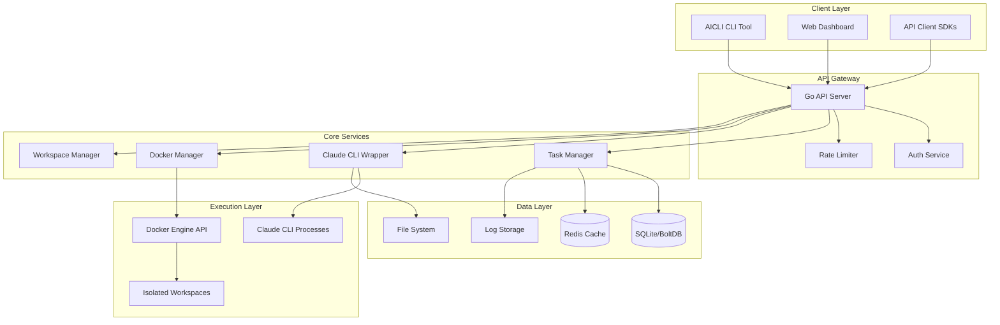

# ARCHITECTURE.md - AICode Manager 시스템 아키텍처

## 📋 문서 정보
- **작성일**: 2025-07-20
- **버전**: 1.0.0
- **프레임워크**: AIWF (AI Workflow Framework)
- **프로젝트**: AICode Manager - Claude CLI 웹 관리 플랫폼

## 🎯 아키텍처 비전

AICode Manager는 Go 언어로 구현된 네이티브 CLI 도구를 중심으로 Claude CLI를 웹 플랫폼에서 관리하는 시스템입니다. 격리된 환경에서 여러 프로젝트를 동시에 관리하고, 실시간으로 작업 상태를 모니터링할 수 있습니다.

### 핵심 설계 원칙
- **격리성 (Isolation)**: 각 Claude 인스턴스는 독립된 컨테이너 환경에서 실행
- **병렬성 (Parallelism)**: 여러 프로젝트 동시 작업 가능한 멀티테넌트 구조
- **확장성 (Scalability)**: 수평적 확장 가능한 마이크로서비스 지향 아키텍처
- **보안성 (Security)**: 프로젝트 간 격리 및 세밀한 사용자 권한 관리
- **효율성 (Efficiency)**: Go의 고성능을 활용한 리소스 최적화

## 🏗️ 시스템 아키텍처

### 전체 구조도



## 🔧 핵심 컴포넌트 설계

### 1. AICLI CLI (커맨드라인 인터페이스)

**목적**: 개발자 친화적인 CLI 도구로 로컬 환경에서 AICode Manager와 상호작용

**주요 기능**:
- 워크스페이스 생성/관리
- 태스크 실행 및 모니터링
- 로그 스트리밍
- 프로젝트 설정 관리

**구현 구조**:
```go
// cmd/aicli/main.go
type CLI struct {
    config     *Config
    apiClient  *APIClient
    wsManager  *WebSocketManager
}

// 커맨드 구조
- aicli workspace create <name>
- aicli workspace list
- aicli task run <command>
- aicli task status <id>
- aicli logs stream <task-id>
- aicli config set <key> <value>
```

### 2. Go API 서버

**목적**: RESTful API + WebSocket 엔드포인트를 제공하는 핵심 백엔드 서비스

**기술 스택**:
- Web Framework: Gin 또는 Echo
- WebSocket: gorilla/websocket
- 인증: JWT + API Keys
- 미들웨어: CORS, Rate Limiting, Request ID

**API 엔드포인트 설계**:
```
/api/v1/
├── /health                    # 헬스체크
├── /auth
│   ├── /login                # 로그인
│   └── /refresh              # 토큰 갱신
├── /workspaces
│   ├── GET /                 # 워크스페이스 목록
│   ├── POST /                # 워크스페이스 생성
│   ├── GET /:id              # 워크스페이스 상세
│   └── DELETE /:id           # 워크스페이스 삭제
├── /tasks
│   ├── POST /                # 태스크 생성
│   ├── GET /:id              # 태스크 상태
│   ├── GET /:id/logs         # 로그 조회
│   └── DELETE /:id           # 태스크 취소
└── /ws/:workspace_id         # WebSocket 연결
```

### 3. Claude CLI 래퍼

**목적**: Claude CLI 프로세스를 관리하고 입출력을 처리하는 핵심 래퍼

**주요 기능**:
- 프로세스 생명주기 관리
- 표준 입출력 스트리밍
- 세션 상태 추적
- 에러 핸들링 및 재시도

**세션 관리 구조**:
```go
type ClaudeSession struct {
    ID          string
    WorkspaceID string
    Process     *exec.Cmd
    State       SessionState
    Created     time.Time
    LastActive  time.Time
}

type SessionManager struct {
    sessions    map[string]*ClaudeSession
    mu          sync.RWMutex
    maxSessions int
    timeout     time.Duration
}
```

### 4. Docker 통합 관리자

**목적**: 격리된 실행 환경을 제공하고 리소스를 관리

**주요 기능**:
- 워크스페이스별 컨테이너 생성/관리
- 볼륨 마운트 및 네트워크 격리
- 리소스 제한 (CPU, 메모리)
- 컨테이너 상태 모니터링

**컨테이너 설정**:
```yaml
# Docker 컨테이너 기본 설정
image: aicli/workspace:latest
resources:
  cpu: 1.0
  memory: 2GB
  disk: 10GB
volumes:
  - /workspace:/workspace
  - /tmp:/tmp
environment:
  - CLAUDE_API_KEY=${CLAUDE_API_KEY}
  - WORKSPACE_ID=${WORKSPACE_ID}
network:
  mode: isolated
  dns: internal
```

### 5. 태스크 관리자

**목적**: 비동기 작업 큐 관리 및 실행 조정

**주요 기능**:
- 작업 스케줄링
- 우선순위 큐 관리
- 동시 실행 제한
- 실패 재시도 정책

**동시성 모델**:
```go
type TaskQueue struct {
    high    chan *Task  // 높은 우선순위
    medium  chan *Task  // 중간 우선순위
    low     chan *Task  // 낮은 우선순위
    workers int         // 워커 수
}

// 워커 풀 패턴
func (q *TaskQueue) Start(ctx context.Context) {
    for i := 0; i < q.workers; i++ {
        go q.worker(ctx, i)
    }
}
```

## 📊 데이터 아키텍처

### 1. 주 데이터베이스 (SQLite/BoltDB)

**선택 기준**:
- SQLite: 구조화된 데이터, SQL 쿼리 필요시
- BoltDB: Key-Value 저장, 단순 구조 선호시

**데이터 모델**:
```sql
-- SQLite 스키마 예시
CREATE TABLE workspaces (
    id TEXT PRIMARY KEY,
    name TEXT NOT NULL,
    owner_id TEXT NOT NULL,
    project_path TEXT,
    container_id TEXT,
    created_at TIMESTAMP,
    updated_at TIMESTAMP
);

CREATE TABLE tasks (
    id TEXT PRIMARY KEY,
    workspace_id TEXT,
    command TEXT,
    status TEXT,
    started_at TIMESTAMP,
    completed_at TIMESTAMP,
    FOREIGN KEY (workspace_id) REFERENCES workspaces(id)
);

CREATE TABLE logs (
    id INTEGER PRIMARY KEY AUTOINCREMENT,
    task_id TEXT,
    timestamp TIMESTAMP,
    level TEXT,
    message TEXT,
    FOREIGN KEY (task_id) REFERENCES tasks(id)
);
```

### 2. 캐시 레이어 (Redis - Optional)

**용도**:
- 세션 상태 캐싱
- 실시간 로그 버퍼링
- 분산 락 구현
- API 응답 캐싱

### 3. 파일 시스템 구조

```
/var/aicli/
├── workspaces/
│   ├── {workspace-id}/
│   │   ├── project/      # 프로젝트 파일
│   │   ├── logs/         # 작업 로그
│   │   └── .aicli/       # 메타데이터
├── config/
│   ├── server.yaml       # 서버 설정
│   └── docker.yaml       # Docker 설정
└── data/
    ├── aicli.db          # SQLite DB
    └── bolt.db           # BoltDB
```

## 🔄 실시간 통신 아키텍처

### 1. WebSocket 프로토콜

**메시지 형식**:
```json
{
  "type": "log|status|error|command",
  "workspace_id": "ws-123",
  "task_id": "task-456",
  "timestamp": "2025-01-20T10:00:00Z",
  "data": {
    // 타입별 페이로드
  }
}
```

### 2. Server-Sent Events (대안)

로그 스트리밍에 특화된 단방향 통신용

## 🚀 개발 마일스톤 (AIWF)

### M01_Foundation (2주)
- S01_M01_Core_Setup: Go 프로젝트 구조 설정
- S02_M01_Basic_CLI: 기본 CLI 커맨드 구현
- S03_M01_API_Server: 기본 API 서버 구현

### M02_Claude_Integration (3주)
- S01_M02_Claude_Wrapper: Claude CLI 래퍼 구현
- S02_M02_Session_Manager: 세션 관리 시스템
- S03_M02_Process_Control: 프로세스 제어 및 모니터링

### M03_Container_Platform (3주)
- S01_M03_Docker_Integration: Docker SDK 통합
- S02_M03_Workspace_Isolation: 워크스페이스 격리
- S03_M03_Resource_Management: 리소스 관리 및 제한

### M04_Data_Layer (2주)
- S01_M04_Storage_Implementation: DB 레이어 구현
- S02_M04_Cache_Layer: Redis 캐시 통합

### M05_Real_Time (2주)
- S01_M05_WebSocket_Server: WebSocket 서버 구현
- S02_M05_Log_Streaming: 실시간 로그 스트리밍

### M06_Web_Interface (4주)
- S01_M06_Dashboard_Design: 웹 대시보드 설계
- S02_M06_Frontend_Implementation: React/Vue 구현
- S03_M06_Real_Time_UI: 실시간 UI 업데이트
- S04_M06_Integration_Testing: 통합 테스트

### M07_Production_Ready (3주)
- S01_M07_Security_Hardening: 보안 강화
- S02_M07_Performance_Optimization: 성능 최적화
- S03_M07_Deployment_Pipeline: 배포 파이프라인

## 🛡️ 보안 아키텍처

### 1. 인증 및 권한

- JWT 기반 인증
- API Key 관리
- Role-Based Access Control (RBAC)
- 세션 타임아웃 정책

### 2. 격리 정책

- 네트워크 격리 (컨테이너별)
- 파일시스템 격리
- 프로세스 격리
- 리소스 제한

### 3. 보안 모니터링

- 감사 로그
- 이상 행동 감지
- 리소스 사용량 모니터링

## 📈 성능 고려사항

### 1. 최적화 전략

- 연결 풀링
- 프로세스 재사용
- 효율적인 로그 버퍼링
- 비동기 I/O 활용

### 2. 확장성 설계

- 수평적 확장 가능
- 로드 밸런싱 지원
- 분산 작업 큐
- 마이크로서비스 준비

### 3. 모니터링 메트릭

- API 응답 시간
- 동시 세션 수
- 리소스 사용률
- 에러율 및 재시도율

## 🔧 기술 스택 요약

### 백엔드
- **언어**: Go 1.21+
- **웹 프레임워크**: Gin/Echo
- **데이터베이스**: SQLite/BoltDB
- **캐시**: Redis (Optional)
- **컨테이너**: Docker SDK

### 프론트엔드
- **프레임워크**: React/Vue 3
- **상태관리**: Zustand/Pinia
- **실시간**: WebSocket
- **UI**: Tailwind CSS

### 인프라
- **컨테이너화**: Docker
- **오케스트레이션**: Docker Compose (개발), K8s (프로덕션)
- **CI/CD**: GitHub Actions
- **모니터링**: Prometheus + Grafana

## 📝 개발 가이드라인

### 1. 코드 구조
```
aicli-web/
├── cmd/                    # 진입점
│   ├── aicli/             # CLI 도구
│   └── api/               # API 서버
├── internal/              # 내부 패키지
│   ├── cli/              # CLI 구현
│   ├── server/           # 서버 구현
│   ├── claude/           # Claude 래퍼
│   ├── docker/           # Docker 관리
│   ├── storage/          # 데이터 저장
│   └── models/           # 데이터 모델
├── pkg/                   # 공개 패키지
├── web/                   # 웹 프론트엔드
└── .aiwf/                # AIWF 프로젝트 구조
```

### 2. 개발 프로세스

1. 마일스톤별 개발 진행
2. 스프린트 단위 작업 관리
3. 테스트 주도 개발 (TDD)
4. 코드 리뷰 필수
5. 문서화 동시 진행

### 3. 품질 기준

- 테스트 커버리지 80% 이상
- 고루틴 누수 방지
- 에러 핸들링 철저
- 로깅 표준 준수
- 보안 가이드라인 준수

## 🎯 프로젝트 목표

1. **개발자 경험**: CLI 우선 설계로 개발자 친화적 도구 제공
2. **안정성**: Go의 강타입과 동시성 모델로 안정적인 시스템 구축
3. **성능**: Python 대비 10-50배 빠른 실행 속도
4. **확장성**: 마이크로서비스 전환 가능한 아키텍처
5. **보안성**: 컨테이너 기반 격리로 안전한 실행 환경

---

이 아키텍처는 AIWF 프레임워크에 따라 지속적으로 업데이트되며, 각 마일스톤 완료 시 검토 및 개선이 이루어집니다.