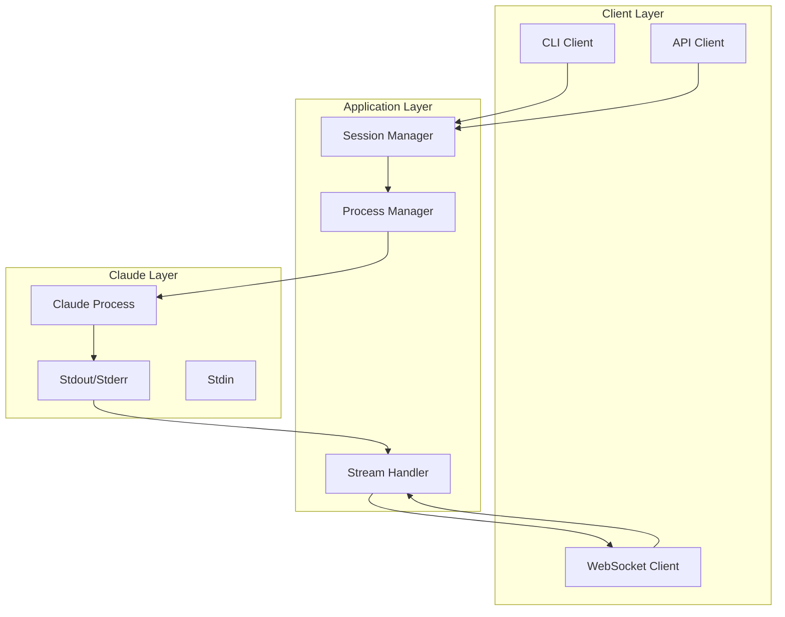

# TX07_S01: Documentation

## 📋 작업 개요

Claude CLI 통합 시스템의 포괄적인 문서화를 수행합니다. 사용 가이드, API 레퍼런스, 설정 가이드, 아키텍처 문서를 작성합니다.

## 🎯 작업 목표

1. Claude 래퍼 사용 가이드 작성
2. API 문서 업데이트 (OpenAPI)
3. 설정 가이드 및 예제 제공
4. 아키텍처 및 설계 문서화

## 📝 상세 작업 내용

### 1. Claude 래퍼 사용 가이드

```markdown
# docs/claude/usage-guide.md

# Claude CLI 통합 사용 가이드

## 개요
AICode Manager의 Claude CLI 통합은 Go 네이티브 프로세스 관리를 통해 
안정적이고 효율적인 Claude 실행 환경을 제공합니다.

## 빠른 시작

### CLI 사용
```bash
# 단일 프롬프트 실행
aicli claude run "Hello, Claude!" --workspace my-project

# 인터랙티브 채팅
aicli claude chat --system "You are a helpful coding assistant"

# 세션 관리
aicli claude session list
aicli claude session show <session-id>
```

### API 사용
```go
// Go 클라이언트 예제
client := aicli.NewClient("http://localhost:8080")

// 세션 생성
session, err := client.CreateClaudeSession(aicli.SessionConfig{
    WorkspaceID: "my-project",
    SystemPrompt: "You are a helpful assistant",
    MaxTurns: 10,
})

// 프롬프트 실행
response, err := client.ExecuteClaude(session.ID, "Write a hello world in Go")
```

## 주요 기능

### 1. 세션 관리
- 세션 생성 및 재사용
- 세션 설정 관리
- 세션 상태 추적

### 2. 스트림 처리
- 실시간 출력 스트리밍
- JSON 구조화된 응답
- 백프레셔 처리

### 3. 에러 처리
- 자동 재시도
- 회로 차단기
- 에러 복구

## 설정 옵션

| 옵션 | 설명 | 기본값 |
|------|------|--------|
| `system_prompt` | 시스템 프롬프트 | "" |
| `max_turns` | 최대 대화 턴 수 | 10 |
| `tools` | 사용 가능한 도구 | ["Read", "Write"] |
| `timeout` | 실행 타임아웃 | 5m |
| `max_retries` | 최대 재시도 횟수 | 3 |
```

### 2. API 레퍼런스

```yaml
# docs/api/claude-endpoints.yaml
# OpenAPI 3.0 스펙 추가

paths:
  /api/v1/claude/execute:
    post:
      summary: Claude 프롬프트 실행
      operationId: executeClaude
      tags:
        - Claude
      requestBody:
        required: true
        content:
          application/json:
            schema:
              $ref: '#/components/schemas/ExecuteRequest'
      responses:
        '202':
          description: 실행 시작됨
          content:
            application/json:
              schema:
                $ref: '#/components/schemas/ExecuteResponse'
        '400':
          $ref: '#/components/responses/BadRequest'
        '500':
          $ref: '#/components/responses/InternalError'
  
  /api/v1/claude/sessions:
    get:
      summary: 세션 목록 조회
      operationId: listSessions
      tags:
        - Claude
      parameters:
        - name: workspace_id
          in: query
          schema:
            type: string
      responses:
        '200':
          description: 세션 목록
          content:
            application/json:
              schema:
                type: object
                properties:
                  sessions:
                    type: array
                    items:
                      $ref: '#/components/schemas/Session'

components:
  schemas:
    ExecuteRequest:
      type: object
      required:
        - workspace_id
        - prompt
      properties:
        workspace_id:
          type: string
        prompt:
          type: string
        system_prompt:
          type: string
        max_turns:
          type: integer
          default: 10
        tools:
          type: array
          items:
            type: string
        stream:
          type: boolean
          default: true
```

### 3. 설정 가이드

```markdown
# docs/claude/configuration.md

# Claude CLI 통합 설정 가이드

## 환경 변수

### 필수 환경 변수
- `CLAUDE_CODE_OAUTH_TOKEN`: Claude OAuth 토큰
- `CLAUDE_API_KEY`: Claude API 키 (대체 인증)

### 선택적 환경 변수
- `CLAUDE_MAX_SESSIONS`: 최대 동시 세션 수 (기본: 10)
- `CLAUDE_SESSION_TIMEOUT`: 세션 타임아웃 (기본: 30m)
- `CLAUDE_LOG_LEVEL`: 로그 레벨 (debug, info, warn, error)

## 설정 파일

### aicli.yaml
```yaml
claude:
  # 프로세스 설정
  process:
    max_concurrent: 10
    startup_timeout: 30s
    shutdown_timeout: 10s
    health_check_interval: 30s
  
  # 스트림 설정
  stream:
    buffer_size: 1024
    max_line_size: 1MB
    backpressure_threshold: 0.8
  
  # 세션 설정
  session:
    pool_size: 5
    reuse_timeout: 10m
    max_idle_time: 30m
  
  # 에러 처리
  error_handling:
    max_retries: 3
    retry_backoff: exponential
    circuit_breaker_threshold: 5
```

## 도구 권한 설정

### 도구 허용 목록
```yaml
tools:
  allowed:
    - Read
    - Write
    - Bash
    - Search
  
  # 도구별 설정
  config:
    Bash:
      timeout: 30s
      allowed_commands:
        - ls
        - cat
        - grep
    Write:
      max_file_size: 10MB
      allowed_paths:
        - /workspace
```

## 리소스 제한

### CPU 및 메모리
```yaml
resources:
  limits:
    cpu: 2.0      # CPU 코어 수
    memory: 2Gi   # 메모리
  requests:
    cpu: 0.5
    memory: 512Mi
```
```

### 4. 아키텍처 문서

```markdown
# docs/claude/architecture.md

# Claude CLI 통합 아키텍처

## 시스템 개요



## 컴포넌트 설명

### Process Manager
- 프로세스 생명주기 관리
- 헬스체크 및 모니터링
- 리소스 제한 적용

### Stream Handler
- JSON 스트림 파싱
- 메시지 라우팅
- 백프레셔 처리

### Session Manager
- 세션 상태 관리
- 세션 풀링
- 설정 관리

## 데이터 흐름

1. **요청 수신**: CLI/API로부터 실행 요청
2. **세션 생성**: 세션 매니저가 새 세션 생성
3. **프로세스 시작**: 프로세스 매니저가 Claude CLI 실행
4. **스트림 처리**: 출력을 파싱하여 클라이언트로 전송
5. **세션 종료**: 완료 후 세션 정리

## 에러 처리 전략

### 재시도 정책
- 네트워크 에러: 3회 재시도
- 프로세스 크래시: 즉시 재시작
- API 에러: 지수 백오프

### 회로 차단기
- 실패 임계값: 5회
- 열린 상태 지속: 30초
- 반열림 테스트: 1회
```

### 5. 트러블슈팅 가이드

```markdown
# docs/claude/troubleshooting.md

# Claude CLI 통합 트러블슈팅

## 일반적인 문제

### 1. 프로세스가 시작되지 않음
**증상**: "Failed to start Claude process" 에러

**원인**:
- Claude CLI가 설치되지 않음
- PATH에 claude 실행 파일 없음
- 권한 부족

**해결**:
```bash
# Claude CLI 설치 확인
which claude

# 권한 확인
ls -la $(which claude)

# PATH 확인
echo $PATH
```

### 2. 인증 실패
**증상**: "Authentication failed" 에러

**원인**:
- OAuth 토큰 만료
- 잘못된 API 키

**해결**:
```bash
# 토큰 갱신
aicli auth refresh

# 토큰 확인
aicli auth status
```

### 3. 스트림 끊김
**증상**: 출력이 중간에 멈춤

**원인**:
- 네트워크 문제
- 버퍼 오버플로우
- 타임아웃

**해결**:
- 버퍼 크기 증가
- 타임아웃 값 조정
- 네트워크 상태 확인

## 성능 문제

### 높은 메모리 사용
- 세션 풀 크기 조정
- 버퍼 크기 최적화
- 가비지 컬렉션 튜닝

### 느린 응답
- 프로세스 풀 사용
- 동시 실행 수 제한
- 캐싱 활용

## 디버깅

### 로그 레벨 설정
```bash
export CLAUDE_LOG_LEVEL=debug
aicli claude run "test" --debug
```

### 프로세스 상태 확인
```bash
# 실행 중인 Claude 프로세스
ps aux | grep claude

# 시스템 리소스
top -p $(pgrep claude)
```

### 메트릭 확인
```bash
# API 메트릭
curl http://localhost:8080/metrics | grep claude

# 세션 상태
aicli claude session list --verbose
```
```

### 6. 예제 및 레시피

```markdown
# docs/claude/examples.md

# Claude CLI 통합 예제

## 기본 사용 예제

### 1. 코드 생성
```bash
aicli claude run "Write a REST API server in Go with user authentication" \
  --tools Write,Read \
  --system "You are an expert Go developer"
```

### 2. 코드 리뷰
```bash
aicli claude run "Review this code for security issues: $(cat main.go)" \
  --format markdown
```

### 3. 문서 생성
```bash
aicli claude run "Generate API documentation for this service" \
  --workspace ./my-service \
  --tools Read,Write
```

## 고급 사용 예제

### 배치 처리
```bash
#!/bin/bash
# batch_process.sh

for file in *.go; do
  echo "Processing $file..."
  aicli claude run "Add comprehensive comments to this Go file: $(cat $file)" \
    --tools Write \
    --output "$file.commented"
done
```

### WebSocket 스트리밍
```javascript
// JavaScript 클라이언트 예제
const ws = new WebSocket('ws://localhost:8080/ws/executions/123');

ws.onmessage = (event) => {
  const msg = JSON.parse(event.data);
  if (msg.type === 'claude_message') {
    console.log(msg.data.content);
  }
};
```

### API 통합
```python
# Python 클라이언트 예제
import requests
import json

# 세션 생성
response = requests.post('http://localhost:8080/api/v1/claude/sessions', 
  json={
    'workspace_id': 'my-project',
    'system_prompt': 'You are a helpful assistant'
  }
)
session = response.json()

# 프롬프트 실행
response = requests.post('http://localhost:8080/api/v1/claude/execute',
  json={
    'session_id': session['id'],
    'prompt': 'Hello, Claude!'
  }
)
```
```

## ✅ 완료 조건

- [ ] 사용 가이드 완성
- [ ] API 문서 업데이트
- [ ] 설정 가이드 작성
- [ ] 아키텍처 문서화
- [ ] 트러블슈팅 가이드
- [ ] 예제 코드 제공

## 🧪 문서 검증

### 기술적 정확성
- 코드 예제 실행 가능
- API 스펙 정확성
- 설정 값 검증

### 완성도
- 모든 기능 문서화
- 일관된 형식
- 명확한 설명

### 사용성
- 쉬운 네비게이션
- 실용적인 예제
- 문제 해결 가이드

## 📚 참고 자료

- 기존 프로젝트 문서
- Go 문서 작성 가이드
- OpenAPI 3.0 스펙
- Markdown 스타일 가이드

## 🔄 의존성

- 모든 구현된 기능
- docs/ 디렉토리 구조
- 기존 문서 템플릿

## 💡 작성 팁

1. 구체적인 예제 포함
2. 시각적 다이어그램 활용
3. 일반적인 사용 사례 중심
4. 에러 메시지 포함
5. 버전 정보 명시

## 🔧 기술 가이드

### 코드베이스 통합 포인트

1. **문서 구조**
   - 메인 문서: `docs/`
   - API 문서: `docs/api/`
   - 개발 문서: `docs/development/`
   - Claude 문서: `docs/claude/` (새로 생성)

2. **기존 문서 패턴**
   - README.md: 프로젝트 개요
   - CONTRIBUTING.md: 기여 가이드
   - docs/api/openapi.yaml: API 스펙

3. **문서 도구**
   - Markdown 문서
   - Mermaid 다이어그램
   - OpenAPI/Swagger

4. **문서 빌드**
   - `make docs`: 문서 빌드
   - `make serve-docs`: 로컬 문서 서버

### 구현 접근법

1. **Claude 문서 디렉토리 생성**
   - `docs/claude/` 디렉토리 구조
   - 사용 가이드, API 참조, 설정, 트러블슈팅

2. **기존 문서 업데이트**
   - README.md에 Claude 섹션 추가
   - API 문서에 Claude 엔드포인트 추가
   - 개발 가이드에 Claude 통합 섹션

3. **예제 코드 작성**
   - 실행 가능한 예제
   - 다양한 언어 클라이언트
   - 일반적인 사용 시나리오

4. **문서 검증**
   - 코드 예제 테스트
   - 링크 검증
   - 일관성 확인

### 테스트 접근법

1. **문서 테스트**
   - 예제 코드 실행 테스트
   - API 스펙 검증
   - 마크다운 린트

2. **사용성 테스트**
   - 문서 네비게이션
   - 가독성 확인
   - 완성도 검증

3. **자동화**
   - 문서 빌드 CI
   - 링크 검사
   - 예제 코드 테스트