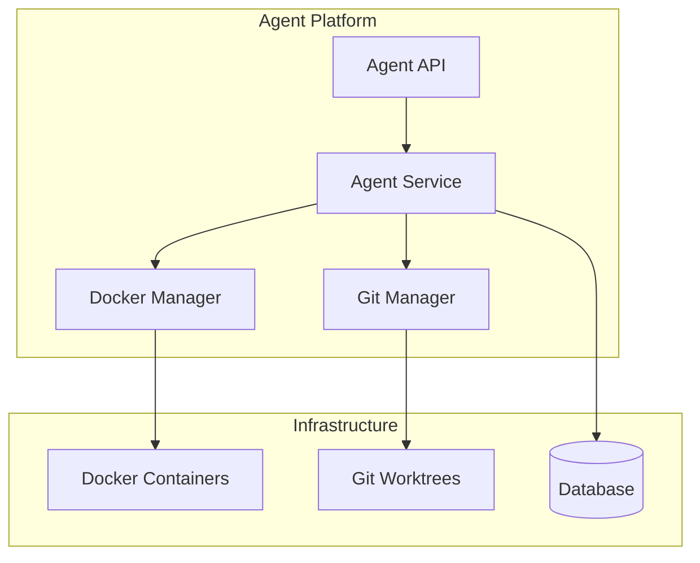

# Task: API 문서화 및 개발자 가이드

## Description
멀티 에이전트 플랫폼의 API 문서화와 개발자 가이드를 작성합니다. OpenAPI 명세서, 사용 예제, 아키텍처 문서, 배포 가이드 등을 포함하여 개발자가 쉽게 이해하고 사용할 수 있도록 합니다.

## Goal / Objectives
- OpenAPI 3.0 명세서 작성 및 Swagger UI 제공
- 상세한 API 사용 가이드 작성
- 아키텍처 및 설계 문서 작성
- 배포 및 운영 가이드 제공
- 예제 코드 및 SDK 제공

## Acceptance Criteria
- [ ] 모든 API 엔드포인트가 OpenAPI로 문서화됨
- [ ] Swagger UI가 자동으로 생성되고 접근 가능함
- [ ] 개발자 가이드가 Getting Started 포함
- [ ] 아키텍처 다이어그램과 설명 완성
- [ ] 예제 코드가 실제로 동작함
- [ ] 배포 가이드가 단계별로 명확함

## Subtasks
- [ ] OpenAPI 명세서 작성 및 주석 추가
- [ ] Swagger UI 통합 및 설정
- [ ] API 사용 가이드 작성
- [ ] 아키텍처 문서 업데이트
- [ ] 예제 코드 및 SDK 작성
- [ ] 배포 및 운영 가이드 작성
- [ ] 문제 해결 가이드 추가
- [ ] 문서 자동 생성 CI/CD 설정

## 기술 가이드

### 주요 인터페이스 및 통합 지점
- **기존 문서 구조**: `docs/` 디렉토리
- **API 문서**: `docs/api/` 
- **개발 가이드**: `docs/development/`
- **Claude 문서**: `docs/claude/`

### 문서화 도구 및 표준
```go
// Swaggo 주석 예시
// @title AICode Manager Agent API
// @version 1.0
// @description Multi-Agent Platform API for managing AI agents
// @host localhost:8080
// @BasePath /api/v1
```

### 따라야 할 기존 패턴
- README 구조: 프로젝트 루트 README.md
- API 문서: OpenAPI 3.0 표준
- 마크다운 스타일: GitHub Flavored Markdown
- 다이어그램: Mermaid 사용

### 문서 구조
```
docs/
├── agents/
│   ├── README.md           # 에이전트 개요
│   ├── getting-started.md  # 빠른 시작 가이드
│   ├── api-reference.md    # API 레퍼런스
│   ├── architecture.md     # 아키텍처 설명
│   ├── deployment.md       # 배포 가이드
│   └── troubleshooting.md  # 문제 해결
├── examples/
│   ├── create-agent.go     # 에이전트 생성 예제
│   ├── manage-agents.go    # 에이전트 관리 예제
│   └── sdk-usage.go        # SDK 사용 예제
└── api/
    └── openapi.yaml        # OpenAPI 명세서
```

## 구현 노트

### 단계별 구현 접근법
1. 기존 문서 구조 분석 및 템플릿 준비
2. API 컨트롤러에 Swaggo 주석 추가
3. OpenAPI 명세서 자동 생성
4. Getting Started 가이드 작성
5. 아키텍처 문서 및 다이어그램 작성
6. 예제 코드 작성 및 테스트
7. 배포 가이드 작성

### 문서화 내용

#### 1. Getting Started
```markdown
# Multi-Agent Platform 시작하기

## 빠른 시작
1. 에이전트 생성
2. Git 저장소 연결
3. 작업 실행
4. 결과 확인

## 첫 번째 에이전트 생성하기
```bash
# API를 사용한 에이전트 생성
curl -X POST http://localhost:8080/api/v1/agents \
  -H "Content-Type: application/json" \
  -d '{
    "name": "my-first-agent",
    "repository": "https://github.com/user/repo.git",
    "branch": "main"
  }'
```
```

#### 2. 아키텍처 다이어그램


#### 3. API 사용 예제
```go
// SDK를 사용한 에이전트 관리
client := aicli.NewClient("http://localhost:8080")

// 에이전트 생성
agent, err := client.Agents.Create(&aicli.CreateAgentRequest{
    Name:       "test-agent",
    Repository: "https://github.com/user/repo.git",
})

// 에이전트 시작
err = client.Agents.Start(agent.ID)

// 로그 스트리밍
logs, err := client.Agents.StreamLogs(agent.ID)
for log := range logs {
    fmt.Println(log.Message)
}
```

### 배포 문서 구조
1. **시스템 요구사항**: Docker, Git, 최소 리소스
2. **설치 방법**: 바이너리, Docker, Kubernetes
3. **설정 가이드**: 환경 변수, 설정 파일
4. **보안 설정**: TLS, 인증, 권한
5. **모니터링**: Prometheus, Grafana 설정

### 문서 자동화
- Swaggo로 OpenAPI 생성
- MkDocs로 정적 사이트 생성
- GitHub Pages로 호스팅
- PR 시 문서 빌드 검증

## Output Log
*(This section is populated as work progresses on the task)*