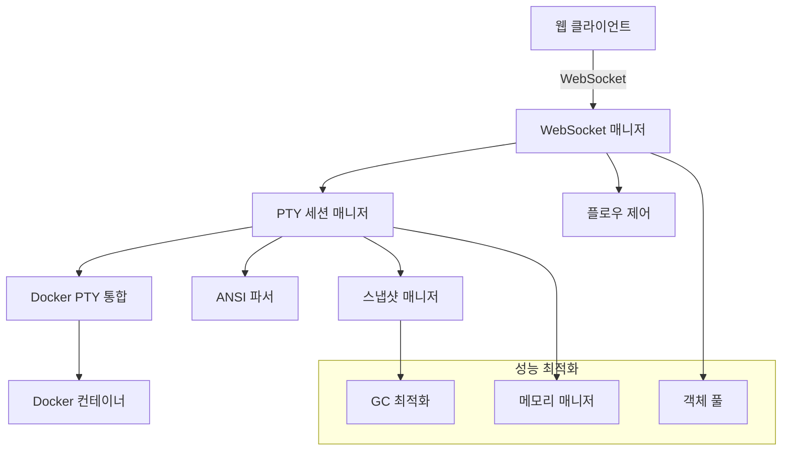

# Task: PTY 스트리밍 시스템 API 문서화 및 개발자 가이드

## Task Summary
PTY 스트리밍 시스템의 API 문서화, 개발자 가이드, 사용 예제, 운영 가이드를 작성합니다. 개발자가 시스템을 이해하고 효과적으로 사용할 수 있도록 포괄적인 문서를 제공합니다.

## Acceptance Criteria

### API 문서화 요구사항
- [ ] OpenAPI 3.0 규격 준수 API 스펙 문서
- [ ] WebSocket API 프로토콜 문서
- [ ] 모든 엔드포인트에 대한 상세 설명
- [ ] 요청/응답 예제 및 스키마
- [ ] 에러 코드 및 처리 가이드
- [ ] 인증 및 권한 관리 문서

### 개발자 가이드 요구사항
- [ ] 시스템 아키텍처 개요
- [ ] 설치 및 설정 가이드
- [ ] 개발 환경 구성 가이드
- [ ] 코드 예제 및 튜토리얼
- [ ] 모범 사례 및 패턴
- [ ] 문제 해결 가이드

### 운영 문서 요구사항
- [ ] 배포 가이드
- [ ] 모니터링 및 로깅 설정
- [ ] 성능 튜닝 가이드
- [ ] 백업 및 복구 절차
- [ ] 보안 설정 가이드

## Implementation Details

### 1. OpenAPI 스펙 문서

```yaml
# docs/api/pty-streaming-api.yaml
openapi: 3.0.3
info:
  title: PTY Streaming API
  description: |
    Docker 컨테이너와 연결된 PTY 세션을 통한 실시간 터미널 스트리밍 API
    
    ## 주요 기능
    - PTY 세션 생성 및 관리
    - 실시간 WebSocket 스트리밍
    - Docker 컨테이너 통합
    - 터미널 스냅샷 캡처
    - 성능 모니터링
    
    ## 인증
    JWT 토큰 기반 인증을 사용합니다.
    
    ## WebSocket 연결
    `/ws/pty/{session_id}` 엔드포인트를 통해 WebSocket 연결을 설정합니다.
    
  version: '1.0.0'
  contact:
    name: AICLI Web API Support
    email: support@aicli-web.com
  license:
    name: MIT
    url: https://opensource.org/licenses/MIT

servers:
  - url: 'https://api.aicli-web.com/v1'
    description: Production server
  - url: 'https://staging-api.aicli-web.com/v1'
    description: Staging server
  - url: 'http://localhost:8080/v1'
    description: Development server

security:
  - bearerAuth: []

paths:
  /pty/sessions:
    post:
      summary: PTY 세션 생성
      description: |
        새로운 PTY 세션을 생성하고 Docker 컨테이너와 연결합니다.
        
        ## 동작 과정
        1. 컨테이너 상태 확인
        2. PTY 세션 생성
        3. Docker exec 생성 및 연결
        4. WebSocket 연결 준비
        
      tags:
        - PTY Sessions
      requestBody:
        required: true
        content:
          application/json:
            schema:
              $ref: '#/components/schemas/CreatePTYSessionRequest'
            examples:
              basic_session:
                summary: 기본 세션 생성
                value:
                  container_id: "container_123"
                  config:
                    shell: "/bin/bash"
                    term: "xterm-256color"
                    rows: 24
                    cols: 80
                    working_dir: "/workspace"
                    environment:
                      TERM: "xterm-256color"
                      LANG: "en_US.UTF-8"
              python_session:
                summary: Python 개발 세션
                value:
                  container_id: "python_dev_container"
                  config:
                    shell: "/bin/bash"
                    term: "xterm-256color"
                    rows: 30
                    cols: 120
                    working_dir: "/app"
                    environment:
                      PYTHONPATH: "/app"
                      TERM: "xterm-256color"
      responses:
        '201':
          description: PTY 세션이 성공적으로 생성됨
          content:
            application/json:
              schema:
                $ref: '#/components/schemas/PTYSessionResponse'
              examples:
                session_created:
                  summary: 세션 생성 성공
                  value:
                    session_id: "pty_session_abc123"
                    container_id: "container_123"
                    status: "active"
                    websocket_url: "ws://localhost:8080/v1/ws/pty/pty_session_abc123"
                    created_at: "2025-08-05T10:00:00Z"
                    config:
                      shell: "/bin/bash"
                      term: "xterm-256color"
                      rows: 24
                      cols: 80
        '400':
          $ref: '#/components/responses/BadRequest'
        '404':
          $ref: '#/components/responses/ContainerNotFound'
        '500':
          $ref: '#/components/responses/InternalServerError'
    
    get:
      summary: PTY 세션 목록 조회
      description: 현재 활성화된 PTY 세션 목록을 반환합니다.
      tags:
        - PTY Sessions
      parameters:
        - name: status
          in: query
          description: 세션 상태로 필터링
          schema:
            type: string
            enum: [active, idle, terminated]
        - name: container_id
          in: query
          description: 컨테이너 ID로 필터링
          schema:
            type: string
        - name: limit
          in: query
          description: 반환할 세션 수 제한
          schema:
            type: integer
            default: 50
            maximum: 100
        - name: offset
          in: query
          description: 페이지네이션 오프셋
          schema:
            type: integer
            default: 0
      responses:
        '200':
          description: PTY 세션 목록
          content:
            application/json:
              schema:
                $ref: '#/components/schemas/PTYSessionListResponse'

  /pty/sessions/{session_id}:
    get:
      summary: PTY 세션 상세 조회
      description: 특정 PTY 세션의 상세 정보를 조회합니다.
      tags:
        - PTY Sessions
      parameters:
        - $ref: '#/components/parameters/SessionId'
      responses:
        '200':
          description: PTY 세션 상세 정보
          content:
            application/json:
              schema:
                $ref: '#/components/schemas/PTYSessionDetailResponse'
        '404':
          $ref: '#/components/responses/SessionNotFound'
    
    delete:
      summary: PTY 세션 종료
      description: |
        PTY 세션을 종료하고 관련 리소스를 정리합니다.
        
        ## 정리 과정
        1. WebSocket 연결 종료
        2. Docker exec 프로세스 종료
        3. 세션 메타데이터 정리
        4. 메모리 리소스 해제
        
      tags:
        - PTY Sessions
      parameters:
        - $ref: '#/components/parameters/SessionId'
      responses:
        '204':
          description: PTY 세션이 성공적으로 종료됨
        '404':
          $ref: '#/components/responses/SessionNotFound'

  /pty/sessions/{session_id}/resize:
    post:
      summary: 터미널 크기 조정
      description: PTY 세션의 터미널 크기를 조정합니다.
      tags:
        - PTY Sessions
      parameters:
        - $ref: '#/components/parameters/SessionId'
      requestBody:
        required: true
        content:
          application/json:
            schema:
              $ref: '#/components/schemas/ResizeTerminalRequest'
      responses:
        '200':
          description: 터미널 크기가 성공적으로 조정됨
        '404':
          $ref: '#/components/responses/SessionNotFound'

  /pty/sessions/{session_id}/snapshots:
    get:
      summary: 터미널 스냅샷 목록 조회
      description: PTY 세션의 터미널 스냅샷 히스토리를 조회합니다.
      tags:
        - Terminal Snapshots
      parameters:
        - $ref: '#/components/parameters/SessionId'
        - name: limit
          in: query
          description: 반환할 스냅샷 수
          schema:
            type: integer
            default: 10
            maximum: 100
        - name: since
          in: query
          description: 특정 시간 이후 스냅샷만 조회
          schema:
            type: string
            format: date-time
      responses:
        '200':
          description: 터미널 스냅샷 목록
          content:
            application/json:
              schema:
                $ref: '#/components/schemas/SnapshotListResponse'

  /ws/pty/{session_id}:
    get:
      summary: PTY WebSocket 연결
      description: |
        PTY 세션과 WebSocket 연결을 설정합니다.
        
        ## WebSocket 프로토콜
        
        ### 메시지 타입
        - `input`: 터미널 입력 (클라이언트 → 서버)
        - `output`: 터미널 출력 (서버 → 클라이언트)
        - `resize`: 터미널 크기 조정 (클라이언트 → 서버)
        - `ping`: 연결 상태 확인 (양방향)
        - `error`: 에러 메시지 (서버 → 클라이언트)
        
        ### 메시지 형식
        ```json
        {
          "type": "input|output|resize|ping|error",
          "data": "메시지 데이터",
          "timestamp": "2025-08-05T10:00:00Z",
          "sequence": 123
        }
        ```
        
        ### 연결 인증
        WebSocket 연결 시 JWT 토큰을 쿼리 파라미터로 전달:
        `ws://host/ws/pty/session_id?token=jwt_token`
        
      tags:
        - WebSocket
      parameters:
        - $ref: '#/components/parameters/SessionId'
        - name: token
          in: query
          required: true
          description: JWT 인증 토큰
          schema:
            type: string
      responses:
        '101':
          description: WebSocket 연결 성공
        '401':
          description: 인증 실패
        '404':
          description: 세션을 찾을 수 없음

components:
  securitySchemes:
    bearerAuth:
      type: http
      scheme: bearer
      bearerFormat: JWT

  parameters:
    SessionId:
      name: session_id
      in: path
      required: true
      description: PTY 세션 ID
      schema:
        type: string
        pattern: '^pty_session_[a-zA-Z0-9]+$'
        example: "pty_session_abc123"

  schemas:
    CreatePTYSessionRequest:
      type: object
      required:
        - container_id
      properties:
        container_id:
          type: string
          description: Docker 컨테이너 ID
          example: "container_123"
        config:
          $ref: '#/components/schemas/PTYConfig'
    
    PTYConfig:
      type: object
      properties:
        shell:
          type: string
          description: 사용할 셸
          default: "/bin/bash"
          example: "/bin/bash"
        term:
          type: string
          description: 터미널 타입
          default: "xterm-256color"
          example: "xterm-256color"
        rows:
          type: integer
          description: 터미널 행 수
          default: 24
          minimum: 1
          maximum: 200
          example: 24
        cols:
          type: integer
          description: 터미널 열 수
          default: 80
          minimum: 1
          maximum: 500
          example: 80
        working_dir:
          type: string
          description: 작업 디렉토리
          default: "/"
          example: "/workspace"
        environment:
          type: object
          description: 환경 변수
          additionalProperties:
            type: string
          example:
            TERM: "xterm-256color"
            LANG: "en_US.UTF-8"
        user:
          type: string
          description: 실행 사용자
          default: "root"
          example: "root"
        privileged:
          type: boolean
          description: 특권 모드 실행 여부
          default: false

    PTYSessionResponse:
      type: object
      properties:
        session_id:
          type: string
          description: 생성된 PTY 세션 ID
          example: "pty_session_abc123"
        container_id:
          type: string
          description: 연결된 컨테이너 ID
          example: "container_123"
        status:
          type: string
          enum: [active, idle, terminated]
          description: 세션 상태
          example: "active"
        websocket_url:
          type: string
          format: uri
          description: WebSocket 연결 URL
          example: "ws://localhost:8080/v1/ws/pty/pty_session_abc123"
        created_at:
          type: string
          format: date-time
          description: 세션 생성 시간
          example: "2025-08-05T10:00:00Z"
        config:
          $ref: '#/components/schemas/PTYConfig'

    ResizeTerminalRequest:
      type: object
      required:
        - rows
        - cols
      properties:
        rows:
          type: integer
          minimum: 1
          maximum: 200
          description: 새로운 행 수
          example: 30
        cols:
          type: integer
          minimum: 1
          maximum: 500
          description: 새로운 열 수
          example: 120

    WebSocketMessage:
      type: object
      required:
        - type
        - data
        - timestamp
      properties:
        type:
          type: string
          enum: [input, output, resize, ping, error]
          description: 메시지 타입
        data:
          type: string
          description: 메시지 데이터 (Base64 인코딩된 바이너리 데이터)
        timestamp:
          type: string
          format: date-time
          description: 메시지 타임스탬프
        sequence:
          type: integer
          description: 메시지 시퀀스 번호
        session_id:
          type: string
          description: 세션 ID

    Error:
      type: object
      required:
        - error
        - message
      properties:
        error:
          type: string
          description: 에러 코드
        message:
          type: string
          description: 에러 메시지
        details:
          type: object
          description: 상세 에러 정보
        timestamp:
          type: string
          format: date-time
          description: 에러 발생 시간

  responses:
    BadRequest:
      description: 잘못된 요청
      content:
        application/json:
          schema:
            $ref: '#/components/schemas/Error'
          example:
            error: "INVALID_REQUEST"
            message: "Required field 'container_id' is missing"
            timestamp: "2025-08-05T10:00:00Z"

    ContainerNotFound:
      description: 컨테이너를 찾을 수 없음
      content:
        application/json:
          schema:
            $ref: '#/components/schemas/Error'
          example:
            error: "CONTAINER_NOT_FOUND"
            message: "Container 'container_123' not found or not running"
            timestamp: "2025-08-05T10:00:00Z"

    SessionNotFound:
      description: PTY 세션을 찾을 수 없음
      content:
        application/json:
          schema:
            $ref: '#/components/schemas/Error'
          example:
            error: "SESSION_NOT_FOUND"
            message: "PTY session 'pty_session_abc123' not found"
            timestamp: "2025-08-05T10:00:00Z"

    InternalServerError:
      description: 서버 내부 오류
      content:
        application/json:
          schema:
            $ref: '#/components/schemas/Error'
          example:
            error: "INTERNAL_SERVER_ERROR"
            message: "An unexpected error occurred"
            timestamp: "2025-08-05T10:00:00Z"

tags:
  - name: PTY Sessions
    description: PTY 세션 관리 API
  - name: Terminal Snapshots
    description: 터미널 스냅샷 관리 API
  - name: WebSocket
    description: 실시간 WebSocket 통신 API
```

### 2. 개발자 가이드

```markdown
# docs/developer-guide.md

# PTY 스트리밍 시스템 개발자 가이드

## 목차
1. [시스템 개요](#시스템-개요)
2. [아키텍처](#아키텍처)
3. [설치 및 설정](#설치-및-설정)
4. [개발 환경 구성](#개발-환경-구성)
5. [API 사용법](#api-사용법)
6. [WebSocket 프로토콜](#websocket-프로토콜)
7. [코드 예제](#코드-예제)
8. [모범 사례](#모범-사례)
9. [문제 해결](#문제-해결)

## 시스템 개요

PTY 스트리밍 시스템은 Docker 컨테이너와 연결된 가상 터미널(PTY)을 통해 실시간 터미널 액세스를 제공하는 웹 기반 솔루션입니다.

### 주요 기능
- **PTY 세션 관리**: Docker 컨테이너와의 터미널 세션 생성 및 관리
- **실시간 스트리밍**: WebSocket을 통한 양방향 실시간 통신
- **터미널 스냅샷**: 1초 간격 터미널 상태 캡처 및 히스토리 관리
- **ANSI 지원**: 완전한 ANSI 이스케이프 시퀀스 파싱 및 색상 지원
- **플로우 제어**: 백프레셔 및 동적 스로틀링
- **성능 최적화**: 메모리 풀링 및 고성능 I/O 처리

### 지원 환경
- **운영체제**: Linux (Ubuntu 20.04+, CentOS 8+, Alpine Linux)
- **컨테이너**: Docker 20.10+
- **브라우저**: Chrome 90+, Firefox 88+, Safari 14+
- **Go 버전**: 1.19+

## 아키텍처



### 핵심 컴포넌트

1. **PTY 세션 매니저** (`internal/pty/`)
   - PTY 세션 생명주기 관리
   - 컨테이너 연결 상태 모니터링
   - 세션 풀 관리

2. **WebSocket 스트리밍** (`internal/websocket/`)
   - 실시간 양방향 통신
   - 연결 관리 및 재연결
   - 메시지 큐잉 및 버퍼링

3. **Docker PTY 통합** (`internal/docker/`)
   - Docker API 연동
   - 컨테이너 생명주기 관리
   - 리소스 모니터링

4. **ANSI 파서** (`internal/terminal/ansi/`)
   - ANSI 이스케이프 시퀀스 파싱
   - 터미널 상태 추적
   - 색상 및 속성 관리

## 설치 및 설정

### 전제 조건

```bash
# Docker 설치 확인
docker --version

# Go 설치 확인
go version

# 필요한 시스템 패키지 설치 (Ubuntu)
sudo apt-get update
sudo apt-get install -y build-essential git
```

### 소스 코드 빌드

```bash
# 저장소 클론
git clone https://github.com/your-org/aicli-web.git
cd aicli-web

# 의존성 설치
go mod download

# 빌드
make build

# 테스트 실행
make test

# Docker 이미지 빌드
make docker
```

### 설정 파일

```yaml
# config/config.yaml
server:
  port: 8080
  host: "0.0.0.0"
  read_timeout: 30s
  write_timeout: 30s

pty:
  max_sessions: 100
  cleanup_interval: 30s
  session_timeout: 1h
  
websocket:
  buffer_size: 4096
  max_connections: 100
  heartbeat_interval: 30s
  reconnect_attempts: 3

docker:
  endpoint: "unix:///var/run/docker.sock"
  api_version: "1.41"
  timeout: 30s

performance:
  memory_limit: "2GB"
  cpu_limit: "2"
  gc_percent: 100
  worker_pool_size: 10

logging:
  level: "info"
  format: "json"
  file: "/var/log/aicli-web/app.log"
```

## 개발 환경 구성

### VS Code 설정

```json
// .vscode/settings.json
{
  "go.buildTags": "integration",
  "go.testTags": "integration",
  "go.lintTool": "golangci-lint",
  "go.formatTool": "goimports",
  "editor.formatOnSave": true,
  "go.useLanguageServer": true
}
```

### 개발용 Docker Compose

```yaml
# docker-compose.dev.yml
version: '3.8'
services:
  aicli-web:
    build:
      context: .
      dockerfile: Dockerfile.dev
    ports:
      - "8080:8080"
    volumes:
      - .:/app
      - /var/run/docker.sock:/var/run/docker.sock
    environment:
      - ENV=development
      - LOG_LEVEL=debug
    depends_on:
      - test-containers

  test-containers:
    image: ubuntu:20.04
    command: tail -f /dev/null
    tty: true
```

## API 사용법

### 1. PTY 세션 생성

```bash
curl -X POST http://localhost:8080/v1/pty/sessions \
  -H "Content-Type: application/json" \
  -H "Authorization: Bearer YOUR_JWT_TOKEN" \
  -d '{
    "container_id": "container_123",
    "config": {
      "shell": "/bin/bash",
      "term": "xterm-256color",
      "rows": 24,
      "cols": 80,
      "working_dir": "/workspace",
      "environment": {
        "TERM": "xterm-256color",
        "LANG": "en_US.UTF-8"
      }
    }
  }'
```

응답:
```json
{
  "session_id": "pty_session_abc123",
  "container_id": "container_123",
  "status": "active",
  "websocket_url": "ws://localhost:8080/v1/ws/pty/pty_session_abc123",
  "created_at": "2025-08-05T10:00:00Z"
}
```

### 2. WebSocket 연결

```javascript
const ws = new WebSocket('ws://localhost:8080/v1/ws/pty/pty_session_abc123?token=YOUR_JWT_TOKEN');

ws.onopen = () => {
  console.log('WebSocket 연결됨');
};

ws.onmessage = (event) => {
  const message = JSON.parse(event.data);
  console.log('수신:', message);
};

// 명령어 전송
ws.send(JSON.stringify({
  type: 'input',
  data: btoa('ls -la\n'), // Base64 인코딩
  timestamp: new Date().toISOString()
}));
```

## WebSocket 프로토콜

### 메시지 형식

모든 WebSocket 메시지는 JSON 형식으로 전송됩니다:

```json
{
  "type": "input|output|resize|ping|error",
  "data": "Base64 인코딩된 데이터",
  "timestamp": "2025-08-05T10:00:00Z",
  "sequence": 123,
  "session_id": "pty_session_abc123"
}
```

### 메시지 타입

1. **input** (클라이언트 → 서버)
   ```json
   {
     "type": "input",
     "data": "bHMgLWxhCg==",  // "ls -la\n"의 Base64
     "timestamp": "2025-08-05T10:00:00Z"
   }
   ```

2. **output** (서버 → 클라이언트)
   ```json
   {
     "type": "output",
     "data": "dG90YWwgOA==",  // 터미널 출력의 Base64
     "timestamp": "2025-08-05T10:00:00Z",
     "sequence": 123
   }
   ```

3. **resize** (클라이언트 → 서버)
   ```json
   {
     "type": "resize",
     "data": "eyJyb3dzIjozMCwiY29scyI6MTIwfQ==",  // {"rows":30,"cols":120}
     "timestamp": "2025-08-05T10:00:00Z"
   }
   ```

## 코드 예제

### Go 클라이언트

```go
package main

import (
    "context"
    "encoding/base64"
    "encoding/json"
    "fmt"
    "log"
    "net/url"
    "os"
    "os/signal"
    "time"

    "github.com/gorilla/websocket"
)

type WebSocketMessage struct {
    Type      string `json:"type"`
    Data      string `json:"data"`
    Timestamp string `json:"timestamp"`
    Sequence  int64  `json:"sequence,omitempty"`
}

func main() {
    // WebSocket 연결
    u := url.URL{Scheme: "ws", Host: "localhost:8080", Path: "/v1/ws/pty/pty_session_abc123"}
    q := u.Query()
    q.Set("token", "YOUR_JWT_TOKEN")
    u.RawQuery = q.Encode()

    c, _, err := websocket.DefaultDialer.Dial(u.String(), nil)
    if err != nil {
        log.Fatal("dial:", err)
    }
    defer c.Close()

    // 메시지 수신 고루틴
    go func() {
        for {
            _, message, err := c.ReadMessage()
            if err != nil {
                log.Println("read:", err)
                return
            }
            
            var msg WebSocketMessage
            if err := json.Unmarshal(message, &msg); err != nil {
                log.Println("unmarshal:", err)
                continue
            }
            
            if msg.Type == "output" {
                data, _ := base64.StdEncoding.DecodeString(msg.Data)
                fmt.Print(string(data))
            }
        }
    }()

    // 명령어 전송
    commands := []string{"pwd", "ls -la", "echo 'Hello, World!'"}
    
    for _, cmd := range commands {
        msg := WebSocketMessage{
            Type:      "input",
            Data:      base64.StdEncoding.EncodeToString([]byte(cmd + "\n")),
            Timestamp: time.Now().Format(time.RFC3339),
        }
        
        if err := c.WriteJSON(msg); err != nil {
            log.Println("write:", err)
            return
        }
        
        time.Sleep(2 * time.Second)
    }

    // 종료 신호 대기
    interrupt := make(chan os.Signal, 1)
    signal.Notify(interrupt, os.Interrupt)
    <-interrupt
}
```

### JavaScript 클라이언트 (브라우저)

```javascript
class PTYClient {
    constructor(sessionId, token) {
        this.sessionId = sessionId;
        this.token = token;
        this.ws = null;
        this.sequence = 0;
        this.reconnectAttempts = 0;
        this.maxReconnectAttempts = 3;
    }

    connect() {
        const wsUrl = `ws://localhost:8080/v1/ws/pty/${this.sessionId}?token=${this.token}`;
        this.ws = new WebSocket(wsUrl);

        this.ws.onopen = () => {
            console.log('PTY WebSocket 연결됨');
            this.reconnectAttempts = 0;
            this.startHeartbeat();
        };

        this.ws.onmessage = (event) => {
            const message = JSON.parse(event.data);
            this.handleMessage(message);
        };

        this.ws.onclose = (event) => {
            console.log('PTY WebSocket 연결 종료:', event.code, event.reason);
            this.stopHeartbeat();
            
            if (this.reconnectAttempts < this.maxReconnectAttempts) {
                setTimeout(() => this.reconnect(), 1000 * Math.pow(2, this.reconnectAttempts));
            }
        };

        this.ws.onerror = (error) => {
            console.error('PTY WebSocket 오류:', error);
        };
    }

    handleMessage(message) {
        switch (message.type) {
            case 'output':
                const output = atob(message.data);
                this.displayOutput(output);
                break;
            case 'error':
                const errorData = JSON.parse(atob(message.data));
                console.error('PTY 오류:', errorData);
                break;
            case 'ping':
                this.sendPong();
                break;
        }
    }

    sendInput(input) {
        if (this.ws && this.ws.readyState === WebSocket.OPEN) {
            const message = {
                type: 'input',
                data: btoa(input),
                timestamp: new Date().toISOString(),
                sequence: ++this.sequence
            };
            this.ws.send(JSON.stringify(message));
        }
    }

    resizeTerminal(rows, cols) {
        if (this.ws && this.ws.readyState === WebSocket.OPEN) {
            const resizeData = JSON.stringify({ rows, cols });
            const message = {
                type: 'resize',
                data: btoa(resizeData),
                timestamp: new Date().toISOString()
            };
            this.ws.send(JSON.stringify(message));
        }
    }

    startHeartbeat() {
        this.heartbeatInterval = setInterval(() => {
            if (this.ws && this.ws.readyState === WebSocket.OPEN) {
                const message = {
                    type: 'ping',
                    data: btoa('ping'),
                    timestamp: new Date().toISOString()
                };
                this.ws.send(JSON.stringify(message));
            }
        }, 30000); // 30초마다 핑
    }

    stopHeartbeat() {
        if (this.heartbeatInterval) {
            clearInterval(this.heartbeatInterval);
            this.heartbeatInterval = null;
        }
    }

    sendPong() {
        const message = {
            type: 'ping',
            data: btoa('pong'),
            timestamp: new Date().toISOString()
        };
        this.ws.send(JSON.stringify(message));
    }

    reconnect() {
        this.reconnectAttempts++;
        console.log(`재연결 시도 ${this.reconnectAttempts}/${this.maxReconnectAttempts}`);
        this.connect();
    }

    displayOutput(output) {
        // 터미널 출력을 화면에 표시하는 로직
        const terminal = document.getElementById('terminal');
        if (terminal) {
            terminal.textContent += output;
            terminal.scrollTop = terminal.scrollHeight;
        }
    }

    disconnect() {
        this.stopHeartbeat();
        if (this.ws) {
            this.ws.close();
        }
    }
}

// 사용 예제
const client = new PTYClient('pty_session_abc123', 'YOUR_JWT_TOKEN');
client.connect();

// 명령어 전송
client.sendInput('ls -la\n');

// 터미널 크기 조정
client.resizeTerminal(30, 120);
```

## 모범 사례

### 1. 에러 처리

```go
// 견고한 에러 처리
func (s *PTYService) CreateSession(ctx context.Context, req *CreateSessionRequest) (*PTYSession, error) {
    // 입력 검증
    if err := s.validateRequest(req); err != nil {
        return nil, fmt.Errorf("invalid request: %w", err)
    }
    
    // 컨테이너 상태 확인
    container, err := s.dockerClient.InspectContainer(ctx, req.ContainerID)
    if err != nil {
        return nil, fmt.Errorf("failed to inspect container: %w", err)
    }
    
    if container.State.Status != "running" {
        return nil, fmt.Errorf("container is not running: %s", container.State.Status)
    }
    
    // 세션 생성 (롤백 가능하도록 트랜잭션 패턴 사용)
    session, err := s.createSessionWithRollback(ctx, req, container)
    if err != nil {
        return nil, fmt.Errorf("failed to create session: %w", err)
    }
    
    return session, nil
}
```

### 2. 리소스 관리

```go
// 리소스 자동 해제를 위한 컨텍스트 사용
func (s *PTYService) HandleSession(ctx context.Context, sessionID string) error {
    session, err := s.getSession(sessionID)
    if err != nil {
        return err
    }
    
    // 컨텍스트 취소 시 리소스 자동 해제
    defer func() {
        if err := s.cleanupSession(session); err != nil {
            log.Errorf("Failed to cleanup session %s: %v", sessionID, err)
        }
    }()
    
    // 타임아웃 설정
    ctx, cancel := context.WithTimeout(ctx, 1*time.Hour)
    defer cancel()
    
    return s.processSession(ctx, session)
}
```

### 3. 성능 최적화

```go
// 객체 풀 사용
var bufferPool = sync.Pool{
    New: func() interface{} {
        return make([]byte, 4096)
    },
}

func (h *WebSocketHandler) handleMessage(conn *websocket.Conn, message []byte) error {
    // 버퍼 풀에서 가져오기
    buffer := bufferPool.Get().([]byte)
    defer bufferPool.Put(buffer)
    
    // 메시지 처리
    return h.processMessage(conn, message, buffer)
}
```

## 문제 해결

### 자주 발생하는 문제

1. **컨테이너 연결 실패**
   ```
   Error: failed to connect to container: permission denied
   ```
   해결책:
   - Docker 소켓 권한 확인: `sudo chmod 666 /var/run/docker.sock`
   - 사용자를 docker 그룹에 추가: `sudo usermod -aG docker $USER`

2. **WebSocket 연결 끊김**
   ```
   Error: websocket: close 1006 (abnormal closure)
   ```
   해결책:
   - 방화벽 설정 확인
   - 프록시 설정에서 WebSocket 지원 확인
   - 네트워크 연결 안정성 점검

3. **메모리 사용량 증가**
   ```
   Warning: memory usage exceeded 2GB
   ```
   해결책:
   - GC 튜닝: `GOGC=50`
   - 세션 정리 주기 단축
   - 객체 풀 크기 조정

### 디버깅 도구

```bash
# 로그 레벨 변경
export LOG_LEVEL=debug

# 메모리 프로파일링
go tool pprof http://localhost:8080/debug/pprof/heap

# CPU 프로파일링
go tool pprof http://localhost:8080/debug/pprof/profile

# 고루틴 상태 확인
curl http://localhost:8080/debug/pprof/goroutine?debug=1
```

### 모니터링

```bash
# 세션 상태 확인
curl -H "Authorization: Bearer $TOKEN" \
     http://localhost:8080/v1/pty/sessions

# 시스템 메트릭 확인 (Prometheus 형식)
curl http://localhost:8080/metrics
```

## 참고 자료

- [Go 공식 문서](https://golang.org/doc/)
- [Docker API 문서](https://docs.docker.com/engine/api/)
- [WebSocket RFC](https://tools.ietf.org/html/rfc6455)
- [ANSI 이스케이프 시퀀스](https://en.wikipedia.org/wiki/ANSI_escape_code)
- [xterm 제어 시퀀스](https://www.xfree86.org/current/ctlseqs.html)
```

### 3. 운영 가이드

```markdown
# docs/operations-guide.md

# PTY 스트리밍 시스템 운영 가이드

## 배포

### Docker Compose 배포

```yaml
# docker-compose.prod.yml
version: '3.8'
services:
  aicli-web:
    image: aicli-web:latest
    ports:
      - "8080:8080"
    volumes:
      - /var/run/docker.sock:/var/run/docker.sock
      - ./config:/app/config:ro
      - ./logs:/app/logs
    environment:
      - ENV=production
      - CONFIG_PATH=/app/config/config.yaml
    restart: unless-stopped
    logging:
      driver: "json-file"
      options:
        max-size: "10m"
        max-file: "3"
```

### Kubernetes 배포

```yaml
# k8s/deployment.yaml
apiVersion: apps/v1
kind: Deployment
metadata:
  name: aicli-web
spec:
  replicas: 3
  selector:
    matchLabels:
      app: aicli-web
  template:
    metadata:
      labels:
        app: aicli-web
    spec:
      containers:
      - name: aicli-web
        image: aicli-web:latest
        ports:
        - containerPort: 8080
        env:
        - name: ENV
          value: "production"
        resources:
          requests:
            memory: "512Mi"
            cpu: "500m"
          limits:
            memory: "2Gi"
            cpu: "2"
        volumeMounts:
        - name: docker-sock
          mountPath: /var/run/docker.sock
        - name: config
          mountPath: /app/config
      volumes:
      - name: docker-sock
        hostPath:
          path: /var/run/docker.sock
      - name: config
        configMap:
          name: aicli-web-config
```

## 모니터링

### Prometheus 메트릭

```yaml
# prometheus.yml
scrape_configs:
  - job_name: 'aicli-web'
    static_configs:
      - targets: ['localhost:8080']
    metrics_path: '/metrics'
    scrape_interval: 15s
```

### 주요 메트릭

- `pty_sessions_total`: 총 PTY 세션 수
- `pty_sessions_active`: 활성 PTY 세션 수
- `websocket_connections_total`: WebSocket 연결 수
- `memory_usage_bytes`: 메모리 사용량
- `cpu_usage_percent`: CPU 사용률

## 보안

### JWT 토큰 관리

```bash
# JWT 시크릿 키 생성
openssl rand -base64 32

# 환경 변수 설정
export JWT_SECRET_KEY="your-secret-key"
```

### 네트워크 보안

```bash
# 방화벽 설정 (Ubuntu)
sudo ufw allow 8080/tcp
sudo ufw enable
```

## 백업 및 복구

### 설정 백업

```bash
#!/bin/bash
# backup.sh
DATE=$(date +%Y%m%d_%H%M%S)
tar -czf "aicli-web-backup-${DATE}.tar.gz" \
    config/ \
    logs/ \
    docker-compose.yml
```

### 데이터 복구

```bash
#!/bin/bash
# restore.sh
BACKUP_FILE=$1
tar -xzf "$BACKUP_FILE"
docker-compose down
docker-compose up -d
```
```

## 파일 구조

```
docs/
├── api/
│   ├── pty-streaming-api.yaml     # OpenAPI 스펙
│   ├── websocket-protocol.md      # WebSocket 프로토콜 문서
│   └── error-codes.md             # 에러 코드 참조
├── developer-guide.md             # 개발자 가이드
├── operations-guide.md            # 운영 가이드
├── architecture.md                # 아키텍처 문서
├── performance-tuning.md          # 성능 튜닝 가이드
├── security-guide.md              # 보안 가이드
├── troubleshooting.md             # 문제 해결 가이드
└── examples/
    ├── go-client/                 # Go 클라이언트 예제
    ├── javascript-client/         # JavaScript 클라이언트 예제
    ├── python-client/             # Python 클라이언트 예제
    └── curl-examples.sh           # cURL 사용 예제
```

## Definition of Done
- [ ] OpenAPI 3.0 규격 API 스펙 문서 작성 완료
- [ ] 포괄적인 개발자 가이드 작성 완료
- [ ] 운영 가이드 및 배포 문서 작성 완료
- [ ] WebSocket 프로토콜 상세 문서 작성 완료
- [ ] 다양한 언어별 클라이언트 예제 작성 완료
- [ ] 문제 해결 가이드 작성 완료
- [ ] 보안 및 성능 튜닝 가이드 작성 완료
- [ ] 모든 문서의 기술 검토 완료
- [ ] 문서 접근성 및 가독성 확인 완료

## Notes
- API 문서는 실제 구현과 동기화되도록 지속적으로 업데이트 필요
- 예제 코드는 다양한 사용 시나리오를 커버하도록 작성
- 운영 가이드는 실제 운영 환경에서 검증된 내용으로 구성
- 문서는 정기적으로 사용자 피드백을 반영하여 개선