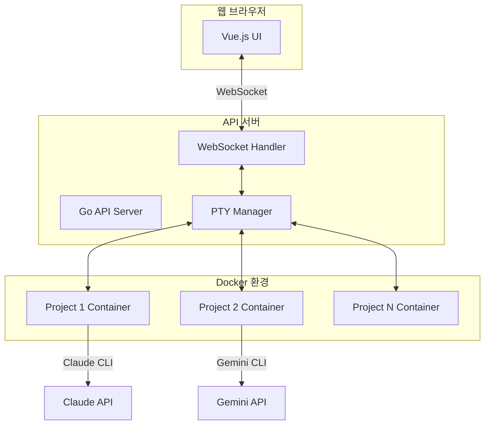

# AICode Manager (aicli-web)

[](https://go.dev/)
[](https://github.com/moonklabs/aicli-web/actions)
[](LICENSE)
[](https://goreportcard.com/report/github.com/moonklabs/aicli-web)
[](https://www.docker.com/)
[](https://github.com/moonklabs/aicli-web)

AICode Manager는 Claude CLI를 웹 플랫폼으로 관리하는 로컬 우선 시스템입니다. Go 언어로 개발된 네이티브 CLI 도구를 중심으로 각 프로젝트별 격리된 Docker 컨테이너에서 Claude CLI를 실행하고 관리합니다.

## 🎯 핵심 기능

### 웹 터미널 인터페이스
- 🖥️ **실시간 터미널 에뮬레이터**: 브라우저에서 직접 CLI 제어
- 🔄 **PTY/WebSocket 스트리밍**: 실시간 양방향 통신
- 📝 **ANSI 이스케이프 시퀀스 지원**: 완벽한 터미널 경험
- 🎨 **테마 및 폰트 커스터마이징**: 개인화된 개발 환경

### Docker 통합
- 🐳 **격리된 실행 환경**: 프로젝트별 독립 컨테이너
- 📦 **자동 이미지 관리**: Claude CLI 버전별 이미지 빌드
- 🔧 **볼륨 마운트**: 로컬 프로젝트와 실시간 동기화
- 🌐 **네트워크 격리**: 안전한 프로젝트 간 분리

### 프로세스 관리
- 🚀 **Claude/Gemini CLI 래핑**: 다양한 AI CLI 도구 지원
- 📊 **세션 관리**: 생명주기 추적 및 제어
- 🔄 **자동 재시작**: 오류 복구 및 안정성 보장
- 📈 **리소스 모니터링**: CPU/메모리 사용량 추적

## 목차

- [빠른 시작](#-빠른-시작)
- [아키텍처](#-아키텍처)
- [설치 방법](#-설치-방법)
- [사용법](#-사용법)
- [Docker 배포](#-docker-배포)
- [개발 가이드](#-개발-가이드)
- [테스트](#-테스트)
- [API 문서](#-api-문서)
- [기여하기](#-기여하기)

## 🚀 빠른 시작

### Docker Compose로 1분 안에 시작하기

```bash
# 1. 프로젝트 클론
git clone https://github.com/moonklabs/aicli-web.git
cd aicli-web

# 2. 환경 설정
cp .env.example .env
# .env 파일에서 CLAUDE_API_KEY 설정

# 3. Docker Compose 실행
docker-compose -f docker-compose.prod.yml up -d

# 4. 웹 UI 접속
open http://localhost:3000
```

### 로컬 개발 환경

```bash
# Go 백엔드 실행
make run-api

# Vue 프론트엔드 실행 (다른 터미널)
cd web && pnpm dev
```

## 🏗️ 아키텍처



### 핵심 컴포넌트

| 컴포넌트 | 기술 스택 | 역할 |
|---------|----------|------|
| **API 서버** | Go + Gin | RESTful API, 비즈니스 로직 |
| **WebSocket** | Gorilla WebSocket | 실시간 통신, PTY 스트리밍 |
| **PTY Manager** | creack/pty | 터미널 에뮬레이션 |
| **Docker Integration** | Docker SDK | 컨테이너 생명주기 관리 |
| **Web UI** | Vue 3 + TypeScript | 사용자 인터페이스 |
| **터미널 컴포넌트** | xterm.js | 웹 터미널 에뮬레이터 |

## 📦 설치 방법

### 사전 요구사항

- Go 1.21+
- Docker 20.10+
- Node.js 18+
- pnpm 8+

### 소스에서 빌드

```bash
# 전체 빌드
make build-all

# 플랫폼별 빌드
make build-linux
make build-darwin
make build-windows
```

### Docker 이미지 빌드

```bash
# 프로덕션 이미지 빌드
docker build -f Dockerfile.prod -t aicli-web:latest .

# 개발 환경 이미지
docker-compose build
```

## 💻 사용법

### CLI 명령어

```bash
# Claude 세션 시작
aicli claude run "Hello, Claude!"

# 세션 관리
aicli claude session list
aicli claude session stop <session-id>

# 워크스페이스 관리
aicli workspace create --name "my-project"
aicli workspace list
aicli workspace attach <workspace-id>
```

### API 엔드포인트

```bash
# 세션 생성
POST /api/v1/sessions
{
  "workspace_id": "ws-123",
  "command": "claude",
  "args": ["--model", "claude-3"]
}

# WebSocket 연결 (터미널 스트리밍)
WS /api/v1/ws/terminal/<session-id>

# 세션 상태 조회
GET /api/v1/sessions/<session-id>
```

## 🐳 Docker 배포

### 프로덕션 배포

```bash
# 배포 스크립트 실행
./scripts/deploy.sh

# 또는 수동 배포
docker-compose -f docker-compose.prod.yml up -d
```

### 환경 변수 설정

```env
# 필수 설정
CLAUDE_API_KEY=your-api-key
JWT_SECRET=your-jwt-secret

# 선택 설정
API_PORT=8080
WEB_PORT=3000
LOG_LEVEL=info
```

자세한 배포 가이드는 [Docker 배포 가이드](docs/DOCKER_DEPLOYMENT_GUIDE.md)를 참조하세요.

## 🧪 테스트

### 테스트 실행

```bash
# 단위 테스트
make test

# 통합 테스트
make test-integration

# 커버리지 리포트
make test-coverage

# E2E 테스트
cd web && pnpm test:e2e
```

### 테스트 커버리지

- **백엔드 (Go)**: 목표 80% 이상
- **프론트엔드 (Vue)**: 목표 85% 이상 (현재 달성)
- **E2E 테스트**: 주요 사용자 플로우 100% 커버

## 📚 API 문서

### Swagger/OpenAPI

API 서버 실행 후:
- Swagger UI: http://localhost:8080/swagger/index.html
- OpenAPI Spec: http://localhost:8080/swagger/doc.json

### 주요 API 그룹

- `/api/v1/auth/*` - 인증 관련
- `/api/v1/sessions/*` - 세션 관리
- `/api/v1/workspaces/*` - 워크스페이스 관리
- `/api/v1/ws/*` - WebSocket 연결

## 🔧 개발 가이드

### 프로젝트 구조

```
aicli-web/
├── cmd/                 # 엔트리포인트
│   ├── aicli/          # CLI 도구
│   └── api/            # API 서버
├── internal/           # 내부 패키지
│   ├── api/            # API 핸들러
│   ├── claude/         # Claude CLI 통합
│   ├── docker/         # Docker 관리
│   ├── pty/            # PTY 세션 관리
│   └── websocket/      # WebSocket 처리
├── web/                # Vue.js 프론트엔드
│   ├── src/
│   │   ├── components/ # Vue 컴포넌트
│   │   ├── views/      # 페이지 뷰
│   │   └── stores/     # Pinia 스토어
│   └── tests/          # 프론트엔드 테스트
├── docker/             # Docker 설정
├── docs/               # 문서
└── scripts/            # 유틸리티 스크립트
```

### 코딩 컨벤션

- Go: 표준 Go 포맷팅 (`gofmt`, `golangci-lint`)
- TypeScript: ESLint + Prettier
- 커밋 메시지: Conventional Commits

### 개발 워크플로우

1. 기능 브랜치 생성: `git checkout -b feature/your-feature`
2. 변경사항 구현 및 테스트
3. 커밋: `git commit -m "feat: add new feature"`
4. PR 생성 및 리뷰

## 🤝 기여하기

프로젝트에 기여해 주셔서 감사합니다! 다음 가이드라인을 따라주세요:

1. 이슈를 먼저 생성하여 논의
2. Fork 후 기능 브랜치 생성
3. 테스트 작성 및 통과 확인
4. PR 생성 시 상세한 설명 포함

자세한 내용은 [CONTRIBUTING.md](CONTRIBUTING.md)를 참조하세요.

## 📄 라이선스

이 프로젝트는 MIT 라이선스 하에 배포됩니다. 자세한 내용은 [LICENSE](LICENSE) 파일을 참조하세요.

## 🙏 감사의 말

- [Anthropic](https://www.anthropic.com) - Claude API
- [Google](https://ai.google.dev) - Gemini API
- 모든 오픈소스 기여자들

---

**문서 버전**: 2.0.0 | **최종 업데이트**: 2025-08-10