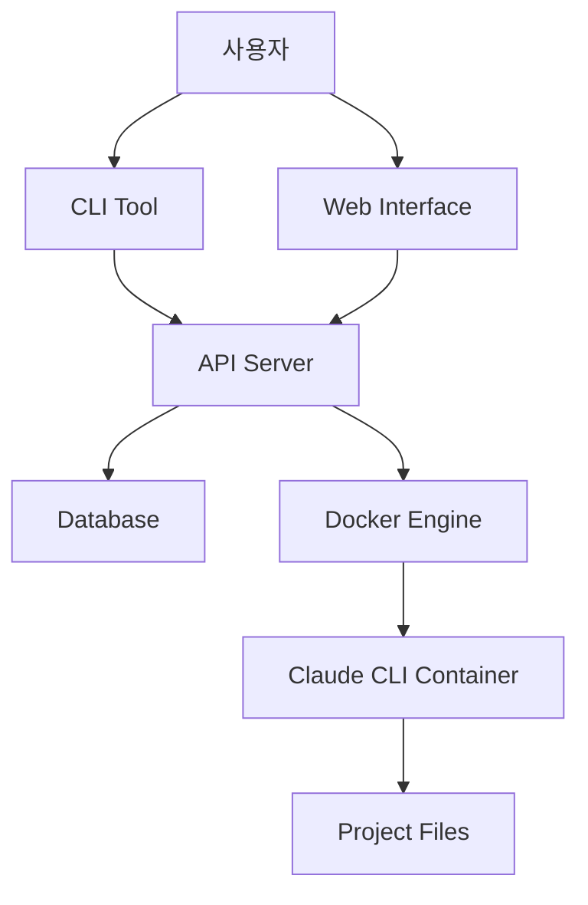

# 아키텍처 문서

## 시스템 개요

AICode Manager는 Claude CLI를 웹 플랫폼으로 관리하는 시스템으로, Go 언어로 개발된 네이티브 CLI 도구와 API 서버로 구성됩니다.

## 핵심 컴포넌트

### 1. CLI 도구 (aicli)
- **역할**: 사용자 인터페이스 및 로컬 작업 관리
- **기술**: Cobra + Viper
- **기능**:
  - 워크스페이스 관리
  - 태스크 생성 및 관리
  - 로그 조회
  - 설정 관리

### 2. API 서버 (aicli-api)
- **역할**: 중앙화된 관리 및 웹 인터페이스
- **기술**: Gin + SQLite/BoltDB
- **기능**:
  - RESTful API 제공
  - 실시간 통신 (WebSocket)
  - 워크스페이스 관리
  - 태스크 스케줄링

### 3. Claude CLI 래퍼
- **역할**: Claude CLI 프로세스 관리
- **기술**: Docker SDK
- **기능**:
  - 격리된 실행 환경
  - 프로세스 생명주기 관리
  - 로그 스트리밍

## 아키텍처 패턴

### 레이어드 아키텍처
```
┌─────────────────────┐
│   Presentation      │  ← CLI / Web Interface
├─────────────────────┤
│   Application       │  ← Business Logic
├─────────────────────┤
│   Domain            │  ← Core Models
├─────────────────────┤
│   Infrastructure    │  ← Database / Docker
└─────────────────────┘
```

### 마이크로서비스 지향
- CLI와 API 서버의 독립적 배포
- Docker 기반 격리
- 수평 확장 가능

## 데이터 플로우



## 디렉토리 구조

```
aicli-web/
├── cmd/                    # 실행 가능한 프로그램
│   ├── aicli/             # CLI 도구
│   └── api/               # API 서버
├── internal/              # 내부 패키지
│   ├── cli/               # CLI 구현
│   ├── server/            # API 서버 구현
│   ├── middleware/        # 미들웨어
│   ├── claude/            # Claude 통합
│   ├── docker/            # Docker SDK
│   ├── storage/           # 데이터 저장소
│   └── models/            # 도메인 모델
├── pkg/                   # 외부 공개 패키지
│   ├── version/           # 버전 관리
│   └── utils/             # 유틸리티
├── api/                   # API 핸들러
│   ├── handlers/          # HTTP 핸들러
│   └── controllers/       # 컨트롤러
├── web/                   # 웹 프론트엔드
├── docs/                  # 문서
├── test/                  # 테스트
└── deployments/           # 배포 설정
```

## 기술 스택

### Backend
- **언어**: Go 1.21+
- **웹 프레임워크**: Gin
- **CLI 프레임워크**: Cobra
- **설정 관리**: Viper
- **데이터베이스**: SQLite/BoltDB

### 컨테이너화
- **런타임**: Docker
- **오케스트레이션**: Docker Compose
- **이미지**: Alpine Linux 기반

### 개발 도구
- **빌드**: Make
- **테스트**: Go testing + testify
- **린팅**: golangci-lint
- **보안**: gosec

## 보안 고려사항

### 1. 컨테이너 격리
- 각 워크스페이스는 독립된 컨테이너에서 실행
- 네트워크 격리 및 리소스 제한
- 루트 권한 없는 실행

### 2. API 보안
- 미들웨어 기반 보안 헤더
- CORS 정책 관리
- 요청 ID 추적
- 입력 유효성 검사

### 3. 데이터 보호
- API 키 암호화 저장
- 로그 민감 정보 마스킹
- 설정 파일 권한 관리

## 성능 최적화

### 1. 빌드 최적화
- 멀티 스테이지 Docker 빌드
- 바이너리 크기 최소화 (`-ldflags "-s -w"`)
- 빌드 캐시 활용

### 2. 런타임 최적화
- 커넥션 풀링
- 요청 캐싱
- 비동기 처리

### 3. 리소스 관리
- 컨테이너 리소스 제한
- 메모리 프로파일링
- GC 튜닝

## 확장성

### 수평 확장
- 상태 비저장 API 서버
- 로드 밸런서 지원
- 데이터베이스 샤딩

### 수직 확장
- 멀티코어 활용
- 메모리 최적화
- I/O 병렬 처리

## 모니터링 및 로깅

### 로깅 전략
- 구조화된 JSON 로깅
- 로그 레벨 관리
- 요청 ID 추적

### 메트릭
- 시스템 리소스 모니터링
- API 응답 시간
- 에러율 추적

### 알람
- 시스템 장애 감지
- 리소스 임계치 초과
- 보안 이벤트

## 배포 전략

### 개발 환경
- Hot reload (Air)
- 로컬 Docker Compose
- 테스트 자동화

### 프로덕션 환경
- Blue-Green 배포
- 헬스체크 기반 롤링 업데이트
- 백업 및 복구 전략

## 미래 확장 계획

### 단기 (3개월)
- WebSocket 실시간 통신
- 사용자 인증 시스템
- 프론트엔드 대시보드

### 중기 (6개월)
- 플러그인 시스템
- 워크플로우 자동화
- 성능 모니터링

### 장기 (1년)
- 멀티 테넌트 지원
- AI 기반 최적화
- 클라우드 네이티브 배포

## 참고 문서

- [API 문서](./api/README.md)
- [개발 가이드](./development/README.md)
- [배포 가이드](../deployments/README.md)
- [보안 가이드](./SECURITY.md)