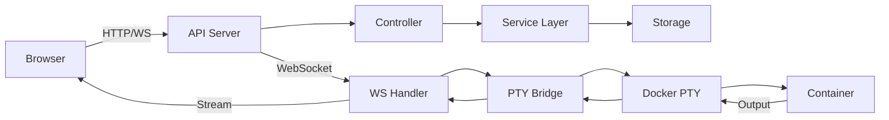

# 프로젝트 구조 상세 가이드

## 📂 디렉토리 구조

```
aicli-web/
├── .aiwf/                      # AI 워크플로우 관리
│   ├── 00_PROJECT_MANIFEST.md  # 프로젝트 매니페스트
│   ├── 03_SPRINTS/            # 스프린트 태스크
│   ├── 04_GENERAL_TASKS/      # 일반 태스크
│   └── 10_STATE_OF_PROJECT/   # 프로젝트 상태 문서
│
├── cmd/                        # 애플리케이션 엔트리포인트
│   ├── aicli/                 # CLI 도구 메인
│   │   └── main.go           # CLI 엔트리포인트
│   └── api/                   # API 서버 메인
│       └── main.go           # API 서버 엔트리포인트
│
├── internal/                   # 내부 패키지 (외부 노출 X)
│   ├── api/                   # API 관련 코드
│   │   ├── controllers/      # HTTP 컨트롤러
│   │   ├── middleware/       # 미들웨어
│   │   ├── routes/           # 라우팅 설정
│   │   └── websocket/        # WebSocket 핸들러
│   │
│   ├── claude/                # Claude CLI 통합
│   │   ├── process_manager.go # 프로세스 관리
│   │   ├── session_manager.go # 세션 관리
│   │   └── pool.go           # 연결 풀 관리
│   │
│   ├── docker/                # Docker 통합
│   │   ├── client.go         # Docker 클라이언트
│   │   ├── container.go      # 컨테이너 관리
│   │   └── volume.go         # 볼륨 관리
│   │
│   ├── pty/                   # PTY (Pseudo Terminal) 관리
│   │   ├── session.go        # PTY 세션
│   │   ├── docker.go         # Docker PTY 통합
│   │   └── pool.go           # PTY 풀 관리
│   │
│   ├── websocket/             # WebSocket 구현
│   │   ├── hub.go            # WebSocket 허브
│   │   ├── client.go         # 클라이언트 연결
│   │   ├── stream.go         # 스트리밍 관리
│   │   ├── pty_bridge.go     # PTY-WebSocket 브리지
│   │   └── pty_handler.go    # PTY 핸들러
│   │
│   ├── storage/               # 데이터 저장소
│   │   ├── sqlite/           # SQLite 구현
│   │   ├── postgres/         # PostgreSQL 구현
│   │   └── interfaces.go     # 저장소 인터페이스
│   │
│   ├── auth/                  # 인증/인가
│   │   ├── jwt.go            # JWT 토큰 관리
│   │   ├── oauth2.go         # OAuth2 통합
│   │   └── middleware.go     # 인증 미들웨어
│   │
│   ├── session/               # 세션 관리
│   │   ├── manager.go        # 세션 매니저
│   │   ├── store.go          # 세션 저장소
│   │   └── pool.go           # 세션 풀
│   │
│   └── agent/                 # 에이전트 시스템
│       ├── coordinator.go    # 에이전트 조정자
│       ├── worker.go         # 워커 에이전트
│       └── docker_adapter.go # Docker 어댑터
│
├── pkg/                        # 외부 패키지 (재사용 가능)
│   ├── version/               # 버전 정보
│   ├── logger/                # 로깅 유틸리티
│   ├── errors/                # 에러 처리
│   └── utils/                 # 공통 유틸리티
│
├── web/                        # Vue.js 프론트엔드
│   ├── src/
│   │   ├── components/        # Vue 컴포넌트
│   │   │   ├── Terminal/     # 터미널 컴포넌트
│   │   │   │   ├── TerminalEmulator.vue
│   │   │   │   ├── TerminalInterface.vue
│   │   │   │   └── TerminalControls.vue
│   │   │   ├── Workspace/    # 워크스페이스 컴포넌트
│   │   │   └── ui/           # UI 컴포넌트
│   │   │
│   │   ├── views/             # 페이지 뷰
│   │   │   ├── Home.vue
│   │   │   ├── Dashboard.vue
│   │   │   └── Settings.vue
│   │   │
│   │   ├── stores/            # Pinia 상태 관리
│   │   │   ├── auth.ts
│   │   │   ├── session.ts
│   │   │   └── workspace.ts
│   │   │
│   │   ├── composables/       # Vue Composables
│   │   │   ├── useWebSocket.ts
│   │   │   ├── useTerminal.ts
│   │   │   └── useAuth.ts
│   │   │
│   │   ├── api/               # API 클라이언트
│   │   │   ├── client.ts
│   │   │   ├── auth.ts
│   │   │   └── session.ts
│   │   │
│   │   └── utils/             # 유틸리티 함수
│   │       ├── websocket.ts
│   │       └── format.ts
│   │
│   ├── tests/                 # 테스트
│   │   ├── unit/             # 단위 테스트
│   │   ├── integration/      # 통합 테스트
│   │   └── e2e/              # E2E 테스트
│   │
│   └── vitest.config.ts       # 테스트 설정
│
├── docker/                     # Docker 설정
│   ├── Dockerfile             # 개발용 Dockerfile
│   ├── Dockerfile.prod        # 프로덕션 Dockerfile
│   └── docker-compose.yml     # Docker Compose 설정
│
├── docs/                       # 문서
│   ├── API.md                 # API 문서
│   ├── DOCKER_DEPLOYMENT_GUIDE.md # Docker 배포 가이드
│   └── PROJECT_STRUCTURE.md   # 이 문서
│
├── scripts/                    # 빌드/배포 스크립트
│   ├── build.sh               # 빌드 스크립트
│   ├── deploy.sh              # 배포 스크립트
│   └── test.sh                # 테스트 스크립트
│
├── test/                       # 통합 테스트
│   ├── integration/           # 통합 테스트
│   │   └── pty_streaming/    # PTY 스트리밍 테스트
│   └── e2e/                   # E2E 테스트
│
├── .github/                    # GitHub 설정
│   └── workflows/             # GitHub Actions
│       ├── ci.yml            # CI 파이프라인
│       └── release.yml       # 릴리즈 파이프라인
│
├── Makefile                    # 빌드 자동화
├── go.mod                      # Go 모듈 정의
├── go.sum                      # Go 의존성 잠금
├── package.json                # Node.js 패키지 정의
├── pnpm-lock.yaml             # pnpm 의존성 잠금
├── README.md                   # 프로젝트 README
├── CLAUDE.md                  # Claude Code 가이드
└── LICENSE                     # 라이선스

```

## 🏗️ 주요 컴포넌트 설명

### Backend (Go)

#### `/cmd`
- **용도**: 애플리케이션 엔트리포인트
- **특징**: 최소한의 코드만 포함, 실제 로직은 `/internal`에 구현

#### `/internal`
- **용도**: 내부 패키지 (외부에서 import 불가)
- **주요 패키지**:
  - `api`: RESTful API 구현
  - `claude`: Claude CLI 래퍼 및 프로세스 관리
  - `docker`: Docker 컨테이너 관리
  - `pty`: 터미널 에뮬레이션
  - `websocket`: 실시간 통신

#### `/pkg`
- **용도**: 재사용 가능한 외부 패키지
- **특징**: 다른 프로젝트에서도 사용 가능한 범용 코드

### Frontend (Vue.js)

#### `/web/src/components`
- **Terminal**: 웹 터미널 에뮬레이터 컴포넌트
- **Workspace**: 워크스페이스 관리 UI
- **ui**: 공통 UI 컴포넌트

#### `/web/src/stores`
- **용도**: Pinia를 사용한 전역 상태 관리
- **주요 스토어**: auth, session, workspace

#### `/web/src/composables`
- **용도**: Vue 3 Composition API 재사용 로직
- **예시**: useWebSocket, useTerminal

## 🔄 데이터 플로우



## 🧪 테스트 구조

### 백엔드 테스트
- **단위 테스트**: `*_test.go` 파일
- **통합 테스트**: `*_integration_test.go` 파일
- **벤치마크**: `*_benchmark_test.go` 파일

### 프론트엔드 테스트
- **단위 테스트**: `*.test.ts` 파일
- **컴포넌트 테스트**: `*.spec.ts` 파일
- **E2E 테스트**: `/web/tests/e2e/` 디렉토리

## 📝 명명 규칙

### Go 코드
- **파일명**: `snake_case.go`
- **패키지명**: 소문자, 단수형
- **인터페이스**: `~er` 접미사 (예: `Reader`, `Writer`)
- **구조체**: PascalCase

### TypeScript/Vue
- **컴포넌트**: PascalCase (예: `TerminalEmulator.vue`)
- **함수/변수**: camelCase
- **상수**: UPPER_SNAKE_CASE
- **타입/인터페이스**: PascalCase

## 🔐 보안 구조

### 인증 계층
1. **JWT 토큰**: API 인증
2. **Session Cookie**: 웹 세션
3. **WebSocket Token**: 실시간 연결 인증

### 격리 계층
1. **Docker 컨테이너**: 프로젝트별 격리
2. **네트워크 격리**: 컨테이너 간 통신 제한
3. **볼륨 격리**: 파일시스템 접근 제한

## 🚀 빌드 & 배포

### 개발 환경
```bash
# 백엔드
make dev

# 프론트엔드
cd web && pnpm dev
```

### 프로덕션 빌드
```bash
# 전체 빌드
make build-all

# Docker 이미지
docker build -f Dockerfile.prod -t aicli-web:latest .
```

### 배포
```bash
# Docker Compose
docker-compose -f docker-compose.prod.yml up -d

# 자동 배포 스크립트
./scripts/deploy.sh
```

---

**문서 버전**: 1.0.0 | **최종 업데이트**: 2025-08-10