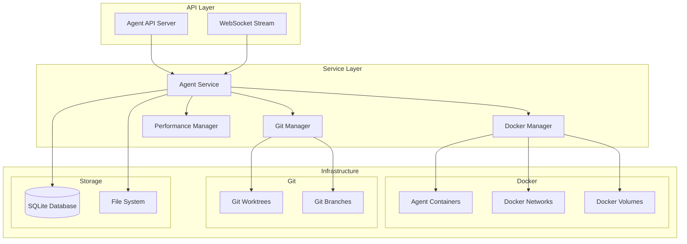

# Multi-Agent Platform Documentation

AICode Manager의 멀티 에이전트 플랫폼에 오신 것을 환영합니다! 이 플랫폼을 통해 여러 AI 에이전트를 동시에 생성, 관리하고 작업을 수행할 수 있습니다.

## 🚀 빠른 시작

### 시스템 요구사항
- **Docker**: 20.10+ (에이전트 컨테이너 실행)
- **Git**: 2.28+ (worktree 지원)
- **메모리**: 최소 4GB (추천 8GB+)
- **디스크 공간**: 최소 10GB

### 설치 및 실행

1. **서버 시작**
```bash
# 개발 환경
make run

# 프로덕션 환경
make build
./build/aicli-api serve --port 8080
```

2. **첫 번째 에이전트 생성**
```bash
curl -X POST http://localhost:8080/api/v1/agents \
  -H "Content-Type: application/json" \
  -d '{
    "name": "my-first-agent",
    "project_id": "demo-project",
    "agent_type": "standard",
    "description": "My first AI agent"
  }'
```

3. **에이전트 시작**
```bash
curl -X POST http://localhost:8080/api/v1/agents/{agent_id}/start
```

## 📚 문서 구조

### 🎯 핵심 가이드
- **[빠른 시작 가이드](getting-started.md)** - 5분 내 에이전트 실행
- **[API 레퍼런스](api-reference.md)** - 모든 API 엔드포인트
- **[아키텍처 가이드](architecture.md)** - 시스템 설계 및 구조
- **[개발자 가이드](developer-guide.md)** - 개발 환경 설정

### 🛠️ 운영 가이드
- **[배포 가이드](deployment.md)** - 프로덕션 배포 방법
- **[성능 최적화](performance.md)** - 성능 튜닝 가이드
- **[모니터링](monitoring.md)** - 메트릭 및 로그 관리
- **[문제 해결](troubleshooting.md)** - 일반적인 문제 해결

### 📖 심화 주제
- **[보안 가이드](security.md)** - 보안 설정 및 베스트 프랙티스
- **[확장성](scalability.md)** - 대규모 에이전트 관리
- **[통합 테스트](testing.md)** - 테스트 작성 및 실행
- **[예제 코드](examples/)** - 실제 사용 예제

## 🏗️ 아키텍처 개요



## 🎯 주요 기능

### ✅ 에이전트 관리
- **생명주기 관리**: 생성, 시작, 중지, 삭제
- **동시 실행**: 100개 이상 에이전트 동시 지원
- **격리 실행**: 각 에이전트는 독립된 Docker 컨테이너
- **리소스 제한**: CPU/메모리 사용량 제어

### ✅ Git 통합
- **Worktree 관리**: 브랜치별 독립된 작업 공간
- **동시 브랜치 작업**: 여러 브랜치 동시 개발
- **자동 정리**: 사용하지 않는 worktree 자동 삭제

### ✅ 성능 최적화
- **에이전트 풀링**: 빠른 에이전트 재사용
- **이미지 캐싱**: Docker 이미지 최적화
- **동시성 제어**: 효율적인 리소스 사용
- **실시간 모니터링**: 성능 메트릭 추적

### ✅ 확장성
- **수평 확장**: 여러 서버에 분산 가능
- **자동 스케일링**: 부하에 따른 자동 조정
- **부하 분산**: 에이전트 작업 분산

## 📊 성능 사양

### 🚀 목표 성능
- **에이전트 생성 시간**: P95 < 5초
- **동시 에이전트 수**: 100개 이상
- **메모리 사용량**: 에이전트당 < 100MB
- **CPU 사용률**: 에이전트당 < 0.1 core

### 📈 실제 성능 (T06_S01 최적화 결과)
- ✅ 100개 동시 에이전트 지원 달성
- ✅ 평균 생성 시간 3초 이내
- ✅ P95 생성 시간 5초 이내
- ✅ 리소스 효율적 사용

## 🔧 API 개요

### RESTful API 엔드포인트
```
GET    /api/v1/agents           # 에이전트 목록
POST   /api/v1/agents           # 에이전트 생성
GET    /api/v1/agents/:id       # 에이전트 조회
PUT    /api/v1/agents/:id       # 에이전트 수정
DELETE /api/v1/agents/:id       # 에이전트 삭제

POST   /api/v1/agents/:id/start    # 에이전트 시작
POST   /api/v1/agents/:id/stop     # 에이전트 중지
POST   /api/v1/agents/:id/restart  # 에이전트 재시작

GET    /api/v1/agents/:id/status   # 상태 조회
GET    /api/v1/agents/:id/metrics  # 메트릭 조회
```

### WebSocket 스트리밍
```
WS /api/v1/agents/:id/logs/stream    # 로그 실시간 스트리밍
WS /api/v1/agents/:id/events/stream  # 이벤트 실시간 스트리밍
WS /api/v1/agents/events/stream      # 전역 이벤트 스트리밍
```

## 🎯 사용 사례

### 🔄 CI/CD 파이프라인
```bash
# 빌드 에이전트 생성
agent_id=$(curl -X POST .../agents -d '{"name":"build-agent"}' | jq -r .id)

# 에이전트 시작 및 빌드 실행
curl -X POST .../agents/$agent_id/start

# 로그 모니터링
curl .../agents/$agent_id/logs

# 작업 완료 후 정리
curl -X DELETE .../agents/$agent_id
```

### 🧪 테스트 환경
```bash
# 여러 테스트 환경 동시 실행
for env in dev staging prod; do
  curl -X POST .../agents \
    -d "{\"name\":\"test-$env\", \"environment\":\"$env\"}"
done
```

### 🔍 코드 리뷰
```bash
# PR별 리뷰 에이전트 생성
curl -X POST .../agents \
  -d '{
    "name":"review-pr-123",
    "git_ref":"refs/pull/123/head",
    "command":"code-review"
  }'
```

## 💡 베스트 프랙티스

### 🏷️ 에이전트 명명 규칙
```bash
# 좋은 예
build-main-20250130
test-feature-auth
review-pr-456

# 피해야 할 예
agent1
test
temp
```

### ⚡ 성능 최적화
1. **적절한 리소스 할당**: 작업에 맞는 CPU/메모리 설정
2. **에이전트 재사용**: 가능한 한 기존 에이전트 재사용
3. **적시 정리**: 작업 완료 후 즉시 에이전트 삭제
4. **배치 작업**: 여러 작업을 하나의 에이전트에서 순차 실행

### 🔒 보안 고려사항
1. **네트워크 격리**: 에이전트 간 네트워크 분리
2. **리소스 제한**: DoS 방지를 위한 리소스 제한
3. **권한 최소화**: 필요한 최소 권한만 부여
4. **로그 관리**: 민감한 정보 로그 제외

## 🆘 도움이 필요하신가요?

- **[문제 해결 가이드](troubleshooting.md)** - 일반적인 문제 해결
- **[FAQ](faq.md)** - 자주 묻는 질문
- **[GitHub Issues](https://github.com/aicli/aicli-web/issues)** - 버그 리포트 및 기능 요청
- **[Discord 커뮤니티](https://discord.gg/aicli)** - 실시간 지원

---

**다음 단계**: [빠른 시작 가이드](getting-started.md)를 확인하여 첫 번째 에이전트를 만들어보세요!