# Multi-Agent Platform 아키텍처

AICode Manager의 Multi-Agent Platform의 전체 아키텍처와 설계 원칙을 설명합니다.

## 시스템 개요

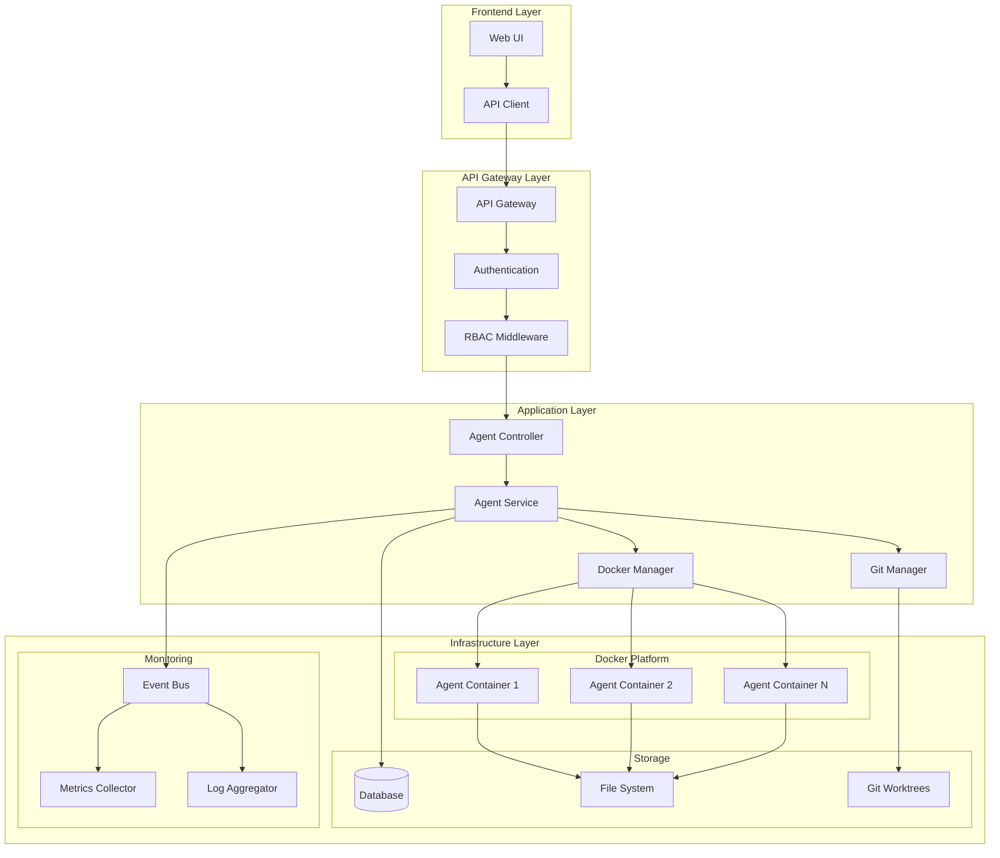

## 핵심 컴포넌트

### 1. Agent Controller (API Layer)

**역할**: HTTP API 엔드포인트 처리
- RESTful API 제공
- 요청 검증 및 응답 형식화
- WebSocket 연결 관리
- 인증/권한 검증

**주요 기능**:
- CRUD 작업 처리
- 실시간 스트리밍 (로그, 이벤트)
- 배치 작업 조정
- 에러 핸들링

### 2. Agent Service (Business Logic Layer)

**역할**: 에이전트 비즈니스 로직 처리
- 에이전트 생명주기 관리
- 상태 추적 및 업데이트
- 리소스 할당 및 해제
- 이벤트 발행

**주요 기능**:
```go
type AgentService interface {
    CreateAgent(ctx context.Context, req CreateAgentRequest) (*Agent, error)
    StartAgent(ctx context.Context, agentID string) error
    StopAgent(ctx context.Context, agentID string) error
    GetAgentStatus(ctx context.Context, agentID string) (*AgentStatus, error)
    GetAgentMetrics(ctx context.Context, agentID string) (*AgentMetrics, error)
    ListActiveAgents(ctx context.Context) ([]*Agent, error)
}
```

### 3. Docker Manager

**역할**: Docker 컨테이너 관리
- 컨테이너 생성/시작/중지/삭제
- 리소스 제한 설정
- 헬스체크 및 모니터링
- 네트워크 격리

**아키텍처**:
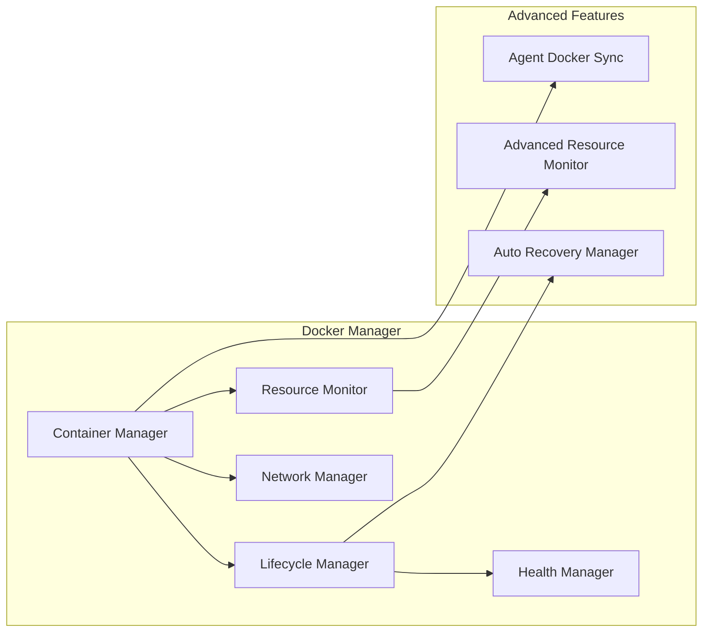

### 4. Git Manager

**역할**: Git 저장소 및 worktree 관리
- 저장소 복제 및 업데이트
- Git worktree 생성/관리
- 브랜치 전환 및 동기화
- 변경사항 추적

**구조**:
```
/workspaces/
├── agent-123/          # Agent 전용 worktree
│   ├── .git/           # Git 메타데이터
│   ├── src/            # 소스 코드
│   └── ...
├── agent-456/
└── shared/
    └── base-repo.git/  # 원본 저장소
```

### 5. Event Bus

**역할**: 시스템 간 이벤트 통신
- 비동기 이벤트 발행/구독
- 이벤트 라우팅 및 필터링
- 이벤트 히스토리 관리

**이벤트 타입**:
- `AgentCreated`
- `AgentStarted`
- `AgentStopped`
- `AgentError`
- `ContainerHealthChanged`
- `ResourceThresholdExceeded`

## 에이전트 생명주기

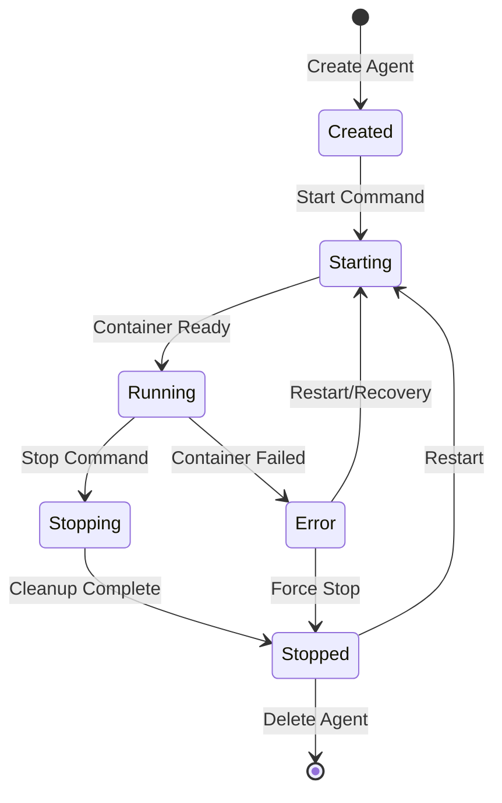

### 상태별 처리 과정

1. **Created → Starting**
   - Docker 이미지 pull
   - Git worktree 생성
   - 환경 변수 설정
   - 컨테이너 생성

2. **Starting → Running**
   - 컨테이너 시작
   - 헬스체크 통과
   - Claude CLI 초기화
   - 이벤트 발행

3. **Running → Stopping**
   - 작업 완료 신호
   - 컨테이너 graceful shutdown
   - 리소스 정리
   - 로그 수집

4. **Error Handling**
   - 자동 복구 시도
   - 컨테이너 재시작
   - 알림 발송
   - 메트릭 기록

## 리소스 관리

### 컨테이너 리소스 제한

```yaml
resources:
  cpu_quota: 100000      # 1 CPU core
  memory_limit: 2GB      # 2GB RAM
  pids_limit: 1000       # Process limit
  disk_io_limit: 100MB/s # Disk I/O limit
```

### 네트워크 격리

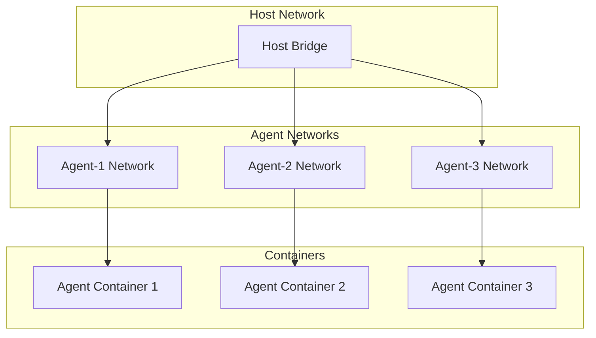

### 스토리지 관리

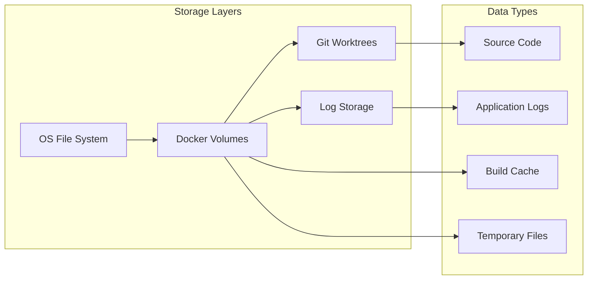

## 모니터링 및 메트릭

### 메트릭 수집 아키텍처

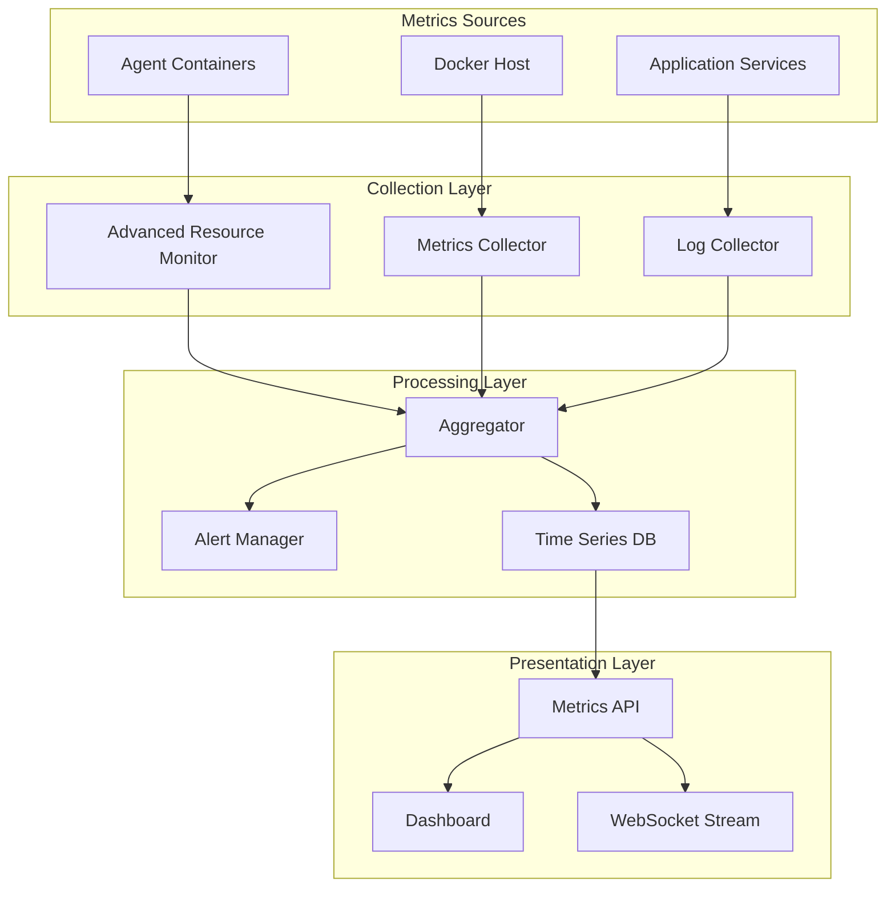

### 수집 메트릭

**시스템 메트릭**:
- CPU 사용률 (current, average, peak)
- 메모리 사용량 (usage, limit, percentage)
- 네트워크 I/O (rx/tx bytes, rate)
- 디스크 I/O (read/write ops, rate)

**애플리케이션 메트릭**:
- 에이전트 상태 변경 횟수
- API 요청 처리 시간
- 에러 발생률
- 동시 활성 에이전트 수

**비즈니스 메트릭**:
- 에이전트 생성/삭제 빈도
- 평균 작업 완료 시간
- 리소스 효율성 지표

## 보안 아키텍처

### 인증 및 권한

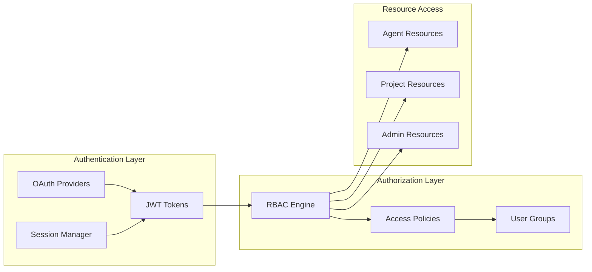

### 컨테이너 보안

- **격리**: 각 에이전트는 독립된 네트워크에서 실행
- **리소스 제한**: CPU, 메모리, 프로세스 수 제한
- **읽기 전용 파일시스템**: 불필요한 쓰기 권한 제거
- **보안 스캐닝**: 컨테이너 이미지 정기 스캔

## 확장성 및 성능

### 수평적 확장

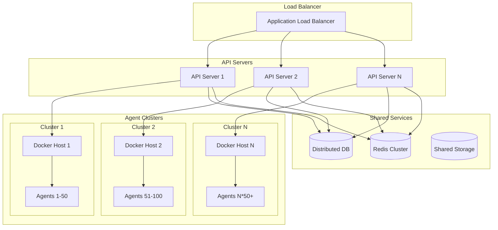

### 성능 최적화

**컨테이너 풀링**:
- 미리 준비된 컨테이너 재사용
- 시작 시간 단축 (5초 → 1초)
- 리소스 효율성 향상

**이미지 캐싱**:
- 레이어 기반 캐싱
- 공통 베이스 이미지 활용
- 네트워크 대역폭 절약

**데이터베이스 최적화**:
- 읽기 복제본 활용
- 쿼리 최적화
- 적절한 인덱싱

## 데이터 흐름

### 에이전트 생성 플로우

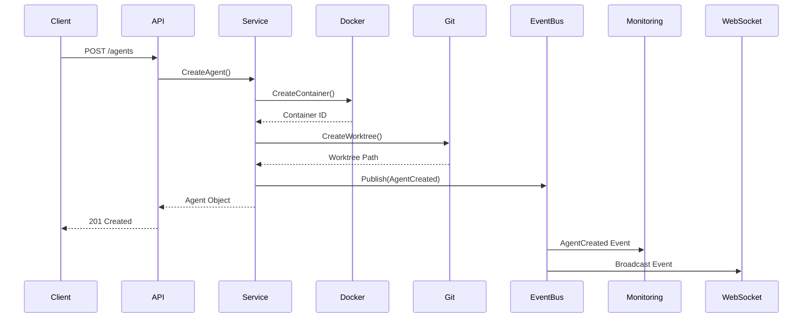

### 메트릭 수집 플로우

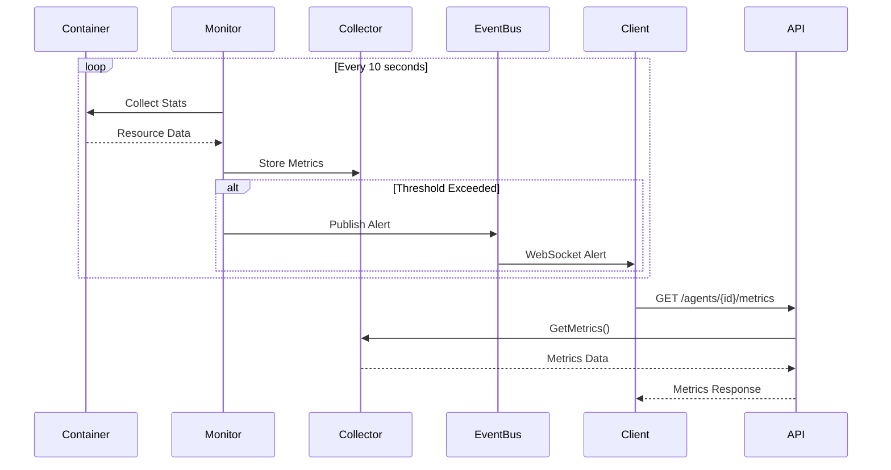

## 장애 복구

### 자동 복구 전략

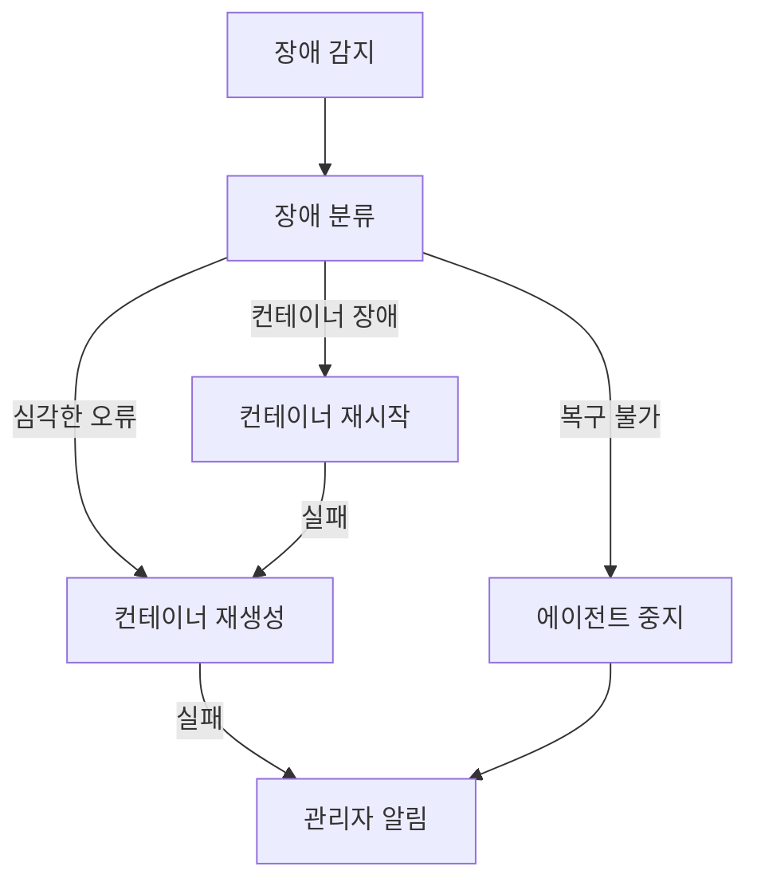

### 복구 정책

**재시작 정책**:
- 최대 재시도 횟수: 3회
- 재시도 간격: 30초, 60초, 120초
- 백오프 전략: 지수적 증가

**헬스체크**:
- 간격: 30초
- 타임아웃: 10초
- 연속 실패 허용: 3회

## 배포 아키텍처

### 개발 환경

```yaml
version: '3.8'
services:
  api:
    image: aicli-api:dev
    ports: ["8080:8080"]
    environment:
      - ENV=development
      - DB_URL=sqlite:///data/aicli.db
  
  web:
    image: aicli-web:dev
    ports: ["3000:3000"]
    depends_on: [api]
```

### 프로덕션 환경

```yaml
# Kubernetes Deployment
apiVersion: apps/v1
kind: Deployment
metadata:
  name: aicli-api
spec:
  replicas: 3
  selector:
    matchLabels:
      app: aicli-api
  template:
    spec:
      containers:
      - name: api
        image: aicli-api:prod
        resources:
          requests:
            memory: "512Mi"
            cpu: "500m"
          limits:
            memory: "1Gi"
            cpu: "1000m"
```

## 설계 원칙

1. **모듈성**: 각 컴포넌트는 독립적으로 개발/배포 가능
2. **확장성**: 수평적/수직적 확장 지원
3. **복원력**: 장애 상황에서도 시스템 지속 운영
4. **보안**: 다층 보안 아키텍처 적용
5. **관찰성**: 메트릭, 로그, 트레이싱 통합
6. **성능**: 낮은 지연시간과 높은 처리량
7. **사용성**: 직관적이고 일관된 API

이 아키텍처는 100개 이상의 동시 에이전트를 안정적으로 지원하며, 필요에 따라 확장 가능한 설계를 제공합니다.