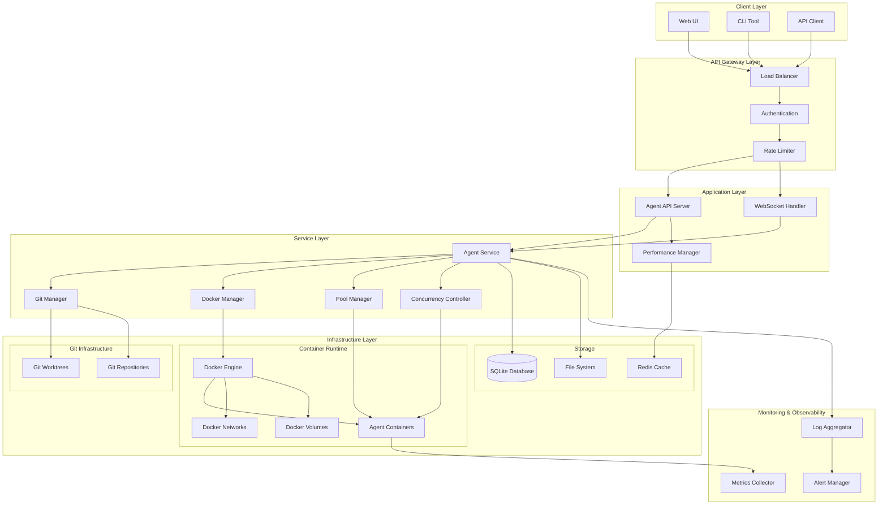
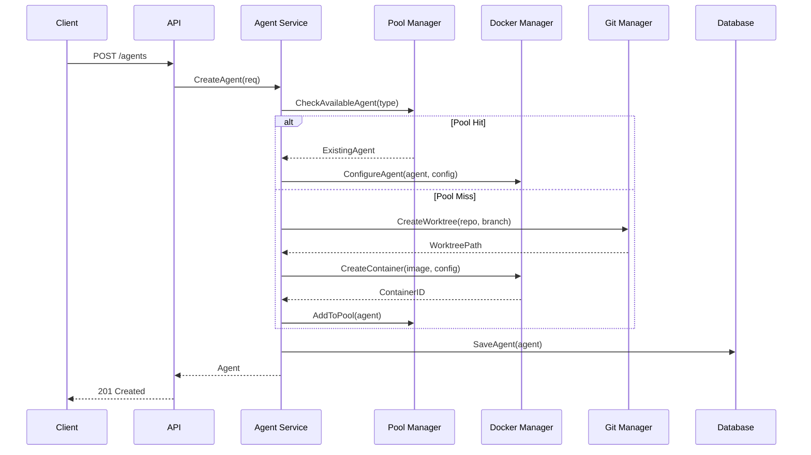
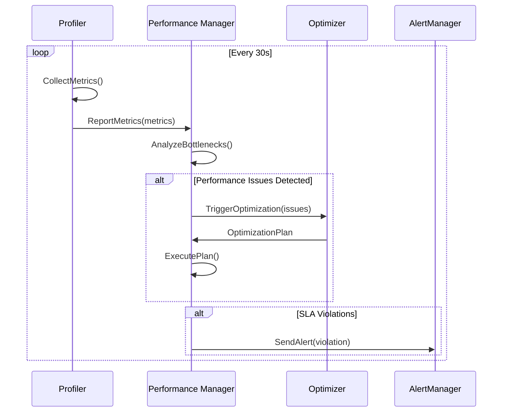

# 아키텍처 가이드

AICode Manager 멀티 에이전트 플랫폼의 전체 시스템 아키텍처를 설명합니다.

## 🏗️ 시스템 아키텍처 개요

### 고수준 아키텍처



## 🔧 핵심 컴포넌트

### 1. API Layer

#### Agent API Server
- **역할**: RESTful API 엔드포인트 제공
- **기술**: Go + Gin 프레임워크
- **위치**: `cmd/api/` + `internal/server/`

```go
// 주요 인터페이스
type AgentAPIServer interface {
    // 에이전트 CRUD
    CreateAgent(req *CreateAgentRequest) (*Agent, error)
    GetAgent(id string) (*Agent, error)
    UpdateAgent(id string, req *UpdateAgentRequest) (*Agent, error)
    DeleteAgent(id string) error
    
    // 에이전트 제어
    StartAgent(id string) error
    StopAgent(id string) error
    RestartAgent(id string) error
    
    // 모니터링
    GetAgentStatus(id string) (*AgentStatus, error)
    GetAgentMetrics(id string) (*AgentMetrics, error)
    StreamAgentLogs(id string) (<-chan LogEntry, error)
}
```

#### WebSocket Handler
- **역할**: 실시간 로그 및 이벤트 스트리밍
- **기술**: Gorilla WebSocket
- **위치**: `internal/server/websocket.go`

### 2. Service Layer

#### Agent Service
- **역할**: 에이전트 생명주기 관리의 핵심 비즈니스 로직
- **위치**: `internal/claude/agent_service.go`

```go
type AgentService struct {
    store          storage.Store
    dockerManager  *docker.Manager
    gitManager     *git.Manager
    poolManager    *AgentPoolManager
    concurrency    *ConcurrencyController
    performance    *PerformanceManager
}
```

#### Docker Manager
- **역할**: Docker 컨테이너 및 리소스 관리
- **위치**: `internal/docker/manager.go`

```go
type Manager struct {
    client       *docker.Client
    networks     *NetworkManager
    volumes      *VolumeManager
    images       *ImageOptimizer
    resources    *ResourceManager
}
```

#### Git Manager
- **역할**: Git worktree 및 브랜치 관리
- **위치**: `internal/git/manager.go`

```go
type Manager struct {
    workspaceRoot string
    worktrees     map[string]*WorktreeInfo
    repositories  map[string]*RepositoryInfo
    cleaner       *WorktreeCleaner
}
```

### 3. Performance Layer (T06_S01 구현 결과)

#### Performance Manager
- **역할**: 성능 최적화 통합 관리
- **위치**: `internal/claude/performance_manager.go`

```go
type PerformanceManager struct {
    profiler            *PerformanceProfiler
    agentPoolManager    *AgentPoolManager
    imageOptimizer      *docker.ImageOptimizer
    concurrencyController *ConcurrencyController
    
    // 모니터링
    dashboard           *PerformanceDashboard
    slaMonitor         *SLAMonitor
    autoOptimizer      *AutoOptimizer
}
```

#### Agent Pool Manager
- **역할**: 에이전트 재사용을 위한 풀링 시스템
- **기능**:
  - 타입별 에이전트 풀 관리
  - LRU 캐싱 및 예측적 스케일링
  - 워밍업 메커니즘

#### Concurrency Controller
- **역할**: 동시성 및 리소스 제어
- **기능**:
  - 가중 세마포어 관리
  - 서킷 브레이커 패턴
  - 백프레셔 제어

#### Image Optimizer
- **역할**: Docker 이미지 최적화
- **기능**:
  - 다단계 캐싱 (Layer, Build, Image)
  - 압축 및 최적화 전략
  - 빌드 캐시 관리

## 📊 데이터 흐름

### 에이전트 생성 플로우



### 성능 모니터링 플로우



## 🗄️ 데이터 모델

### 에이전트 모델

```go
type Agent struct {
    ID          string            `json:"id" db:"id"`
    Name        string            `json:"name" db:"name"`
    ProjectID   string            `json:"project_id" db:"project_id"`
    AgentType   AgentType         `json:"agent_type" db:"agent_type"`
    Status      AgentStatus       `json:"status" db:"status"`
    ContainerID string            `json:"container_id" db:"container_id"`
    Config      *AgentConfig      `json:"config" db:"config"`
    CreatedAt   time.Time         `json:"created_at" db:"created_at"`
    UpdatedAt   time.Time         `json:"updated_at" db:"updated_at"`
}

type AgentConfig struct {
    Resources   *ResourceConfig   `json:"resources,omitempty"`
    Environment map[string]string `json:"environment,omitempty"`
    GitConfig   *GitConfig        `json:"git_config,omitempty"`
}

type ResourceConfig struct {
    CPU    string `json:"cpu,omitempty"`    // "0.5", "2.0"
    Memory string `json:"memory,omitempty"` // "512Mi", "2Gi"
}
```

### 데이터베이스 스키마

```sql
-- 에이전트 테이블
CREATE TABLE agents (
    id TEXT PRIMARY KEY,
    name TEXT UNIQUE NOT NULL,
    project_id TEXT NOT NULL,
    agent_type TEXT NOT NULL,
    status TEXT NOT NULL,
    container_id TEXT,
    config TEXT, -- JSON
    created_at DATETIME DEFAULT CURRENT_TIMESTAMP,
    updated_at DATETIME DEFAULT CURRENT_TIMESTAMP
);

-- 성능 메트릭 테이블
CREATE TABLE agent_metrics (
    id INTEGER PRIMARY KEY AUTOINCREMENT,
    agent_id TEXT NOT NULL,
    cpu_percent REAL,
    memory_usage INTEGER,
    memory_percent REAL,
    collected_at DATETIME DEFAULT CURRENT_TIMESTAMP,
    FOREIGN KEY (agent_id) REFERENCES agents(id)
);

-- 이벤트 로그 테이블
CREATE TABLE agent_events (
    id INTEGER PRIMARY KEY AUTOINCREMENT,
    agent_id TEXT NOT NULL,
    event_type TEXT NOT NULL,
    event_data TEXT, -- JSON
    timestamp DATETIME DEFAULT CURRENT_TIMESTAMP,
    FOREIGN KEY (agent_id) REFERENCES agents(id)
);
```

## 🔀 동시성 및 확장성

### 동시성 설계

#### 1. Agent Pool 동시성
```go
type TypedAgentPool struct {
    sync.RWMutex
    agents    map[string]*PooledAgent
    available chan *PooledAgent
    maxSize   int
    current   int
}

func (p *TypedAgentPool) GetAgent(ctx context.Context) (*PooledAgent, error) {
    select {
    case agent := <-p.available:
        return agent, nil
    case <-time.After(p.timeout):
        return nil, ErrPoolTimeout
    case <-ctx.Done():
        return nil, ctx.Err()
    }
}
```

#### 2. Docker 작업 동시성
```go
type ConcurrencyController struct {
    semaphores map[string]*WeightedSemaphore
    limits     map[string]int
    
    // 리소스별 제한
    containerCreation *WeightedSemaphore
    imageBuilds       *WeightedSemaphore
    networkOperations *WeightedSemaphore
}
```

### 확장성 고려사항

#### 수평 확장
- **API 서버**: 무상태 설계로 여러 인스턴스 실행 가능
- **로드 밸런싱**: 에이전트별 세션 어피니티 불필요
- **데이터베이스**: SQLite에서 PostgreSQL로 마이그레이션 지원

#### 수직 확장
- **리소스 모니터링**: 실시간 CPU/메모리 사용량 추적
- **자동 스케일링**: 부하에 따른 풀 크기 조정
- **백프레셔**: 과부하 시 요청 제한

## 🔒 보안 아키텍처

### 네트워크 격리

```go
type NetworkManager struct {
    isolatedNetworks map[string]*NetworkInfo
    defaultNetwork   *NetworkInfo
}

type NetworkInfo struct {
    ID          string
    Name        string
    Isolated    bool
    IPAMConfig  *IPAMConfig
    Policies    []NetworkPolicy
}
```

### 리소스 격리

#### 1. 컨테이너 격리
- 각 에이전트는 독립된 Docker 컨테이너에서 실행
- cgroups를 통한 리소스 제한
- 네트워크 네임스페이스 분리

#### 2. 파일시스템 격리
- Git worktree를 통한 코드 격리
- 임시 디렉토리 자동 정리
- 권한 최소화 원칙

## 📈 성능 최적화 아키텍처

### 캐싱 전략

#### 1. 에이전트 풀링
```go
type PoolStrategy interface {
    ShouldPool(agent *Agent) bool
    GetPoolKey(agent *Agent) string
    GetMaxAge() time.Duration
}

// 구현체들
type StandardPoolStrategy struct{}
type GPUPoolStrategy struct{}
type MemoryOptimizedPoolStrategy struct{}
```

#### 2. Docker 이미지 캐싱
```go
type ImageCache struct {
    layers    map[string]*LayerInfo
    builds    map[string]*BuildInfo
    images    map[string]*ImageInfo
    
    // LRU 정책
    lru       *LRUCache
    maxSize   int64
    currentSize int64
}
```

### 성능 모니터링

#### 메트릭 수집
```go
type PerformanceProfiler struct {
    config    ProfilerConfig
    metrics   *ProfilerMetrics
    collector *MetricsCollector
    
    // 병목점 분석
    bottleneckDetector *BottleneckDetector
    recommendations    []OptimizationRecommendation
}
```

#### SLA 모니터링
```go
type SLAMonitor struct {
    targets map[string]SLATarget
    violations []SLAViolation
    alerts     chan Alert
}

type SLATarget struct {
    Name         string
    Threshold    float64
    Unit         string
    Operator     string // "lt", "gt", "eq"
    WindowSize   time.Duration
}
```

## 🔍 모니터링 및 관찰가능성

### 로깅 아키텍처

```go
type LogManager struct {
    aggregator  *LogAggregator
    processors  []LogProcessor
    outputs     []LogOutput
    
    // 실시간 스트리밍
    subscribers map[string][]LogSubscriber
}

type LogEntry struct {
    Timestamp   time.Time         `json:"timestamp"`
    Level       string            `json:"level"`
    Message     string            `json:"message"`
    AgentID     string            `json:"agent_id"`
    ContainerID string            `json:"container_id"`
    Source      string            `json:"source"`
    Metadata    map[string]interface{} `json:"metadata"`
}
```

### 메트릭 아키텍처

```go
type MetricsCollector struct {
    registry    *prometheus.Registry
    collectors  []prometheus.Collector
    
    // 커스텀 메트릭
    agentCreationDuration prometheus.HistogramVec
    activeAgents         prometheus.GaugeVec
    apiRequestDuration   prometheus.HistogramVec
    errorRate           prometheus.CounterVec
}
```

## 🔄 이벤트 기반 아키텍처

### 이벤트 시스템

```go
type EventManager struct {
    publishers  map[string]EventPublisher
    subscribers map[string][]EventSubscriber
    bus         EventBus
}

type AgentEvent struct {
    Type      AgentEventType     `json:"type"`
    AgentID   string            `json:"agent_id"`
    Timestamp time.Time         `json:"timestamp"`
    Data      map[string]interface{} `json:"data"`
}

// 이벤트 타입들
const (
    AgentCreated      AgentEventType = "agent.created"
    AgentStarted      AgentEventType = "agent.started"
    AgentStopped      AgentEventType = "agent.stopped"
    AgentFailed       AgentEventType = "agent.failed"
    AgentDeleted      AgentEventType = "agent.deleted"
    ResourceLimitHit  AgentEventType = "agent.resource_limit"
    HealthCheckFailed AgentEventType = "agent.health_check_failed"
)
```

## 🧪 테스트 아키텍처 (T07_S01 구현 결과)

### 통합 테스트 구조

```go
type IntegrationTestSuite struct {
    server     *httptest.Server
    client     *http.Client
    docker     *docker.Manager
    database   *sql.DB
    testAgent  *models.Agent
}

// 테스트 시나리오들
func (suite *IntegrationTestSuite) TestCompleteAgentLifecycle()
func (suite *IntegrationTestSuite) TestConcurrentAgentOperations()
func (suite *IntegrationTestSuite) TestGitWorktreeManagement()
func (suite *IntegrationTestSuite) TestPerformanceRequirements()
```

### 테스트 환경 격리

#### 1. Docker 테스트 환경
```go
type TestDockerManager struct {
    testNetwork *docker.Network
    testImages  []string
    cleanup     []func() error
}
```

#### 2. 데이터베이스 테스트 환경
```go
type TestDatabase struct {
    db       *sql.DB
    tempPath string
    schema   string
}
```

## 📚 API 설계 원칙

### RESTful API 설계

#### 1. 리소스 중심 설계
```
/api/v1/agents           # 에이전트 컬렉션
/api/v1/agents/{id}      # 특정 에이전트
/api/v1/agents/{id}/status   # 에이전트 상태
/api/v1/agents/{id}/logs     # 에이전트 로그
```

#### 2. HTTP 상태 코드 활용
- `200 OK`: 성공적인 조회/수정
- `201 Created`: 리소스 생성 성공
- `204 No Content`: 삭제 성공
- `400 Bad Request`: 잘못된 요청
- `404 Not Found`: 리소스 없음
- `409 Conflict`: 상태 충돌
- `429 Too Many Requests`: 제한 초과

#### 3. 페이지네이션
```go
type PaginationParams struct {
    Limit  int `query:"limit" validate:"min=1,max=100"`
    Offset int `query:"offset" validate:"min=0"`
}

type PaginatedResponse struct {
    Data       interface{}       `json:"data"`
    Pagination PaginationMetadata `json:"pagination"`
}
```

## 🔮 확장 계획

### 단기 확장 (3개월)
- **Kubernetes 통합**: 에이전트를 Pod로 실행
- **메시지 큐**: Redis/RabbitMQ를 통한 비동기 작업
- **API Gateway**: 인증, 로깅, 모니터링 통합

### 중기 확장 (6개월)
- **멀티 테넌트**: 조직별 격리 및 리소스 할당
- **워크플로우 엔진**: 복잡한 에이전트 작업 체인
- **분산 스토리지**: 대용량 파일 처리

### 장기 확장 (12개월)
- **AI 최적화**: 머신러닝 기반 리소스 예측
- **엣지 배포**: 지역별 에이전트 실행
- **GraphQL API**: 복합 쿼리 지원

---

이 아키텍처 가이드는 AICode Manager의 현재 구현과 미래 확장 계획을 모두 포함합니다. 구체적인 구현 세부사항은 각 컴포넌트별 문서를 참조하세요.

**다음**: [성능 가이드](performance.md)에서 성능 최적화 전략을 확인하세요.