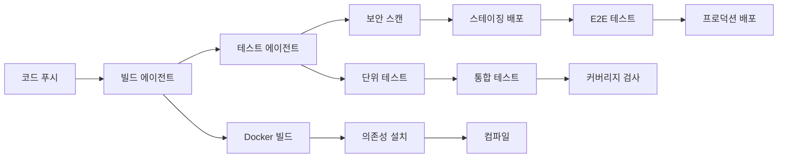

# CI/CD 파이프라인 구축

AICode Manager를 활용한 완전한 CI/CD 파이프라인 구축 가이드입니다.

## 🎯 파이프라인 개요

이 예제에서는 다음과 같은 CI/CD 파이프라인을 구축합니다:



## 🔧 GitHub Actions 통합

### 1. 기본 워크플로우 설정

```yaml
# .github/workflows/ci-cd.yml
name: CI/CD Pipeline with AICode Manager

on:
  push:
    branches: [ main, develop ]
  pull_request:
    branches: [ main ]

env:
  AICLI_API_URL: ${{ secrets.AICLI_API_URL }}
  AICLI_API_TOKEN: ${{ secrets.AICLI_API_TOKEN }}
  PROJECT_ID: ${{ github.event.repository.name }}
  BUILD_NUMBER: ${{ github.run_number }}

jobs:
  build:
    runs-on: ubuntu-latest
    outputs:
      agent-id: ${{ steps.create-agent.outputs.agent-id }}
      
    steps:
    - name: Checkout code
      uses: actions/checkout@v3
      
    - name: Create build agent
      id: create-agent
      run: |
        AGENT_ID=$(curl -s -X POST "$AICLI_API_URL/api/v1/agents" \
          -H "Authorization: Bearer $AICLI_API_TOKEN" \
          -H "Content-Type: application/json" \
          -d "{
            \"name\": \"build-$PROJECT_ID-$BUILD_NUMBER\",
            \"project_id\": \"$PROJECT_ID\",
            \"agent_type\": \"standard\",
            \"description\": \"Build agent for $GITHUB_SHA\",
            \"config\": {
              \"git\": {
                \"repository\": \"$GITHUB_SERVER_URL/$GITHUB_REPOSITORY.git\",
                \"commit\": \"$GITHUB_SHA\",
                \"ref\": \"$GITHUB_REF\"
              },
              \"environment\": {
                \"NODE_ENV\": \"production\",
                \"BUILD_NUMBER\": \"$BUILD_NUMBER\",
                \"GITHUB_SHA\": \"$GITHUB_SHA\"
              },
              \"resources\": {
                \"cpu\": \"2\",
                \"memory\": \"4Gi\"
              }
            }
          }" | jq -r '.id')
        
        echo "agent-id=$AGENT_ID" >> $GITHUB_OUTPUT
        echo "Created build agent: $AGENT_ID"
        
    - name: Start build agent
      run: |
        curl -X POST "$AICLI_API_URL/api/v1/agents/${{ steps.create-agent.outputs.agent-id }}/start" \
          -H "Authorization: Bearer $AICLI_API_TOKEN"
          
    - name: Wait for build completion
      run: |
        AGENT_ID="${{ steps.create-agent.outputs.agent-id }}"
        
        # 빌드 완료까지 대기 (최대 30분)
        for i in {1..180}; do
          STATUS=$(curl -s "$AICLI_API_URL/api/v1/agents/$AGENT_ID/status" \
            -H "Authorization: Bearer $AICLI_API_TOKEN" | jq -r '.status')
          
          echo "Build status: $STATUS"
          
          if [ "$STATUS" = "completed" ]; then
            echo "Build completed successfully!"
            break
          elif [ "$STATUS" = "failed" ]; then
            echo "Build failed!"
            exit 1
          fi
          
          sleep 10
        done
        
    - name: Get build artifacts
      run: |
        AGENT_ID="${{ steps.create-agent.outputs.agent-id }}"
        
        # 빌드 아티팩트 다운로드
        curl -o build-artifacts.tar.gz \
          "$AICLI_API_URL/api/v1/agents/$AGENT_ID/artifacts" \
          -H "Authorization: Bearer $AICLI_API_TOKEN"
          
    - name: Upload artifacts
      uses: actions/upload-artifact@v3
      with:
        name: build-artifacts
        path: build-artifacts.tar.gz

  test:
    needs: build
    runs-on: ubuntu-latest
    
    strategy:
      matrix:
        test-type: [unit, integration, e2e]
        
    steps:
    - name: Download build artifacts
      uses: actions/download-artifact@v3
      with:
        name: build-artifacts
        
    - name: Create test agent
      id: create-test-agent
      run: |
        TEST_AGENT_ID=$(curl -s -X POST "$AICLI_API_URL/api/v1/agents" \
          -H "Authorization: Bearer $AICLI_API_TOKEN" \
          -H "Content-Type: application/json" \
          -d "{
            \"name\": \"test-${{ matrix.test-type }}-$PROJECT_ID-$BUILD_NUMBER\",
            \"project_id\": \"$PROJECT_ID\",
            \"agent_type\": \"standard\",
            \"description\": \"${{ matrix.test-type }} test agent\",
            \"config\": {
              \"environment\": {
                \"TEST_TYPE\": \"${{ matrix.test-type }}\",
                \"NODE_ENV\": \"test\"
              },
              \"resources\": {
                \"cpu\": \"1\",
                \"memory\": \"2Gi\"
              }
            }
          }" | jq -r '.id')
        
        echo "test-agent-id=$TEST_AGENT_ID" >> $GITHUB_OUTPUT
        
    - name: Run tests
      run: |
        TEST_AGENT_ID="${{ steps.create-test-agent.outputs.test-agent-id }}"
        
        # 테스트 실행
        curl -X POST "$AICLI_API_URL/api/v1/agents/$TEST_AGENT_ID/start" \
          -H "Authorization: Bearer $AICLI_API_TOKEN"
          
        # 테스트 완료 대기
        # (build 단계와 유사한 대기 로직)

  security-scan:
    needs: build
    runs-on: ubuntu-latest
    
    steps:
    - name: Create security scan agent
      run: |
        SECURITY_AGENT_ID=$(curl -s -X POST "$AICLI_API_URL/api/v1/agents" \
          -H "Authorization: Bearer $AICLI_API_TOKEN" \
          -H "Content-Type: application/json" \
          -d "{
            \"name\": \"security-scan-$PROJECT_ID-$BUILD_NUMBER\",
            \"project_id\": \"$PROJECT_ID\",
            \"agent_type\": \"standard\",
            \"description\": \"Security vulnerability scan\",
            \"config\": {
              \"environment\": {
                \"SCAN_TYPE\": \"vulnerability\",
                \"REPORT_FORMAT\": \"sarif\"
              },
              \"resources\": {
                \"cpu\": \"1\",
                \"memory\": \"1Gi\"
              }
            }
          }" | jq -r '.id')
        
        echo "SECURITY_AGENT_ID=$SECURITY_AGENT_ID" >> $GITHUB_ENV

  deploy-staging:
    needs: [test, security-scan]
    runs-on: ubuntu-latest
    if: github.ref == 'refs/heads/develop'
    
    steps:
    - name: Deploy to staging
      run: |
        DEPLOY_AGENT_ID=$(curl -s -X POST "$AICLI_API_URL/api/v1/agents" \
          -H "Authorization: Bearer $AICLI_API_TOKEN" \
          -H "Content-Type: application/json" \
          -d "{
            \"name\": \"deploy-staging-$PROJECT_ID-$BUILD_NUMBER\",
            \"project_id\": \"$PROJECT_ID\",
            \"agent_type\": \"standard\",
            \"description\": \"Staging deployment\",
            \"config\": {
              \"environment\": {
                \"DEPLOY_ENV\": \"staging\",
                \"BUILD_NUMBER\": \"$BUILD_NUMBER\"
              }
            }
          }" | jq -r '.id')

  deploy-production:
    needs: [test, security-scan]
    runs-on: ubuntu-latest
    if: github.ref == 'refs/heads/main'
    environment: production
    
    steps:
    - name: Deploy to production
      run: |
        DEPLOY_AGENT_ID=$(curl -s -X POST "$AICLI_API_URL/api/v1/agents" \
          -H "Authorization: Bearer $AICLI_API_TOKEN" \
          -H "Content-Type: application/json" \
          -d "{
            \"name\": \"deploy-prod-$PROJECT_ID-$BUILD_NUMBER\",
            \"project_id\": \"$PROJECT_ID\",
            \"agent_type\": \"standard\",
            \"description\": \"Production deployment\",
            \"config\": {
              \"environment\": {
                \"DEPLOY_ENV\": \"production\",
                \"BUILD_NUMBER\": \"$BUILD_NUMBER\"
              }
            }
          }" | jq -r '.id')
```

### 2. 고급 파이프라인 스크립트

#### 파이프라인 오케스트레이션 스크립트

```bash
#!/bin/bash
# pipeline-orchestrator.sh

set -e

# 설정
API_URL="${AICLI_API_URL:-http://localhost:8080}"
PROJECT_ID="${1:-default-project}"
GIT_SHA="${2:-$(git rev-parse HEAD)}"
BUILD_NUMBER="${3:-$(date +%s)}"

# 유틸리티 함수
log() {
    echo "[$(date '+%Y-%m-%d %H:%M:%S')] $1"
}

create_agent() {
    local name="$1"
    local config="$2"
    
    curl -s -X POST "$API_URL/api/v1/agents" \
        -H "Authorization: Bearer $AICLI_API_TOKEN" \
        -H "Content-Type: application/json" \
        -d "$config" | jq -r '.id'
}

wait_for_completion() {
    local agent_id="$1"
    local timeout="${2:-1800}"  # 30분 기본 타임아웃
    local start_time=$(date +%s)
    
    while true; do
        local current_time=$(date +%s)
        local elapsed=$((current_time - start_time))
        
        if [ $elapsed -gt $timeout ]; then
            log "타임아웃: 에이전트 $agent_id"
            return 1
        fi
        
        local status=$(curl -s "$API_URL/api/v1/agents/$agent_id/status" \
            -H "Authorization: Bearer $AICLI_API_TOKEN" | jq -r '.status')
        
        case "$status" in
            "completed")
                log "완료: 에이전트 $agent_id"
                return 0
                ;;
            "failed")
                log "실패: 에이전트 $agent_id"
                return 1
                ;;
            *)
                log "대기 중: 에이전트 $agent_id (상태: $status)"
                sleep 30
                ;;
        esac
    done
}

cleanup_agent() {
    local agent_id="$1"
    log "정리 중: 에이전트 $agent_id"
    curl -s -X DELETE "$API_URL/api/v1/agents/$agent_id" \
        -H "Authorization: Bearer $AICLI_API_TOKEN" > /dev/null
}

# 메인 파이프라인
main() {
    log "CI/CD 파이프라인 시작: $PROJECT_ID (빌드 #$BUILD_NUMBER)"
    
    local created_agents=()
    
    # 에러 시 정리를 위한 트랩 설정
    trap 'cleanup_agents "${created_agents[@]}"' EXIT
    
    # 1단계: 빌드
    log "1단계: 빌드 시작"
    local build_config="{
        \"name\": \"build-$PROJECT_ID-$BUILD_NUMBER\",
        \"project_id\": \"$PROJECT_ID\",
        \"agent_type\": \"standard\",
        \"description\": \"Build pipeline for commit $GIT_SHA\",
        \"config\": {
            \"git\": {
                \"commit\": \"$GIT_SHA\"
            },
            \"environment\": {
                \"BUILD_NUMBER\": \"$BUILD_NUMBER\",
                \"NODE_ENV\": \"production\"
            },
            \"resources\": {
                \"cpu\": \"4\",
                \"memory\": \"8Gi\"
            }
        }
    }"
    
    local build_agent_id=$(create_agent "build" "$build_config")
    created_agents+=("$build_agent_id")
    log "빌드 에이전트 생성됨: $build_agent_id"
    
    # 빌드 에이전트 시작
    curl -s -X POST "$API_URL/api/v1/agents/$build_agent_id/start" \
        -H "Authorization: Bearer $AICLI_API_TOKEN" > /dev/null
    
    # 빌드 완료 대기
    if ! wait_for_completion "$build_agent_id"; then
        log "빌드 실패"
        exit 1
    fi
    
    # 2단계: 병렬 테스트
    log "2단계: 테스트 시작"
    local test_agents=()
    
    # 단위 테스트
    local unit_test_config="{
        \"name\": \"unit-test-$PROJECT_ID-$BUILD_NUMBER\",
        \"project_id\": \"$PROJECT_ID\",
        \"agent_type\": \"standard\",
        \"description\": \"Unit tests\",
        \"config\": {
            \"environment\": {
                \"TEST_TYPE\": \"unit\",
                \"BUILD_NUMBER\": \"$BUILD_NUMBER\"
            },
            \"resources\": {
                \"cpu\": \"2\",
                \"memory\": \"4Gi\"
            }
        }
    }"
    
    local unit_test_agent=$(create_agent "unit-test" "$unit_test_config")
    created_agents+=("$unit_test_agent")
    test_agents+=("$unit_test_agent")
    
    # 통합 테스트
    local integration_test_config="{
        \"name\": \"integration-test-$PROJECT_ID-$BUILD_NUMBER\",
        \"project_id\": \"$PROJECT_ID\",
        \"agent_type\": \"memory_optimized\",
        \"description\": \"Integration tests\",
        \"config\": {
            \"environment\": {
                \"TEST_TYPE\": \"integration\",
                \"BUILD_NUMBER\": \"$BUILD_NUMBER\"
            },
            \"resources\": {
                \"cpu\": \"2\",
                \"memory\": \"8Gi\"
            }
        }
    }"
    
    local integration_test_agent=$(create_agent "integration-test" "$integration_test_config")
    created_agents+=("$integration_test_agent")
    test_agents+=("$integration_test_agent")
    
    # 모든 테스트 에이전트 시작
    for agent_id in "${test_agents[@]}"; do
        curl -s -X POST "$API_URL/api/v1/agents/$agent_id/start" \
            -H "Authorization: Bearer $AICLI_API_TOKEN" > /dev/null
        log "테스트 에이전트 시작됨: $agent_id"
    done
    
    # 모든 테스트 완료 대기
    local test_failed=false
    for agent_id in "${test_agents[@]}"; do
        if ! wait_for_completion "$agent_id"; then
            log "테스트 실패: $agent_id"
            test_failed=true
        fi
    done
    
    if [ "$test_failed" = true ]; then
        log "테스트 단계 실패"
        exit 1
    fi
    
    # 3단계: 보안 스캔
    log "3단계: 보안 스캔 시작"
    local security_config="{
        \"name\": \"security-scan-$PROJECT_ID-$BUILD_NUMBER\",
        \"project_id\": \"$PROJECT_ID\",
        \"agent_type\": \"standard\",
        \"description\": \"Security vulnerability scan\",
        \"config\": {
            \"environment\": {
                \"SCAN_TYPE\": \"vulnerability\",
                \"BUILD_NUMBER\": \"$BUILD_NUMBER\"
            },
            \"resources\": {
                \"cpu\": \"1\",
                \"memory\": \"2Gi\"
            }
        }
    }"
    
    local security_agent=$(create_agent "security-scan" "$security_config")
    created_agents+=("$security_agent")
    
    curl -s -X POST "$API_URL/api/v1/agents/$security_agent/start" \
        -H "Authorization: Bearer $AICLI_API_TOKEN" > /dev/null
    
    if ! wait_for_completion "$security_agent"; then
        log "보안 스캔 실패"
        exit 1
    fi
    
    # 4단계: 배포 (브랜치에 따라)
    local current_branch=$(git branch --show-current)
    
    if [ "$current_branch" = "main" ]; then
        log "4단계: 프로덕션 배포 시작"
        deploy_to_environment "production"
    elif [ "$current_branch" = "develop" ]; then
        log "4단계: 스테이징 배포 시작"
        deploy_to_environment "staging"
    else
        log "배포 스킵: 브랜치 $current_branch"
    fi
    
    log "파이프라인 완료!"
}

deploy_to_environment() {
    local env="$1"
    
    local deploy_config="{
        \"name\": \"deploy-$env-$PROJECT_ID-$BUILD_NUMBER\",
        \"project_id\": \"$PROJECT_ID\",
        \"agent_type\": \"standard\",
        \"description\": \"Deploy to $env environment\",
        \"config\": {
            \"environment\": {
                \"DEPLOY_ENV\": \"$env\",
                \"BUILD_NUMBER\": \"$BUILD_NUMBER\"
            },
            \"resources\": {
                \"cpu\": \"1\",
                \"memory\": \"2Gi\"
            }
        }
    }"
    
    local deploy_agent=$(create_agent "deploy-$env" "$deploy_config")
    created_agents+=("$deploy_agent")
    
    curl -s -X POST "$API_URL/api/v1/agents/$deploy_agent/start" \
        -H "Authorization: Bearer $AICLI_API_TOKEN" > /dev/null
    
    if ! wait_for_completion "$deploy_agent"; then
        log "$env 배포 실패"
        return 1
    fi
    
    log "$env 배포 완료"
}

cleanup_agents() {
    local agents=("$@")
    log "에이전트 정리 중..."
    
    for agent_id in "${agents[@]}"; do
        if [ -n "$agent_id" ] && [ "$agent_id" != "null" ]; then
            cleanup_agent "$agent_id"
        fi
    done
}

# 스크립트 실행
if [[ "${BASH_SOURCE[0]}" == "${0}" ]]; then
    main "$@"
fi
```

## 🐳 Docker 기반 파이프라인

### 멀티 스테이지 빌드 예제

```bash
#!/bin/bash
# docker-pipeline.sh

PROJECT_ID="webapp"
BUILD_NUMBER=$(date +%s)
REGISTRY="your-registry.com"

# 1단계: Docker 빌드 에이전트
build_docker_image() {
    local build_config="{
        \"name\": \"docker-build-$BUILD_NUMBER\",
        \"project_id\": \"$PROJECT_ID\",
        \"agent_type\": \"standard\",
        \"description\": \"Docker multi-stage build\",
        \"config\": {
            \"environment\": {
                \"DOCKER_BUILDKIT\": \"1\",
                \"REGISTRY\": \"$REGISTRY\",
                \"BUILD_NUMBER\": \"$BUILD_NUMBER\"
            },
            \"resources\": {
                \"cpu\": \"4\",
                \"memory\": \"8Gi\"
            },
            \"mounts\": [
                {
                    \"type\": \"bind\",
                    \"source\": \"/var/run/docker.sock\",
                    \"target\": \"/var/run/docker.sock\"
                }
            ]
        }
    }"
    
    local agent_id=$(create_agent "docker-build" "$build_config")
    
    # Docker 빌드 실행
    curl -X POST "$API_URL/api/v1/agents/$agent_id/execute" \
        -H "Authorization: Bearer $AICLI_API_TOKEN" \
        -H "Content-Type: application/json" \
        -d '{
            "command": "docker build",
            "args": [
                "--target", "production",
                "--build-arg", "BUILD_NUMBER='$BUILD_NUMBER'",
                "--tag", "'$REGISTRY'/'$PROJECT_ID':latest",
                "--tag", "'$REGISTRY'/'$PROJECT_ID':'$BUILD_NUMBER'",
                "."
            ]
        }'
    
    wait_for_completion "$agent_id"
    
    # 이미지 푸시
    curl -X POST "$API_URL/api/v1/agents/$agent_id/execute" \
        -H "Authorization: Bearer $AICLI_API_TOKEN" \
        -H "Content-Type: application/json" \
        -d '{
            "command": "docker push",
            "args": ["'$REGISTRY'/'$PROJECT_ID':latest"]
        }'
}
```

## 📊 파이프라인 모니터링

### 실시간 모니터링 대시보드

```python
#!/usr/bin/env python3
# pipeline-monitor.py

import asyncio
import websockets
import json
from datetime import datetime

class PipelineMonitor:
    def __init__(self, api_url, project_id):
        self.api_url = api_url
        self.project_id = project_id
        self.active_agents = {}
    
    async def monitor_pipeline(self):
        """파이프라인 실시간 모니터링"""
        ws_url = f"ws://{self.api_url.replace('http://', '')}/api/v1/agents/events/stream"
        
        async with websockets.connect(ws_url) as websocket:
            print(f"파이프라인 모니터링 시작: {self.project_id}")
            
            async for message in websocket:
                event = json.loads(message)
                await self.handle_event(event)
    
    async def handle_event(self, event):
        """이벤트 처리"""
        event_type = event.get('event_type')
        agent_id = event.get('agent_id')
        timestamp = event.get('timestamp')
        
        if event_type == 'agent.created':
            self.active_agents[agent_id] = {
                'name': event['data']['name'],
                'status': 'created',
                'created_at': timestamp
            }
            print(f"🆕 에이전트 생성: {event['data']['name']}")
            
        elif event_type == 'agent.started':
            if agent_id in self.active_agents:
                self.active_agents[agent_id]['status'] = 'running'
                print(f"🚀 에이전트 시작: {self.active_agents[agent_id]['name']}")
                
        elif event_type == 'agent.completed':
            if agent_id in self.active_agents:
                self.active_agents[agent_id]['status'] = 'completed'
                print(f"✅ 에이전트 완료: {self.active_agents[agent_id]['name']}")
                
        elif event_type == 'agent.failed':
            if agent_id in self.active_agents:
                self.active_agents[agent_id]['status'] = 'failed'
                print(f"❌ 에이전트 실패: {self.active_agents[agent_id]['name']}")
    
    def print_status(self):
        """현재 상태 출력"""
        print("\n📊 파이프라인 상태:")
        for agent_id, info in self.active_agents.items():
            status_emoji = {
                'created': '🆕',
                'running': '🚀',
                'completed': '✅',
                'failed': '❌'
            }.get(info['status'], '❓')
            
            print(f"  {status_emoji} {info['name']}: {info['status']}")

if __name__ == "__main__":
    import sys
    
    if len(sys.argv) < 3:
        print("사용법: python pipeline-monitor.py <API_URL> <PROJECT_ID>")
        sys.exit(1)
    
    monitor = PipelineMonitor(sys.argv[1], sys.argv[2])
    
    try:
        asyncio.run(monitor.monitor_pipeline())
    except KeyboardInterrupt:
        print("\n모니터링 종료")
```

## 🔔 알림 및 보고

### Slack 알림 통합

```bash
#!/bin/bash
# slack-notifications.sh

SLACK_WEBHOOK_URL="${SLACK_WEBHOOK_URL}"

send_slack_notification() {
    local message="$1"
    local color="$2"
    local project="$3"
    local build_number="$4"
    
    curl -X POST "$SLACK_WEBHOOK_URL" \
        -H "Content-Type: application/json" \
        -d "{
            \"attachments\": [
                {
                    \"color\": \"$color\",
                    \"title\": \"CI/CD 파이프라인 알림\",
                    \"fields\": [
                        {
                            \"title\": \"프로젝트\",
                            \"value\": \"$project\",
                            \"short\": true
                        },
                        {
                            \"title\": \"빌드 번호\",
                            \"value\": \"$build_number\",
                            \"short\": true
                        },
                        {
                            \"title\": \"메시지\",
                            \"value\": \"$message\",
                            \"short\": false
                        }
                    ],
                    \"footer\": \"AICode Manager\",
                    \"ts\": $(date +%s)
                }
            ]
        }"
}

# 사용 예시
send_slack_notification "빌드가 성공적으로 완료되었습니다!" "good" "$PROJECT_ID" "$BUILD_NUMBER"
send_slack_notification "테스트에서 실패가 발생했습니다." "danger" "$PROJECT_ID" "$BUILD_NUMBER"
```

## 🎯 성능 최적화

### 파이프라인 병렬화

```bash
#!/bin/bash
# parallel-pipeline.sh

# 병렬 테스트 실행
run_parallel_tests() {
    local build_artifacts="$1"
    local test_types=("unit" "integration" "e2e" "security")
    local test_pids=()
    
    for test_type in "${test_types[@]}"; do
        {
            run_test_agent "$test_type" "$build_artifacts"
        } &
        test_pids+=($!)
    done
    
    # 모든 테스트 완료 대기
    local all_passed=true
    for pid in "${test_pids[@]}"; do
        if ! wait "$pid"; then
            all_passed=false
        fi
    done
    
    if [ "$all_passed" = false ]; then
        echo "일부 테스트가 실패했습니다"
        return 1
    fi
    
    echo "모든 테스트가 성공했습니다"
    return 0
}

# 에이전트 풀 사전 준비
prepare_agent_pool() {
    local pool_size="${1:-5}"
    
    echo "에이전트 풀 워밍업 중..."
    curl -X POST "$API_URL/api/v1/performance/pools/warmup" \
        -H "Authorization: Bearer $AICLI_API_TOKEN" \
        -H "Content-Type: application/json" \
        -d "{
            \"pool_type\": \"standard\",
            \"target_size\": $pool_size
        }"
}
```

## 📈 메트릭 및 분석

### 파이프라인 성능 분석

```python
#!/usr/bin/env python3
# pipeline-analytics.py

import requests
import json
from datetime import datetime, timedelta

class PipelineAnalytics:
    def __init__(self, api_url, api_token):
        self.api_url = api_url
        self.session = requests.Session()
        self.session.headers.update({
            "Authorization": f"Bearer {api_token}",
            "Content-Type": "application/json"
        })
    
    def get_pipeline_metrics(self, project_id, days=7):
        """파이프라인 성능 메트릭 수집"""
        end_date = datetime.now()
        start_date = end_date - timedelta(days=days)
        
        # 지정된 기간의 에이전트 목록 조회
        response = self.session.get(
            f"{self.api_url}/api/v1/agents",
            params={
                "project_id": project_id,
                "created_after": start_date.isoformat(),
                "created_before": end_date.isoformat()
            }
        )
        
        agents = response.json().get('agents', [])
        
        # 메트릭 계산
        metrics = {
            "total_pipelines": len(set(self._extract_build_number(a['name']) for a in agents)),
            "total_agents": len(agents),
            "success_rate": self._calculate_success_rate(agents),
            "avg_duration": self._calculate_avg_duration(agents),
            "agent_type_distribution": self._get_agent_type_distribution(agents),
            "failure_analysis": self._analyze_failures(agents)
        }
        
        return metrics
    
    def _extract_build_number(self, agent_name):
        """에이전트 이름에서 빌드 번호 추출"""
        parts = agent_name.split('-')
        return parts[-1] if parts else None
    
    def _calculate_success_rate(self, agents):
        """성공률 계산"""
        if not agents:
            return 0
        
        completed = sum(1 for a in agents if a.get('status') == 'completed')
        return (completed / len(agents)) * 100
    
    def _calculate_avg_duration(self, agents):
        """평균 실행 시간 계산"""
        durations = []
        
        for agent in agents:
            created_at = datetime.fromisoformat(agent['created_at'].replace('Z', '+00:00'))
            updated_at = datetime.fromisoformat(agent['updated_at'].replace('Z', '+00:00'))
            duration = (updated_at - created_at).total_seconds()
            durations.append(duration)
        
        return sum(durations) / len(durations) if durations else 0
    
    def generate_report(self, project_id):
        """파이프라인 리포트 생성"""
        metrics = self.get_pipeline_metrics(project_id)
        
        report = f"""
📊 파이프라인 성능 리포트 - {project_id}
{'='*50}

📈 기본 메트릭:
- 총 파이프라인 수: {metrics['total_pipelines']}
- 총 에이전트 수: {metrics['total_agents']}
- 성공률: {metrics['success_rate']:.1f}%
- 평균 실행 시간: {metrics['avg_duration']:.1f}초

🔧 에이전트 타입 분포:
{self._format_distribution(metrics['agent_type_distribution'])}

⚠️ 실패 분석:
{self._format_failures(metrics['failure_analysis'])}
        """
        
        return report.strip()

if __name__ == "__main__":
    import os
    
    analytics = PipelineAnalytics(
        os.getenv('AICLI_API_URL'),
        os.getenv('AICLI_API_TOKEN')
    )
    
    project_id = input("프로젝트 ID 입력: ")
    report = analytics.generate_report(project_id)
    print(report)
```

---

이 CI/CD 파이프라인 가이드를 통해 AICode Manager를 활용한 완전한 자동화 시스템을 구축할 수 있습니다. 각 구성 요소는 프로젝트의 요구사항에 맞게 customization할 수 있습니다.

**다음**: [다중 환경 테스트](multi-env-testing.md)에서 여러 환경에서의 테스트 자동화를 확인하세요!