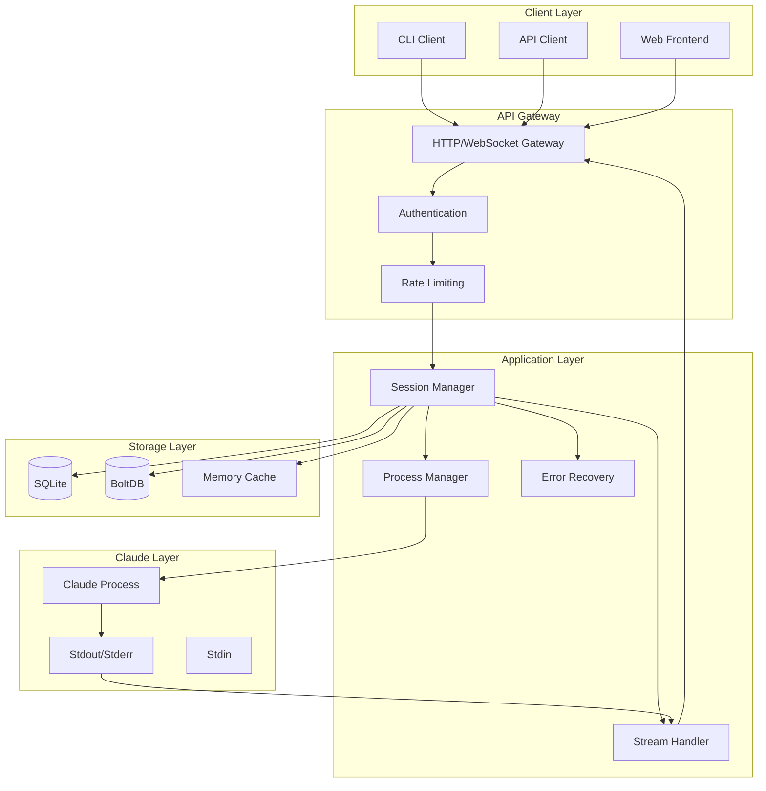
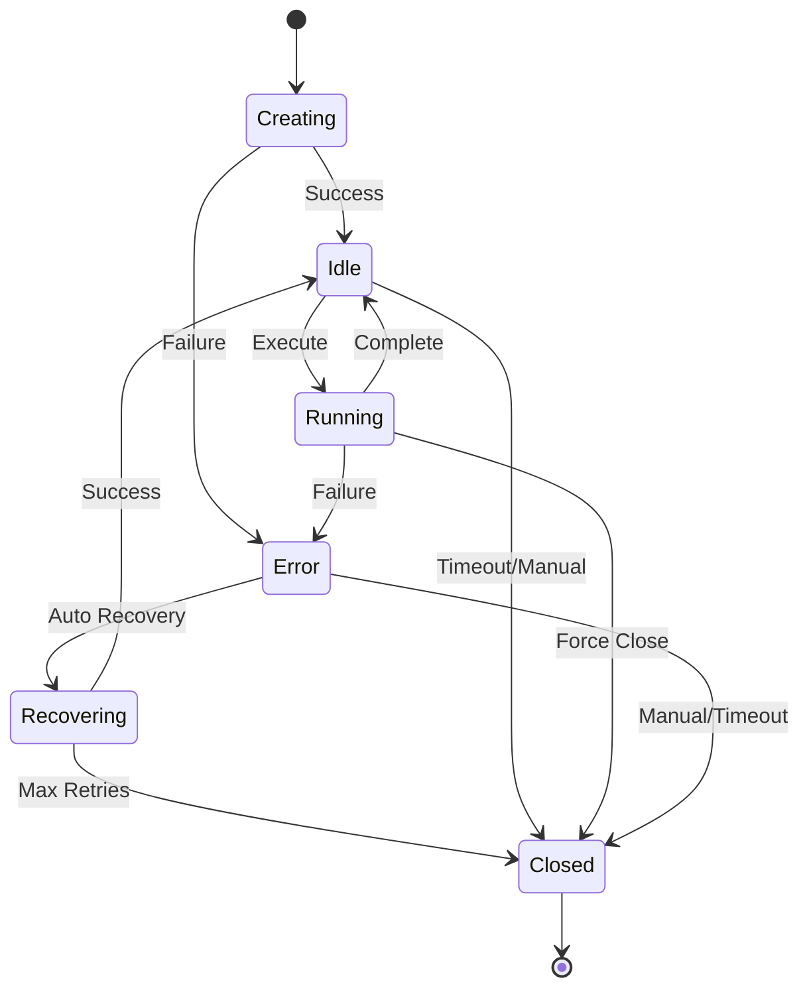
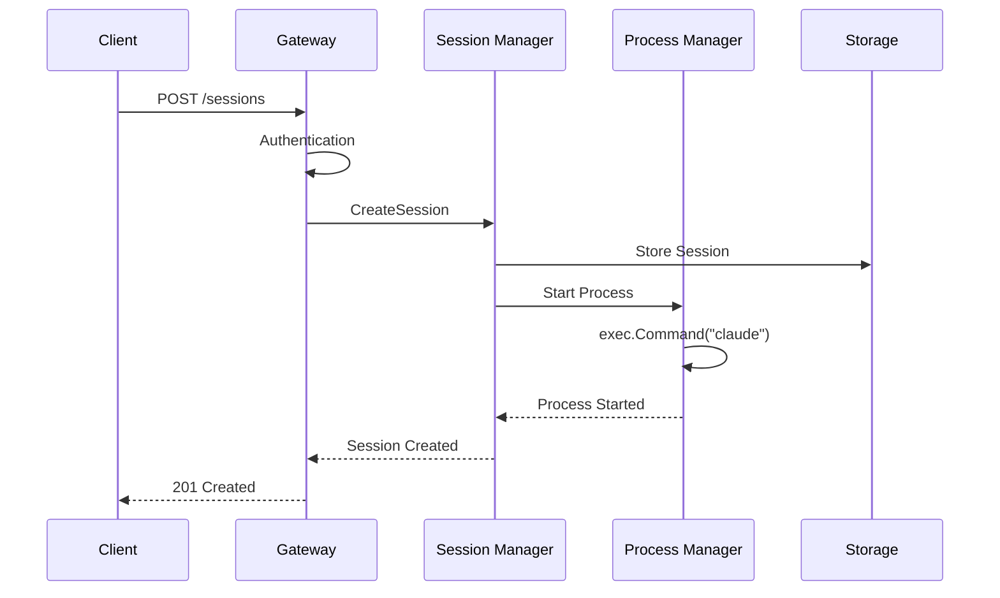
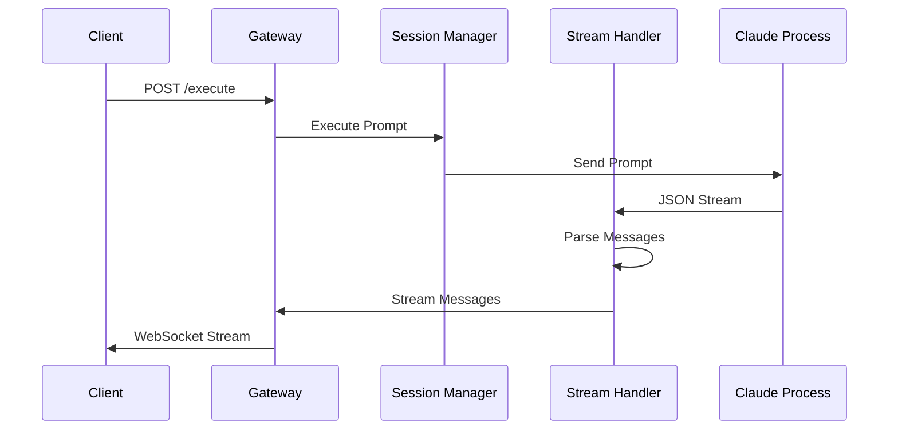
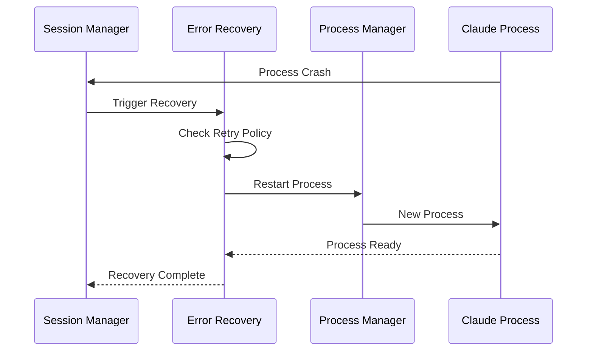
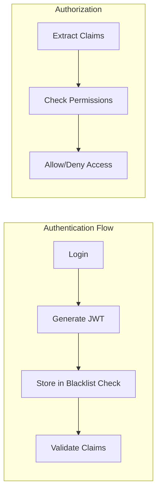

# Claude CLI 통합 아키텍처

## 시스템 개요

AICode Manager의 Claude CLI 통합은 Go 네이티브 프로세스 관리를 통해 안정적이고 확장 가능한 Claude 실행 환경을 제공합니다. 본 문서는 시스템의 전체 아키텍처와 주요 컴포넌트들을 설명합니다.

## 전체 아키텍처



## 레이어별 상세 설명

### 1. Client Layer (클라이언트 계층)

#### CLI Client
- **역할**: 명령줄 인터페이스를 통한 Claude 상호작용
- **기능**: 
  - 단일 프롬프트 실행
  - 인터랙티브 세션
  - 배치 처리
  - 세션 관리

```go
// CLI 클라이언트 예제
type CLIClient struct {
    baseURL string
    token   string
    output  OutputFormatter
}

func (c *CLIClient) ExecutePrompt(prompt string, config *Config) error
```

#### API Client
- **역할**: RESTful API를 통한 프로그래밍 방식 접근
- **기능**:
  - 세션 CRUD 작업
  - 프롬프트 실행 및 모니터링
  - 메트릭 및 로그 조회

#### Web Frontend
- **역할**: 웹 브라우저 기반 사용자 인터페이스
- **기능**:
  - 시각적 세션 관리
  - 실시간 로그 스트리밍
  - 대시보드 및 모니터링

### 2. API Gateway (게이트웨이 계층)

#### HTTP/WebSocket Gateway
- **기술**: Gin 웹 프레임워크
- **기능**:
  - HTTP API 라우팅
  - WebSocket 연결 관리
  - 요청/응답 변환
  - CORS 처리

```go
type Gateway struct {
    router     *gin.Engine
    wsUpgrader websocket.Upgrader
    authMgr    auth.Manager
    rateLimiter ratelimit.Limiter
}
```

#### Authentication
- **방식**: JWT Bearer 토큰
- **기능**:
  - 토큰 생성 및 검증
  - 사용자 권한 관리
  - 토큰 갱신
  - 블랙리스트 관리

#### Rate Limiting
- **전략**: 토큰 버킷 알고리즘
- **기능**:
  - API 요청 제한
  - 사용자별 할당량
  - 버스트 트래픽 처리

### 3. Application Layer (애플리케이션 계층)

#### Session Manager (세션 매니저)

세션의 전체 생명주기를 관리하는 핵심 컴포넌트입니다.

```go
type SessionManager interface {
    Create(config *SessionConfig) (*Session, error)
    Get(id string) (*Session, error)
    Update(id string, updates *SessionUpdates) error
    Delete(id string) error
    List(filter *SessionFilter) ([]*Session, error)
    Execute(ctx context.Context, id string, prompt string) (<-chan StreamMessage, error)
}
```

**주요 기능**:
- 세션 CRUD 작업
- 세션 상태 관리 (Idle, Running, Closed, Error)
- 세션 풀링 및 재사용
- 자동 정리 및 타임아웃 처리

**세션 상태 머신**:


#### Process Manager (프로세스 매니저)

Claude CLI 프로세스의 생명주기를 관리합니다.

```go
type ProcessManager interface {
    Start(config *ProcessConfig) (*Process, error)
    Stop(pid int) error
    Kill(pid int) error
    Health() (*HealthStatus, error)
    Metrics() (*ProcessMetrics, error)
}
```

**주요 기능**:
- 프로세스 생성 및 종료
- 환경 변수 관리
- 리소스 제한 적용
- 헬스체크 및 모니터링

**프로세스 격리**:
- 각 세션마다 독립적인 프로세스
- 리소스 제한 (CPU, Memory, File descriptors)
- 프로세스 그룹 관리
- Graceful shutdown 지원

#### Stream Handler (스트림 핸들러)

Claude CLI의 출력을 실시간으로 파싱하고 처리합니다.

```go
type StreamHandler interface {
    Parse(reader io.Reader) (<-chan StreamMessage, error)
    RegisterHandler(messageType string, handler MessageHandler)
    SetBackpressurePolicy(policy BackpressurePolicy)
}
```

**주요 기능**:
- JSON 스트림 실시간 파싱
- 메시지 타입별 라우팅
- 백프레셔 처리
- 버퍼 관리 및 최적화

**메시지 타입**:
```go
const (
    MessageTypeText       = "text"
    MessageTypeToolUse    = "tool_use"
    MessageTypeError      = "error"
    MessageTypeSystem     = "system"
    MessageTypeMetadata   = "metadata"
    MessageTypeStatus     = "status"
    MessageTypeProgress   = "progress"
    MessageTypeComplete   = "complete"
)
```

#### Error Recovery (에러 복구)

에러 상황에서의 자동 복구를 담당합니다.

```go
type ErrorRecovery interface {
    Recover(session *Session, err error) error
    SetRetryPolicy(policy RetryPolicy)
    SetCircuitBreaker(breaker CircuitBreaker)
}
```

**복구 전략**:
1. **재시도 가능한 에러**: 지수 백오프로 자동 재시도
2. **프로세스 크래시**: 새 프로세스 생성 및 세션 상태 복원
3. **네트워크 에러**: 연결 재시도 및 버퍼 복구
4. **인증 에러**: 토큰 갱신 시도

### 4. Storage Layer (저장소 계층)

#### 데이터 저장소 추상화

```go
type Storage interface {
    Session() SessionStorage
    Workspace() WorkspaceStorage
    Project() ProjectStorage
    Task() TaskStorage
}
```

#### SQLite
- **용도**: 구조화된 데이터 저장
- **데이터**: 세션 메타데이터, 사용자 정보, 로그
- **특징**: 트랜잭션 지원, 복잡한 쿼리

#### BoltDB
- **용도**: Key-Value 데이터 저장
- **데이터**: 세션 상태, 캐시, 설정
- **특징**: 고성능, 임베디드

#### Memory Cache
- **용도**: 자주 접근하는 데이터 캐싱
- **데이터**: 활성 세션, 사용자 권한
- **특징**: 빠른 접근, 휘발성

### 5. Claude Layer (Claude 계층)

#### Claude Process
실제 Claude CLI 프로세스입니다.

```bash
# 프로세스 실행 예시
claude --no-color --format json --stream
```

**프로세스 설정**:
- 환경 변수: `CLAUDE_CODE_OAUTH_TOKEN`
- 명령줄 인자: `--format json --stream`
- 작업 디렉토리: 워크스페이스 경로

#### 입출력 처리
- **Stdin**: 프롬프트 및 명령 전송
- **Stdout**: JSON 스트림 수신
- **Stderr**: 에러 메시지 수신

## 데이터 흐름

### 1. 세션 생성 흐름



### 2. 프롬프트 실행 흐름



### 3. 에러 복구 흐름



## 동시성 및 확장성

### Goroutine 모델

```go
// 세션별 전용 고루틴
func (sm *SessionManager) manageSession(session *Session) {
    go sm.processMonitor(session)
    go sm.streamHandler(session)
    go sm.healthChecker(session)
}
```

### 동시 실행 제한

```go
type ConcurrencyLimiter struct {
    semaphore chan struct{}
    maxConcurrent int
}

func (cl *ConcurrencyLimiter) Acquire() {
    cl.semaphore <- struct{}{}
}

func (cl *ConcurrencyLimiter) Release() {
    <-cl.semaphore
}
```

### 수평 확장

1. **로드 밸런싱**: 여러 인스턴스 간 세션 분산
2. **상태 공유**: 공유 저장소를 통한 세션 상태 동기화
3. **서비스 디스커버리**: 동적 인스턴스 발견 및 라우팅

## 보안 아키텍처

### 1. 인증 및 인가



### 2. 프로세스 격리

- **사용자별 격리**: 각 사용자마다 별도 프로세스
- **리소스 제한**: cgroups를 통한 리소스 제한
- **파일시스템 제한**: chroot를 통한 파일 접근 제한

### 3. 네트워크 보안

- **TLS 종료**: 게이트웨이에서 HTTPS/WSS 처리
- **방화벽 규칙**: Claude API 엔드포인트만 허용
- **DDoS 보호**: Rate limiting 및 요청 패턴 분석

## 모니터링 및 관찰성

### 1. 메트릭

```go
type Metrics struct {
    SessionsActive    prometheus.Gauge
    RequestsTotal     prometheus.Counter
    ErrorsTotal       prometheus.Counter
    ResponseTime      prometheus.Histogram
    MemoryUsage       prometheus.Gauge
}
```

### 2. 로깅

- **구조화된 로깅**: JSON 형식으로 로그 출력
- **컨텍스트 정보**: 세션 ID, 사용자 ID, 요청 ID
- **로그 레벨**: DEBUG, INFO, WARN, ERROR

### 3. 분산 추적

```go
func (sm *SessionManager) Execute(ctx context.Context, sessionID string, prompt string) {
    span, ctx := opentracing.StartSpanFromContext(ctx, "session.execute")
    defer span.Finish()
    
    span.SetTag("session.id", sessionID)
    span.SetTag("prompt.length", len(prompt))
    
    // 실행 로직
}
```

## 성능 최적화

### 1. 세션 풀링

```go
type SessionPool struct {
    idle     chan *Session
    active   map[string]*Session
    maxSize  int
    minSize  int
}

func (sp *SessionPool) Get() *Session {
    select {
    case session := <-sp.idle:
        return session
    default:
        return sp.createNew()
    }
}
```

### 2. 스트림 버퍼링

- **링 버퍼**: 고정 크기 순환 버퍼
- **백프레셔**: 버퍼 포화 시 처리 전략
- **배치 처리**: 여러 메시지를 한 번에 처리

### 3. 캐싱 전략

- **세션 메타데이터**: 메모리 캐시
- **사용자 권한**: Redis 캐시
- **설정 정보**: 로컬 캐시 + TTL

## 장애 복구 및 고가용성

### 1. 장애 시나리오

1. **프로세스 크래시**: 자동 재시작
2. **메모리 부족**: 세션 정리 및 가비지 컬렉션
3. **네트워크 장애**: 재연결 및 버퍼 복구
4. **저장소 장애**: 대체 저장소로 페일오버

### 2. 복구 전략

```go
type RecoveryStrategy interface {
    CanRecover(err error) bool
    Recover(session *Session, err error) error
    GetRetryDelay(attempt int) time.Duration
}

type ExponentialBackoffStrategy struct {
    baseDelay time.Duration
    maxDelay  time.Duration
    factor    float64
}
```

### 3. 헬스체크

- **프로세스 헬스**: 프로세스 응답성 확인
- **시스템 헬스**: CPU, 메모리, 디스크 사용량
- **외부 의존성**: Claude API 연결 상태

## 확장 가능한 설계

### 1. 플러그인 아키텍처

```go
type Plugin interface {
    Name() string
    Initialize(config map[string]interface{}) error
    Execute(context PluginContext) (PluginResult, error)
}

type PluginManager struct {
    plugins map[string]Plugin
    config  map[string]map[string]interface{}
}
```

### 2. 이벤트 기반 아키텍처

```go
type EventBus interface {
    Subscribe(eventType string, handler EventHandler) error
    Publish(event Event) error
}

type Event struct {
    Type      string
    SessionID string
    Data      interface{}
    Timestamp time.Time
}
```

### 3. 마이크로서비스 분리

- **세션 서비스**: 세션 관리 전담
- **실행 서비스**: 프롬프트 실행 전담
- **모니터링 서비스**: 메트릭 및 로그 수집
- **게이트웨이 서비스**: API 라우팅 및 인증

이 아키텍처는 확장 가능하고 유지보수가 용이한 Claude CLI 통합 시스템을 구축하기 위한 설계 원칙과 구현 방법을 제시합니다.