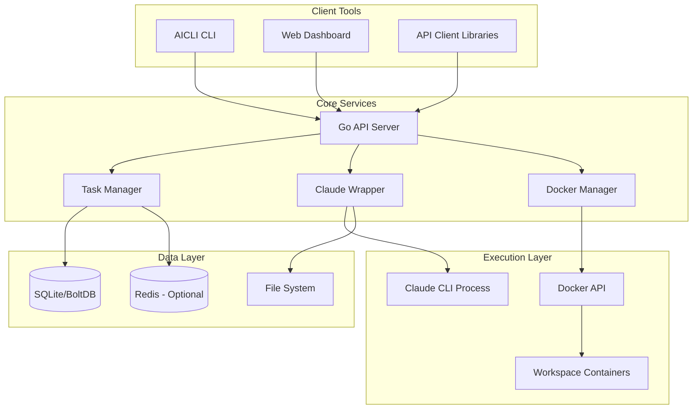

# CLI 기반 시스템 아키텍처

## 🏗️ 전체 아키텍처 개요

Go 언어로 구현된 네이티브 CLI 도구를 중심으로 한 아키텍처입니다.



## 🔧 핵심 컴포넌트

### 1. AICLI CLI (커맨드라인 도구)

```go
// cmd/aicli/main.go
package main

import (
    "github.com/spf13/cobra"
    "github.com/yourusername/aicli/internal/cli"
)

func main() {
    rootCmd := &cobra.Command{
        Use:   "aicli",
        Short: "AI-powered code management CLI",
    }
    
    rootCmd.AddCommand(
        cli.NewWorkspaceCmd(),
        cli.NewTaskCmd(),
        cli.NewLogsCmd(),
        cli.NewConfigCmd(),
    )
    
    rootCmd.Execute()
}
```

### 2. API 서버 (Go)

```go
// internal/server/server.go
package server

import (
    "github.com/gin-gonic/gin"
    "github.com/gorilla/websocket"
)

type Server struct {
    router        *gin.Engine
    taskManager   *TaskManager
    claudeWrapper *ClaudeWrapper
    dockerManager *DockerManager
    wsUpgrader    websocket.Upgrader
}

func NewServer(config *Config) *Server {
    s := &Server{
        router:        gin.New(),
        taskManager:   NewTaskManager(config.DB),
        claudeWrapper: NewClaudeWrapper(),
        dockerManager: NewDockerManager(),
        wsUpgrader:    websocket.Upgrader{},
    }
    
    s.setupRoutes()
    return s
}

func (s *Server) setupRoutes() {
    // API routes
    api := s.router.Group("/api/v1")
    {
        api.GET("/health", s.healthCheck)
        api.GET("/workspaces", s.listWorkspaces)
        api.POST("/workspaces", s.createWorkspace)
        api.POST("/tasks", s.createTask)
        api.GET("/tasks/:id", s.getTask)
        api.GET("/tasks/:id/logs", s.streamLogs)
    }
    
    // WebSocket endpoint
    s.router.GET("/ws/:workspace_id", s.handleWebSocket)
}
```

### 3. Claude CLI 래퍼

```go
// internal/claude/wrapper.go
package claude

import (
    "bufio"
    "context"
    "io"
    "os/exec"
    "sync"
)

type Wrapper struct {
    sessions map[string]*Session
    mu       sync.RWMutex
}

type Session struct {
    ID        string
    Cmd       *exec.Cmd
    Stdin     io.WriteCloser
    Stdout    io.ReadCloser
    Stderr    io.ReadCloser
    Context   context.Context
    Cancel    context.CancelFunc
}

func (w *Wrapper) CreateSession(ctx context.Context, workDir string) (*Session, error) {
    sessionCtx, cancel := context.WithCancel(ctx)
    
    cmd := exec.CommandContext(sessionCtx,
        "claude", "chat",
        "--stream-json",
        "--permission-mode=auto",
    )
    cmd.Dir = workDir
    
    stdin, _ := cmd.StdinPipe()
    stdout, _ := cmd.StdoutPipe()
    stderr, _ := cmd.StderrPipe()
    
    session := &Session{
        ID:      generateID(),
        Cmd:     cmd,
        Stdin:   stdin,
        Stdout:  stdout,
        Stderr:  stderr,
        Context: sessionCtx,
        Cancel:  cancel,
    }
    
    if err := cmd.Start(); err != nil {
        return nil, err
    }
    
    w.mu.Lock()
    w.sessions[session.ID] = session
    w.mu.Unlock()
    
    return session, nil
}

func (w *Wrapper) StreamOutput(session *Session, output chan<- string) {
    scanner := bufio.NewScanner(session.Stdout)
    for scanner.Scan() {
        select {
        case output <- scanner.Text():
        case <-session.Context.Done():
            return
        }
    }
}
```

### 4. 동시성 관리

```go
// internal/task/manager.go
package task

import (
    "context"
    "sync"
)

type Manager struct {
    tasks      map[string]*Task
    mu         sync.RWMutex
    workerPool chan struct{}
}

func NewManager(maxConcurrent int) *Manager {
    return &Manager{
        tasks:      make(map[string]*Task),
        workerPool: make(chan struct{}, maxConcurrent),
    }
}

func (m *Manager) ExecuteTask(ctx context.Context, task *Task) error {
    // 워커 풀에서 슬롯 획득
    select {
    case m.workerPool <- struct{}{}:
        defer func() { <-m.workerPool }()
    case <-ctx.Done():
        return ctx.Err()
    }
    
    // 고루틴으로 작업 실행
    errCh := make(chan error, 1)
    go func() {
        errCh <- m.runTask(ctx, task)
    }()
    
    select {
    case err := <-errCh:
        return err
    case <-ctx.Done():
        return ctx.Err()
    }
}
```

## 📊 데이터 스토리지

### 1. 임베디드 데이터베이스 (BoltDB/SQLite)

```go
// internal/storage/bolt.go
package storage

import (
    "encoding/json"
    bolt "go.etcd.io/bbolt"
)

type BoltStorage struct {
    db *bolt.DB
}

func (s *BoltStorage) SaveTask(task *Task) error {
    return s.db.Update(func(tx *bolt.Tx) error {
        b, err := tx.CreateBucketIfNotExists([]byte("tasks"))
        if err != nil {
            return err
        }
        
        encoded, err := json.Marshal(task)
        if err != nil {
            return err
        }
        
        return b.Put([]byte(task.ID), encoded)
    })
}
```

### 2. 옵션: Redis for 캐싱

```go
// internal/cache/redis.go
package cache

import (
    "context"
    "time"
    "github.com/go-redis/redis/v8"
)

type RedisCache struct {
    client *redis.Client
}

func (c *RedisCache) SetTaskStatus(taskID string, status string) error {
    ctx := context.Background()
    return c.client.Set(ctx, 
        fmt.Sprintf("task:%s:status", taskID), 
        status, 
        time.Hour,
    ).Err()
}
```

## 🔄 실시간 통신

### 1. Server-Sent Events (SSE)

```go
// internal/api/sse.go
package api

import (
    "fmt"
    "net/http"
)

func (s *Server) streamTaskLogs(w http.ResponseWriter, r *http.Request) {
    taskID := chi.URLParam(r, "taskID")
    
    // SSE 헤더 설정
    w.Header().Set("Content-Type", "text/event-stream")
    w.Header().Set("Cache-Control", "no-cache")
    w.Header().Set("Connection", "keep-alive")
    
    flusher, ok := w.(http.Flusher)
    if !ok {
        http.Error(w, "SSE not supported", http.StatusInternalServerError)
        return
    }
    
    // 로그 스트림 구독
    logChan := s.taskManager.SubscribeLogs(taskID)
    defer s.taskManager.UnsubscribeLogs(taskID, logChan)
    
    for {
        select {
        case log := <-logChan:
            fmt.Fprintf(w, "data: %s\n\n", log)
            flusher.Flush()
        case <-r.Context().Done():
            return
        }
    }
}
```

### 2. WebSocket 구현

```go
// internal/api/websocket.go
package api

import (
    "github.com/gorilla/websocket"
)

func (s *Server) handleWebSocket(w http.ResponseWriter, r *http.Request) {
    conn, err := s.wsUpgrader.Upgrade(w, r, nil)
    if err != nil {
        return
    }
    defer conn.Close()
    
    workspaceID := chi.URLParam(r, "workspaceID")
    client := &WSClient{
        conn:        conn,
        workspaceID: workspaceID,
        send:        make(chan []byte, 256),
    }
    
    s.hub.register <- client
    defer func() { s.hub.unregister <- client }()
    
    go client.writePump()
    client.readPump()
}
```

## 🐳 Docker 통합

```go
// internal/docker/manager.go
package docker

import (
    "context"
    "github.com/docker/docker/api/types"
    "github.com/docker/docker/client"
)

type Manager struct {
    client *client.Client
}

func (m *Manager) CreateWorkspaceContainer(workspaceID, projectPath string) (string, error) {
    ctx := context.Background()
    
    resp, err := m.client.ContainerCreate(ctx, &container.Config{
        Image: "aicli/workspace:latest",
        Env: []string{
            fmt.Sprintf("WORKSPACE_ID=%s", workspaceID),
        },
        WorkingDir: "/workspace",
    }, &container.HostConfig{
        Binds: []string{
            fmt.Sprintf("%s:/workspace", projectPath),
        },
        Resources: container.Resources{
            Memory:   2 * 1024 * 1024 * 1024, // 2GB
            NanoCPUs: 1000000000,              // 1 CPU
        },
    }, nil, nil, "")
    
    if err != nil {
        return "", err
    }
    
    if err := m.client.ContainerStart(ctx, resp.ID, types.ContainerStartOptions{}); err != nil {
        return "", err
    }
    
    return resp.ID, nil
}
```

## 🚀 성능 최적화

### 1. 연결 풀링

```go
type ConnectionPool struct {
    pool chan *Connection
    factory func() (*Connection, error)
}

func NewConnectionPool(size int, factory func() (*Connection, error)) *ConnectionPool {
    pool := make(chan *Connection, size)
    for i := 0; i < size; i++ {
        conn, _ := factory()
        pool <- conn
    }
    return &ConnectionPool{pool: pool, factory: factory}
}
```

### 2. 프로세스 재사용

```go
type ProcessPool struct {
    available chan *exec.Cmd
    mu        sync.Mutex
}

func (p *ProcessPool) Get() *exec.Cmd {
    select {
    case cmd := <-p.available:
        return cmd
    default:
        return p.createNew()
    }
}
```

## 📦 빌드 및 배포

### 1. 멀티 플랫폼 빌드

```makefile
# Makefile
BINARY_NAME=aicli
VERSION=$(shell git describe --tags --always)

build-all:
	GOOS=darwin GOARCH=amd64 go build -o dist/$(BINARY_NAME)-darwin-amd64 ./cmd/aicli
	GOOS=darwin GOARCH=arm64 go build -o dist/$(BINARY_NAME)-darwin-arm64 ./cmd/aicli
	GOOS=linux GOARCH=amd64 go build -o dist/$(BINARY_NAME)-linux-amd64 ./cmd/aicli
	GOOS=windows GOARCH=amd64 go build -o dist/$(BINARY_NAME)-windows-amd64.exe ./cmd/aicli
```

### 2. 정적 링킹

```bash
CGO_ENABLED=0 go build -ldflags="-s -w -X main.version=${VERSION}" -o aicli ./cmd/aicli
```

## 🔍 Python 설계 대비 장점

1. **성능**: 10-50배 빠른 실행 속도
2. **메모리**: 5-10배 적은 메모리 사용
3. **배포**: 단일 바이너리로 간편한 배포
4. **동시성**: 고루틴으로 효율적인 병렬 처리
5. **안정성**: 컴파일 타임 타입 체크