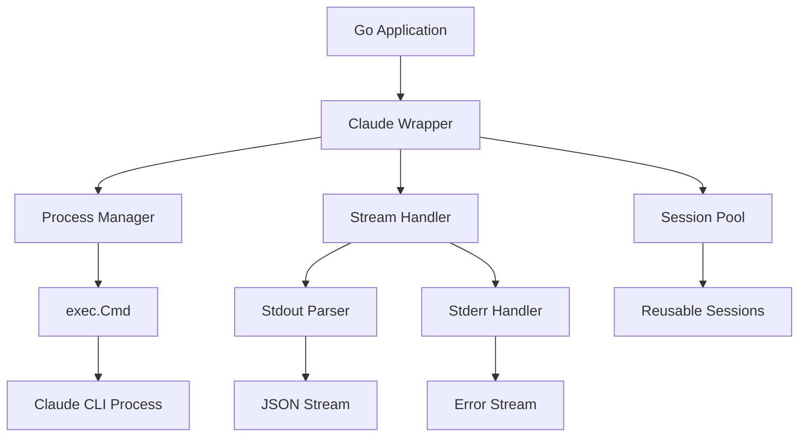

# Claude CLI 래핑 전략 (Go 구현)

## 🎯 개요

Go 언어로 Claude CLI를 효율적으로 래핑하여 프로세스 관리, 스트림 처리, 동시성 제어를 구현합니다.

## 🏗️ 아키텍처



## 📦 핵심 구현

### 1. Claude Wrapper 인터페이스

```go
// internal/claude/interface.go
package claude

import (
    "context"
    "io"
)

type Wrapper interface {
    // 세션 관리
    CreateSession(ctx context.Context, config SessionConfig) (*Session, error)
    GetSession(sessionID string) (*Session, error)
    CloseSession(sessionID string) error
    
    // 명령 실행
    Execute(ctx context.Context, sessionID string, prompt string) (*Response, error)
    Stream(ctx context.Context, sessionID string, prompt string) (<-chan Message, error)
    
    // 상태 관리
    ListSessions() []SessionInfo
    GetStats() Stats
}

type SessionConfig struct {
    WorkspaceID   string
    WorkingDir    string
    SystemPrompt  string
    MaxTurns      int
    AllowedTools  []string
    Environment   map[string]string
    OAuthToken    string
}

type Session struct {
    ID          string
    Config      SessionConfig
    Process     *Process
    Created     time.Time
    LastUsed    time.Time
    State       SessionState
}

type SessionState int

const (
    StateIdle SessionState = iota
    StateRunning
    StateClosed
    StateError
)
```

### 2. Process Manager 구현

```go
// internal/claude/process.go
package claude

import (
    "bufio"
    "context"
    "fmt"
    "io"
    "os/exec"
    "sync"
    "syscall"
)

type Process struct {
    cmd       *exec.Cmd
    stdin     io.WriteCloser
    stdout    io.ReadCloser
    stderr    io.ReadCloser
    mu        sync.Mutex
    done      chan struct{}
    exitCode  int
    exitError error
}

func NewProcess(ctx context.Context, config SessionConfig) (*Process, error) {
    // Claude CLI 명령 구성
    args := []string{
        "chat",
        "--stream-json",
        fmt.Sprintf("--max-turns=%d", config.MaxTurns),
        "--permission-mode=auto",
    }
    
    if config.SystemPrompt != "" {
        args = append(args, "--system-prompt", config.SystemPrompt)
    }
    
    if len(config.AllowedTools) > 0 {
        args = append(args, "--allowed-tools", strings.Join(config.AllowedTools, ","))
    }
    
    cmd := exec.CommandContext(ctx, "claude", args...)
    cmd.Dir = config.WorkingDir
    
    // 환경 변수 설정
    cmd.Env = os.Environ()
    for k, v := range config.Environment {
        cmd.Env = append(cmd.Env, fmt.Sprintf("%s=%s", k, v))
    }
    
    // OAuth 토큰 설정
    if config.OAuthToken != "" {
        cmd.Env = append(cmd.Env, fmt.Sprintf("CLAUDE_CODE_OAUTH_TOKEN=%s", config.OAuthToken))
    }
    
    // 프로세스 그룹 설정 (graceful shutdown을 위해)
    cmd.SysProcAttr = &syscall.SysProcAttr{
        Setpgid: true,
    }
    
    // 파이프 생성
    stdin, err := cmd.StdinPipe()
    if err != nil {
        return nil, fmt.Errorf("create stdin pipe: %w", err)
    }
    
    stdout, err := cmd.StdoutPipe()
    if err != nil {
        return nil, fmt.Errorf("create stdout pipe: %w", err)
    }
    
    stderr, err := cmd.StderrPipe()
    if err != nil {
        return nil, fmt.Errorf("create stderr pipe: %w", err)
    }
    
    p := &Process{
        cmd:    cmd,
        stdin:  stdin,
        stdout: stdout,
        stderr: stderr,
        done:   make(chan struct{}),
    }
    
    // 프로세스 시작
    if err := cmd.Start(); err != nil {
        return nil, fmt.Errorf("start process: %w", err)
    }
    
    // 프로세스 모니터링
    go p.monitor()
    
    return p, nil
}

func (p *Process) monitor() {
    err := p.cmd.Wait()
    p.mu.Lock()
    p.exitError = err
    if err != nil {
        if exitErr, ok := err.(*exec.ExitError); ok {
            p.exitCode = exitErr.ExitCode()
        }
    }
    p.mu.Unlock()
    close(p.done)
}

func (p *Process) SendPrompt(prompt string) error {
    p.mu.Lock()
    defer p.mu.Unlock()
    
    select {
    case <-p.done:
        return fmt.Errorf("process has exited")
    default:
    }
    
    _, err := fmt.Fprintln(p.stdin, prompt)
    return err
}

func (p *Process) Close() error {
    p.mu.Lock()
    defer p.mu.Unlock()
    
    // stdin 닫기
    p.stdin.Close()
    
    // 프로세스가 종료되기를 기다림
    select {
    case <-p.done:
        return nil
    case <-time.After(5 * time.Second):
        // 타임아웃 시 강제 종료
        if p.cmd.Process != nil {
            // 프로세스 그룹 전체 종료
            syscall.Kill(-p.cmd.Process.Pid, syscall.SIGTERM)
            time.Sleep(1 * time.Second)
            syscall.Kill(-p.cmd.Process.Pid, syscall.SIGKILL)
        }
    }
    
    return nil
}
```

### 3. Stream Handler

```go
// internal/claude/stream.go
package claude

import (
    "bufio"
    "context"
    "encoding/json"
    "fmt"
    "io"
    "sync"
)

type StreamHandler struct {
    reader  *bufio.Reader
    decoder *json.Decoder
    mu      sync.Mutex
    closed  bool
}

type Message struct {
    Type      string          `json:"type"`
    Content   string          `json:"content,omitempty"`
    Text      string          `json:"text,omitempty"`
    ToolName  string          `json:"name,omitempty"`
    ToolInput json.RawMessage `json:"input,omitempty"`
    Error     string          `json:"error,omitempty"`
    Timestamp time.Time       `json:"timestamp"`
}

func NewStreamHandler(r io.Reader) *StreamHandler {
    return &StreamHandler{
        reader:  bufio.NewReader(r),
        decoder: json.NewDecoder(r),
    }
}

func (s *StreamHandler) Stream(ctx context.Context, output chan<- Message) error {
    defer close(output)
    
    scanner := bufio.NewScanner(s.reader)
    scanner.Buffer(make([]byte, 1024*1024), 1024*1024) // 1MB 버퍼
    
    for scanner.Scan() {
        select {
        case <-ctx.Done():
            return ctx.Err()
        default:
        }
        
        line := scanner.Bytes()
        if len(line) == 0 {
            continue
        }
        
        var msg Message
        if err := json.Unmarshal(line, &msg); err != nil {
            // JSON이 아닌 경우 텍스트로 처리
            msg = Message{
                Type:      "text",
                Content:   string(line),
                Timestamp: time.Now(),
            }
        } else {
            msg.Timestamp = time.Now()
        }
        
        select {
        case output <- msg:
        case <-ctx.Done():
            return ctx.Err()
        }
    }
    
    return scanner.Err()
}

// 버퍼링된 스트림 핸들러
type BufferedStreamHandler struct {
    *StreamHandler
    buffer    []Message
    maxBuffer int
    mu        sync.RWMutex
}

func NewBufferedStreamHandler(r io.Reader, maxBuffer int) *BufferedStreamHandler {
    return &BufferedStreamHandler{
        StreamHandler: NewStreamHandler(r),
        maxBuffer:     maxBuffer,
        buffer:        make([]Message, 0, maxBuffer),
    }
}

func (b *BufferedStreamHandler) AddMessage(msg Message) {
    b.mu.Lock()
    defer b.mu.Unlock()
    
    b.buffer = append(b.buffer, msg)
    if len(b.buffer) > b.maxBuffer {
        b.buffer = b.buffer[1:]
    }
}

func (b *BufferedStreamHandler) GetBuffer() []Message {
    b.mu.RLock()
    defer b.mu.RUnlock()
    
    result := make([]Message, len(b.buffer))
    copy(result, b.buffer)
    return result
}
```

### 4. Session Pool 구현

```go
// internal/claude/pool.go
package claude

import (
    "context"
    "fmt"
    "sync"
    "time"
)

type SessionPool struct {
    sessions    map[string]*Session
    available   chan string // 사용 가능한 세션 ID
    maxSessions int
    mu          sync.RWMutex
    
    // 메트릭
    created   int64
    reused    int64
    destroyed int64
}

func NewSessionPool(maxSessions int) *SessionPool {
    return &SessionPool{
        sessions:    make(map[string]*Session),
        available:   make(chan string, maxSessions),
        maxSessions: maxSessions,
    }
}

func (p *SessionPool) Get(ctx context.Context, config SessionConfig) (*Session, error) {
    // 재사용 가능한 세션 확인
    select {
    case sessionID := <-p.available:
        p.mu.RLock()
        session, exists := p.sessions[sessionID]
        p.mu.RUnlock()
        
        if exists && p.isCompatible(session.Config, config) {
            session.LastUsed = time.Now()
            atomic.AddInt64(&p.reused, 1)
            return session, nil
        }
    default:
    }
    
    // 새 세션 생성
    p.mu.Lock()
    if len(p.sessions) >= p.maxSessions {
        p.mu.Unlock()
        return nil, fmt.Errorf("session pool full")
    }
    p.mu.Unlock()
    
    session, err := p.createSession(ctx, config)
    if err != nil {
        return nil, err
    }
    
    p.mu.Lock()
    p.sessions[session.ID] = session
    p.mu.Unlock()
    
    atomic.AddInt64(&p.created, 1)
    return session, nil
}

func (p *SessionPool) Release(sessionID string) {
    p.mu.RLock()
    session, exists := p.sessions[sessionID]
    p.mu.RUnlock()
    
    if !exists || session.State != StateIdle {
        return
    }
    
    select {
    case p.available <- sessionID:
    default:
        // 풀이 가득 찬 경우 세션 종료
        p.destroy(sessionID)
    }
}

func (p *SessionPool) isCompatible(a, b SessionConfig) bool {
    return a.WorkingDir == b.WorkingDir &&
           a.SystemPrompt == b.SystemPrompt &&
           a.MaxTurns == b.MaxTurns
}

// 정기적인 정리
func (p *SessionPool) StartCleaner(interval time.Duration) {
    ticker := time.NewTicker(interval)
    go func() {
        for range ticker.C {
            p.cleanup()
        }
    }()
}

func (p *SessionPool) cleanup() {
    p.mu.Lock()
    defer p.mu.Unlock()
    
    now := time.Now()
    for id, session := range p.sessions {
        // 10분 이상 사용되지 않은 세션 정리
        if now.Sub(session.LastUsed) > 10*time.Minute {
            p.destroy(id)
        }
    }
}
```

### 5. 고급 기능

#### 5.1 자동 재시도

```go
type RetryableWrapper struct {
    *WrapperImpl
    maxRetries int
    backoff    time.Duration
}

func (r *RetryableWrapper) Execute(ctx context.Context, sessionID string, prompt string) (*Response, error) {
    var lastErr error
    
    for i := 0; i < r.maxRetries; i++ {
        if i > 0 {
            select {
            case <-time.After(r.backoff * time.Duration(i)):
            case <-ctx.Done():
                return nil, ctx.Err()
            }
        }
        
        resp, err := r.WrapperImpl.Execute(ctx, sessionID, prompt)
        if err == nil {
            return resp, nil
        }
        
        lastErr = err
        
        // 재시도 가능한 에러인지 확인
        if !isRetryable(err) {
            return nil, err
        }
    }
    
    return nil, fmt.Errorf("max retries exceeded: %w", lastErr)
}

func isRetryable(err error) bool {
    // 네트워크 에러, 타임아웃 등 재시도 가능한 에러 확인
    return strings.Contains(err.Error(), "timeout") ||
           strings.Contains(err.Error(), "connection refused")
}
```

#### 5.2 메트릭 수집

```go
type Metrics struct {
    TotalRequests   int64
    SuccessRequests int64
    FailedRequests  int64
    AvgResponseTime time.Duration
    ActiveSessions  int
    
    mu sync.RWMutex
}

func (w *WrapperImpl) recordMetrics(start time.Time, success bool) {
    duration := time.Since(start)
    
    w.metrics.mu.Lock()
    defer w.metrics.mu.Unlock()
    
    w.metrics.TotalRequests++
    if success {
        w.metrics.SuccessRequests++
    } else {
        w.metrics.FailedRequests++
    }
    
    // 이동 평균 계산
    w.metrics.AvgResponseTime = (w.metrics.AvgResponseTime + duration) / 2
}
```

#### 5.3 로그 집계

```go
type LogAggregator struct {
    sessions map[string]*SessionLogs
    mu       sync.RWMutex
}

type SessionLogs struct {
    SessionID string
    Logs      []LogEntry
    Summary   LogSummary
}

type LogEntry struct {
    Timestamp time.Time
    Level     string
    Message   string
    Source    string // stdout/stderr
}

type LogSummary struct {
    TotalLines   int
    ErrorCount   int
    WarningCount int
    ToolUsages   map[string]int
}

func (a *LogAggregator) Process(sessionID string, msg Message) {
    a.mu.Lock()
    defer a.mu.Unlock()
    
    if _, ok := a.sessions[sessionID]; !ok {
        a.sessions[sessionID] = &SessionLogs{
            SessionID: sessionID,
            Summary:   LogSummary{ToolUsages: make(map[string]int)},
        }
    }
    
    logs := a.sessions[sessionID]
    entry := LogEntry{
        Timestamp: msg.Timestamp,
        Message:   msg.Content,
    }
    
    // 로그 레벨 파싱
    if strings.Contains(msg.Content, "ERROR") {
        entry.Level = "error"
        logs.Summary.ErrorCount++
    } else if strings.Contains(msg.Content, "WARN") {
        entry.Level = "warning"
        logs.Summary.WarningCount++
    } else {
        entry.Level = "info"
    }
    
    // 도구 사용 추적
    if msg.Type == "tool_use" {
        logs.Summary.ToolUsages[msg.ToolName]++
    }
    
    logs.Logs = append(logs.Logs, entry)
    logs.Summary.TotalLines++
}
```

## 🔧 성능 최적화

### 1. 프로세스 풀링

```go
var processPool = sync.Pool{
    New: func() interface{} {
        // 기본 프로세스 생성
        ctx := context.Background()
        config := SessionConfig{
            MaxTurns:     10,
            AllowedTools: []string{"Read", "Write", "Bash"},
        }
        
        proc, _ := NewProcess(ctx, config)
        return proc
    },
}

func getProcess() *Process {
    return processPool.Get().(*Process)
}

func putProcess(p *Process) {
    // 프로세스 상태 초기화
    p.Reset()
    processPool.Put(p)
}
```

### 2. 버퍼 재사용

```go
var bufferPool = sync.Pool{
    New: func() interface{} {
        return make([]byte, 4096)
    },
}

func readWithPooledBuffer(r io.Reader) ([]byte, error) {
    buf := bufferPool.Get().([]byte)
    defer bufferPool.Put(buf)
    
    n, err := r.Read(buf)
    if err != nil {
        return nil, err
    }
    
    result := make([]byte, n)
    copy(result, buf[:n])
    return result, nil
}
```

### 3. 동시성 제어

```go
type ConcurrencyLimiter struct {
    sem chan struct{}
}

func NewConcurrencyLimiter(max int) *ConcurrencyLimiter {
    return &ConcurrencyLimiter{
        sem: make(chan struct{}, max),
    }
}

func (l *ConcurrencyLimiter) Acquire() {
    l.sem <- struct{}{}
}

func (l *ConcurrencyLimiter) Release() {
    <-l.sem
}

func (l *ConcurrencyLimiter) WithLimit(fn func() error) error {
    l.Acquire()
    defer l.Release()
    return fn()
}
```

## 📊 모니터링 및 디버깅

### 디버그 모드

```go
type DebugWrapper struct {
    *WrapperImpl
    debugOutput io.Writer
}

func (d *DebugWrapper) Execute(ctx context.Context, sessionID string, prompt string) (*Response, error) {
    fmt.Fprintf(d.debugOutput, "[DEBUG] Executing prompt: %s\n", prompt)
    
    start := time.Now()
    resp, err := d.WrapperImpl.Execute(ctx, sessionID, prompt)
    
    fmt.Fprintf(d.debugOutput, "[DEBUG] Execution took: %v\n", time.Since(start))
    if err != nil {
        fmt.Fprintf(d.debugOutput, "[DEBUG] Error: %v\n", err)
    }
    
    return resp, err
}
```

## 🚨 에러 처리

```go
type ClaudeError struct {
    Type    string
    Message string
    Code    string
    Details map[string]interface{}
}

func (e *ClaudeError) Error() string {
    return fmt.Sprintf("%s: %s", e.Type, e.Message)
}

func parseError(stderr string) error {
    if strings.Contains(stderr, "Credit balance is too low") {
        return &ClaudeError{
            Type:    "InsufficientCredits",
            Message: "API credit balance is too low",
            Code:    "INSUFFICIENT_CREDITS",
        }
    }
    
    if strings.Contains(stderr, "Authentication failed") {
        return &ClaudeError{
            Type:    "AuthenticationError",
            Message: "Failed to authenticate with Claude",
            Code:    "AUTH_FAILED",
        }
    }
    
    return &ClaudeError{
        Type:    "UnknownError",
        Message: stderr,
        Code:    "UNKNOWN",
    }
}
```