# AICode Manager Database ERD

## Entity Relationship Diagram

```mermaid
erDiagram
    WORKSPACE ||--o{ PROJECT : has
    PROJECT ||--o{ SESSION : has
    SESSION ||--o{ TASK : contains
    
    WORKSPACE {
        string id PK "UUID v4"
        string name "워크스페이스 이름"
        string project_path "프로젝트 경로"
        string status "상태: active/inactive/archived"
        string owner_id "소유자 ID"
        string claude_key "Claude API 키 (암호화)"
        int active_tasks "활성 태스크 수"
        timestamp created_at "생성 시간"
        timestamp updated_at "수정 시간"
        timestamp deleted_at "삭제 시간 (soft delete)"
        int version "버전 번호"
    }
    
    PROJECT {
        string id PK "UUID v4"
        string workspace_id FK "워크스페이스 ID"
        string name "프로젝트 이름"
        string path "프로젝트 경로"
        string description "프로젝트 설명"
        string git_url "Git 리포지토리 URL"
        string git_branch "Git 브랜치"
        string language "주 개발 언어"
        string status "상태: active/inactive/archived"
        json config "프로젝트 설정"
        json git_info "Git 정보"
        timestamp created_at "생성 시간"
        timestamp updated_at "수정 시간"
        timestamp deleted_at "삭제 시간 (soft delete)"
        int version "버전 번호"
    }
    
    SESSION {
        string id PK "UUID v4"
        string project_id FK "프로젝트 ID"
        int process_id "프로세스 ID"
        string status "상태: pending/active/idle/ending/ended/error"
        timestamp started_at "시작 시간"
        timestamp ended_at "종료 시간"
        timestamp last_active "마지막 활동 시간"
        json metadata "메타데이터"
        bigint command_count "명령어 실행 수"
        bigint bytes_in "입력 바이트"
        bigint bytes_out "출력 바이트"
        bigint error_count "에러 수"
        bigint max_idle_time "최대 유휴 시간 (나노초)"
        bigint max_lifetime "최대 생명 시간 (나노초)"
        timestamp created_at "생성 시간"
        timestamp updated_at "수정 시간"
        int version "버전 번호"
    }
    
    TASK {
        string id PK "UUID v4"
        string session_id FK "세션 ID"
        string command "실행 명령어"
        string status "상태: pending/running/completed/failed/cancelled"
        text output "출력 결과"
        text error "에러 메시지"
        timestamp started_at "시작 시간"
        timestamp completed_at "완료 시간"
        bigint bytes_in "입력 바이트"
        bigint bytes_out "출력 바이트"
        bigint duration "실행 시간 (밀리초)"
        timestamp created_at "생성 시간"
        timestamp updated_at "수정 시간"
        int version "버전 번호"
    }
```

## 관계 설명

### 1. Workspace - Project (1:N)
- 하나의 워크스페이스는 여러 프로젝트를 포함할 수 있습니다.
- 프로젝트는 반드시 하나의 워크스페이스에 속합니다.
- 워크스페이스 삭제 시 프로젝트들은 cascade soft delete 됩니다.

### 2. Project - Session (1:N)
- 하나의 프로젝트는 여러 세션을 가질 수 있습니다.
- 세션은 반드시 하나의 프로젝트에 속합니다.
- 동시에 활성화된 세션은 프로젝트당 1개로 제한될 수 있습니다.

### 3. Session - Task (1:N)
- 하나의 세션은 여러 태스크를 포함할 수 있습니다.
- 태스크는 반드시 하나의 세션에 속합니다.
- 세션 종료 시 진행 중인 태스크는 자동으로 취소됩니다.

## 인덱스 전략

### Primary Keys
- 모든 테이블의 ID는 UUID v4를 사용합니다.
- CHAR(36) 타입으로 저장하여 인덱싱 효율을 높입니다.

### Foreign Keys
- `project.workspace_id` → `workspace.id`
- `session.project_id` → `project.id`
- `task.session_id` → `session.id`

### Additional Indexes
1. **Workspace**
   - `idx_workspace_owner_id` on (owner_id)
   - `idx_workspace_status` on (status) WHERE deleted_at IS NULL

2. **Project**
   - `idx_project_workspace_id` on (workspace_id)
   - `idx_project_status` on (status) WHERE deleted_at IS NULL
   - `idx_project_workspace_status` on (workspace_id, status) WHERE deleted_at IS NULL

3. **Session**
   - `idx_session_project_id` on (project_id)
   - `idx_session_status` on (status)
   - `idx_session_project_status` on (project_id, status)
   - `idx_session_last_active` on (last_active) WHERE status IN ('active', 'idle')

4. **Task**
   - `idx_task_session_id` on (session_id)
   - `idx_task_status` on (status)
   - `idx_task_session_status` on (session_id, status)
   - `idx_task_created_at` on (created_at)

## 특별 고려사항

### 1. Soft Delete
- Workspace와 Project는 soft delete를 지원합니다.
- `deleted_at` 필드가 NULL이 아닌 경우 삭제된 것으로 간주합니다.
- 쿼리 시 항상 `deleted_at IS NULL` 조건을 포함해야 합니다.

### 2. 낙관적 잠금 (Optimistic Locking)
- 모든 테이블에 `version` 필드를 추가하여 동시성 제어를 구현합니다.
- UPDATE 시 version을 확인하고 증가시킵니다.

### 3. JSON 필드
- `project.config`: 프로젝트별 Claude 설정 저장
- `project.git_info`: Git 상태 정보 캐싱
- `session.metadata`: 세션별 추가 정보 저장

### 4. 타임스탬프
- 모든 시간은 UTC로 저장합니다.
- Go의 time.Time 타입과 호환되도록 설계합니다.

### 5. 대용량 텍스트 필드
- `task.output`과 `task.error`는 TEXT 타입으로 저장합니다.
- 필요시 별도의 blob 스토리지 사용을 고려할 수 있습니다.