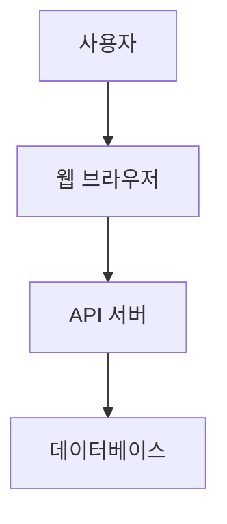

# 문서 사이트 구축 가이드

이 가이드는 AICode Manager의 MkDocs 기반 문서 사이트를 로컬에서 빌드하고 배포하는 방법을 설명합니다.

## 개요

AICode Manager는 다음과 같은 문서화 시스템을 사용합니다:

- **MkDocs**: 마크다운 기반 정적 사이트 생성기
- **Material for MkDocs**: 모던하고 반응형인 테마
- **다국어 지원**: 한국어 우선, 영어 지원
- **GitHub Actions**: 자동 빌드 및 배포
- **GitHub Pages**: 무료 호스팅

## 로컬 개발 환경 설정

### 1. 사전 요구사항

```bash
# Python 3.8 이상
python3 --version

# pip 패키지 관리자
pip --version

# Git (선택사항, 버전 정보용)
git --version
```

### 2. 가상 환경 설정 (권장)

```bash
# 가상 환경 생성
python3 -m venv venv-docs

# 가상 환경 활성화
# Linux/macOS:
source venv-docs/bin/activate

# Windows:
venv-docs\Scripts\activate
```

### 3. 의존성 설치

```bash
# MkDocs 및 플러그인 설치
pip install -r requirements-docs.txt

# 설치 확인
mkdocs --version
```

## 문서 빌드

### 빠른 시작

```bash
# 기본 빌드
./scripts/build-docs.sh

# 빌드 후 서버 시작
./scripts/build-docs.sh -s

# 개발 모드 (파일 감지)
./scripts/build-docs.sh -w
```

### 수동 빌드

```bash
# 설정 검증
mkdocs config-check

# 개발 서버 시작
mkdocs serve

# 프로덕션 빌드
mkdocs build --strict

# 특정 포트에서 서버 시작
mkdocs serve --dev-addr=0.0.0.0:3000
```

## 문서 구조

```
docs/
├── index.md                    # 홈페이지
├── introduction/               # 시작하기
│   ├── overview.md
│   ├── quickstart.md
│   └── installation.md
├── user-guide/                 # 사용자 가이드
│   ├── workspaces.md
│   ├── projects.md
│   └── tasks.md
├── api/                        # API 참조
│   ├── overview.md
│   ├── authentication.md
│   └── openapi.md
├── admin/                      # 관리자 가이드
│   ├── architecture.md
│   └── deployment.md
├── security/                   # 보안
│   └── 보안_설정_가이드.md
├── troubleshooting/           # 문제 해결
│   └── 문제해결_가이드.md
├── migration/                 # 마이그레이션
│   └── 마이그레이션_가이드.md
├── stylesheets/               # 커스텀 CSS
│   └── extra.css
└── javascripts/               # 커스텀 JS
    └── extra.js
```

## 고급 기능

### 1. Mermaid 다이어그램

````markdown

````

### 2. 코드 탭

````markdown
=== "Python"
    ```python
    print("Hello World")
    ```

=== "Go"
    ```go
    fmt.Println("Hello World")
    ```
````

### 3. 알림 박스

```markdown
!!! note "참고"
    이것은 참고 사항입니다.

!!! warning "주의"
    이것은 주의 사항입니다.

!!! danger "위험"
    이것은 위험 사항입니다.
```

### 4. 키보드 단축키

```markdown
++ctrl+k++ 를 눌러 검색하세요.
```

## 배포

### GitHub Pages 자동 배포

1. **GitHub Actions 활성화**
   - `.github/workflows/docs.yml` 파일이 포함되어 있음
   - `main` 브랜치에 푸시하면 자동 빌드

2. **GitHub Pages 설정**
   ```
   Repository Settings > Pages
   Source: GitHub Actions
   ```

3. **배포 확인**
   - Actions 탭에서 빌드 상태 확인
   - `https://your-username.github.io/aicli-web/`에서 확인

### 수동 배포

```bash
# GitHub Pages에 수동 배포
mkdocs gh-deploy

# 특정 브랜치에 배포
mkdocs gh-deploy --config-file mkdocs.yml --remote-branch gh-pages
```

### 다른 호스팅 서비스

#### Netlify
1. Netlify에 사이트 연결
2. Build settings:
   - Build command: `mkdocs build`
   - Publish directory: `site`

#### Vercel
1. Vercel에 프로젝트 연결
2. `vercel.json` 설정:
```json
{
  "builds": [
    {
      "src": "mkdocs.yml",
      "use": "@vercel/static-build",
      "config": {
        "distDir": "site"
      }
    }
  ],
  "build": {
    "env": {
      "PYTHON_VERSION": "3.9"
    }
  },
  "installCommand": "pip install -r requirements-docs.txt",
  "buildCommand": "mkdocs build"
}
```

## 문서 작성 가이드

### 1. 마크다운 규칙

- **헤딩**: `#` 사용, 계층적 구조 유지
- **링크**: `[텍스트](URL)` 형식
- **이미지**: `` 형식
- **코드**: 백틱(`) 사용

### 2. 파일 명명 규칙

- **영어 파일명**: 소문자, 하이픈 구분
- **한국어 파일명**: 가능하지만 URL 고려
- **확장자**: 항상 `.md`

### 3. 내부 링크

```markdown
# 상대 경로 사용
[사용자 가이드](../user-guide/workspaces.md)

# 앵커 링크
[설치 방법](#설치-방법)
```

### 4. 이미지 최적화

```markdown
# 반응형 이미지
{ width=300 }

# 캡션이 있는 이미지
<figure markdown>
  
  <figcaption>시스템 아키텍처</figcaption>
</figure>
```

## 품질 관리

### 1. 자동 검사

```bash
# 링크 검사
markdown-link-check docs/**/*.md

# 맞춤법 검사 (한국어 지원)
cspell "docs/**/*.md"

# 마크다운 린팅
markdownlint docs/
```

### 2. 수동 검토

- **정확성**: 기술적 내용 검증
- **가독성**: 문장 구조, 용어 통일
- **완성도**: 누락된 정보 확인
- **접근성**: 다양한 사용자 고려

### 3. 성능 최적화

```bash
# 이미지 최적화
find docs/images -name "*.png" -exec pngquant --ext .png --force {} \;

# 빌드 사이즈 확인
du -sh site/

# 페이지 로딩 속도 확인
lighthouse site/index.html
```

## 문제 해결

### 1. 일반적인 오류

#### 빌드 실패
```bash
# 의존성 문제
pip install --upgrade -r requirements-docs.txt

# 설정 오류
mkdocs config-check

# 파이썬 경로 문제
which python3
```

#### 플러그인 오류
```bash
# 플러그인 재설치
pip uninstall mkdocs-material
pip install mkdocs-material

# 캐시 정리
rm -rf ~/.cache/pip
```

#### 인코딩 문제
```bash
# 환경 변수 설정
export LC_ALL=ko_KR.UTF-8
export LANG=ko_KR.UTF-8
```

### 2. 개발 팁

- **실시간 미리보기**: `mkdocs serve` 사용
- **빌드 최적화**: `--strict` 플래그로 오류 검출
- **디버깅**: `--verbose` 플래그로 상세 정보 확인

### 3. 브라우저 호환성

- Chrome 90+
- Firefox 88+
- Safari 14+
- Edge 90+

## 기여하기

### 1. 문서 개선

1. 이슈 생성 또는 확인
2. 브랜치 생성: `docs/feature-name`
3. 문서 작성/수정
4. 로컬에서 테스트
5. Pull Request 생성

### 2. 번역

1. `docs/` 하위에 언어 디렉토리 생성
2. 기존 문서를 번역
3. `mkdocs.yml`에 언어 설정 추가
4. 네비게이션 구조 동일하게 유지

### 3. 테마 커스터마이징

- `docs/stylesheets/extra.css`: 추가 CSS
- `docs/javascripts/extra.js`: 추가 JavaScript
- 기본 테마 수정은 지양, 확장만 권장

## 참고 자료

- [MkDocs 공식 문서](https://www.mkdocs.org/)
- [Material for MkDocs](https://squidfunk.github.io/mkdocs-material/)
- [Markdown Guide](https://www.markdownguide.org/)
- [Mermaid 문법](https://mermaid.js.org/)

---

문서 사이트 관련 문의사항이나 개선 제안이 있으시면 [GitHub Issues](https://github.com/your-org/aicli-web/issues)에 등록해 주세요.