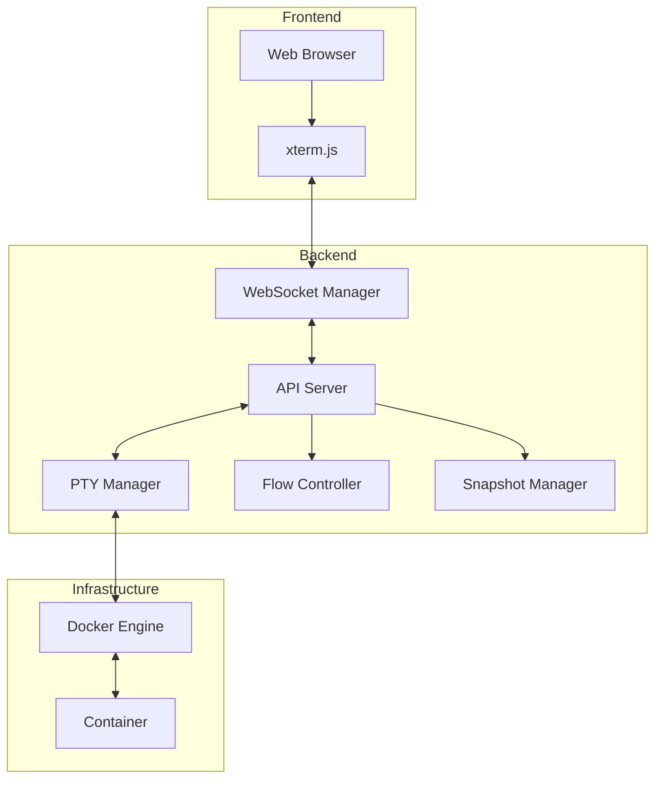

# PTY Streaming 문서

## 개요

PTY Streaming은 Docker 컨테이너 내에서 실행되는 터미널 세션을 웹 브라우저로 실시간 스트리밍하는 고성능 솔루션입니다.

## 문서 구조

```
docs/
├── api/
│   └── pty-streaming-openapi.yaml  # OpenAPI 3.0 사양
└── pty-streaming/
    ├── README.md              # 현재 문서
    ├── developer-guide.md     # 개발자 가이드
    └── operations-guide.md    # 운영 가이드
```

## 빠른 시작

### 개발자를 위한 시작

1. **개발 환경 설정**
   ```bash
   git clone https://github.com/aicli/aicli-web.git
   cd aicli-web
   make dev
   ```

2. **API 테스트**
   ```bash
   # PTY 세션 생성
   curl -X POST http://localhost:8080/api/v1/pty/sessions \
     -H "Content-Type: application/json" \
     -d '{"container_id": "test-container"}'
   ```

3. **WebSocket 연결**
   ```javascript
   const ws = new WebSocket('ws://localhost:8080/api/v1/ws/stream/session-id');
   ```

자세한 내용은 [개발자 가이드](developer-guide.md)를 참조하세요.

### 운영자를 위한 시작

1. **Docker Compose 배포**
   ```bash
   docker-compose up -d
   ```

2. **헬스 체크**
   ```bash
   curl http://localhost:8080/health
   ```

3. **모니터링 설정**
   ```bash
   # Prometheus 접속
   http://localhost:9090
   
   # Grafana 접속
   http://localhost:3000
   ```

자세한 내용은 [운영 가이드](operations-guide.md)를 참조하세요.

## 주요 기능

### 1. PTY 세션 관리
- Docker 컨테이너와 PTY 세션 연결
- 세션 생명주기 관리
- 다중 세션 지원
- 자동 유휴 세션 정리

### 2. WebSocket 스트리밍
- 실시간 양방향 통신
- 낮은 지연 시간 (< 50ms)
- 자동 재연결
- 메시지 압축 지원

### 3. 터미널 스냅샷
- 터미널 상태 캡처
- ANSI 이스케이프 시퀀스 파싱
- 스냅샷 저장 및 복원
- 재생 기능

### 4. 플로우 제어
- 백프레셔 관리
- 동적 스로틀링
- 레이트 리미팅
- 적응형 플로우 제어 (ML 기반)

### 5. 성능 최적화
- 메모리 풀링
- GC 튜닝
- I/O 배치 처리
- 커넥션 풀 관리

## API 레퍼런스

### REST API 엔드포인트

| 메서드 | 경로 | 설명 |
|--------|------|------|
| POST | `/api/v1/pty/sessions` | PTY 세션 생성 |
| GET | `/api/v1/pty/sessions` | 세션 목록 조회 |
| GET | `/api/v1/pty/sessions/{id}` | 세션 상세 조회 |
| DELETE | `/api/v1/pty/sessions/{id}` | 세션 종료 |
| PATCH | `/api/v1/pty/sessions/{id}` | 세션 업데이트 |
| POST | `/api/v1/pty/sessions/{id}/input` | 입력 전송 |

### WebSocket API

```javascript
// 연결 URL
ws://localhost:8080/api/v1/ws/stream/{sessionId}

// 메시지 형식
// Client -> Server
{
  "type": "input",
  "data": "base64_encoded_data"
}

// Server -> Client
{
  "type": "output",
  "data": "base64_encoded_data",
  "timestamp": "2024-01-01T12:00:00Z"
}
```

전체 API 사양은 [OpenAPI 문서](/docs/api/pty-streaming-openapi.yaml)를 참조하세요.

## 아키텍처

### 시스템 아키텍처

```
┌─────────────┐
│   Browser   │
└─────┬──────┘
      │ WebSocket
      ▼
┌───────────────────────────┐
│      API Server            │
├─────────────┬─────────────┤
│ WebSocket   │   PTY       │
│ Manager     │   Manager   │
└─────────────┴─────┬───────┘
                     │
      ┌────────────┴────────────┐
      │      Docker SDK          │
      └───────────┬────────────┘
                     │
      ┌────────────┴────────────┐
      │   Docker Containers      │
      │   ┌──────┐ ┌──────┐   │
      │   │ PTY1 │ │ PTY2 │   │
      │   └──────┘ └──────┘   │
      └──────────────────────────┘
```

### 컴포넌트 다이어그램



## 성능 메트릭

### 벤치마크 결과

| 메트릭 | 값 | 조건 |
|--------|-----|------|
| 동시 세션 | 1,000+ | 8GB RAM |
| 메시지 처리량 | 50,000 msg/s | 단일 노드 |
| 지연 시간 | < 50ms | P95 |
| 메모리 사용량 | < 500MB | 100 세션 |
| CPU 사용률 | < 30% | 4 Core |

### 최적화 기법

- **메모리 풀링**: 빈번한 할당/해제 감소
- **배치 처리**: I/O 효율성 향상
- **동적 스로틀링**: 부하에 따른 자동 조절
- **GC 튜닝**: 일시 중지 시간 최소화

## 보안 고려사항

### 인증 및 권한
- JWT 기반 인증
- RBAC (Role-Based Access Control)
- OAuth 2.0 지원

### 네트워크 보안
- TLS/SSL 지원
- WebSocket Secure (WSS)
- IP 화이트리스트

### 컨테이너 격리
- 사용자별 세션 격리
- 리소스 제한
- 네트워크 격리

## 사용 예제

### JavaScript/TypeScript

```typescript
import { PTYClient } from '@aicli/pty-client';

const client = new PTYClient({
  url: 'ws://localhost:8080',
  reconnect: true,
  reconnectInterval: 5000
});

// 세션 생성
const session = await client.createSession({
  containerId: 'my-container',
  rows: 24,
  cols: 80
});

// 스트림 연결
await session.connect();

// 출력 처리
session.onOutput((data) => {
  terminal.write(data);
});

// 입력 전송
terminal.onData((data) => {
  session.sendInput(data);
});

// 세션 종료
await session.close();
```

### Go

```go
package main

import (
    "github.com/aicli/aicli-web/pkg/pty"
)

func main() {
    // PTY 매니저 생성
    manager := pty.NewManager(pty.DefaultConfig())
    
    // 세션 생성
    session, err := manager.CreateSession("container-id", &pty.Config{
        Rows: 24,
        Cols: 80,
        Term: "xterm-256color",
    })
    if err != nil {
        panic(err)
    }
    defer session.Close()
    
    // I/O 처리
    go func() {
        buf := make([]byte, 4096)
        for {
            n, err := session.Read(buf)
            if err != nil {
                return
            }
            // 출력 처리
            handleOutput(buf[:n])
        }
    }()
    
    // 입력 전송
    session.Write([]byte("ls -la\n"))
}
```

## 문제 해결

### FAQ

**Q: WebSocket 연결이 자꾸 끊어집니다.**

A: 다음 사항을 확인하세요:
- 프록시/로드밸런서 WebSocket 설정
- Keep-alive 타임아웃 설정
- 클라이언트 측 재연결 로직

**Q: 터미널 출력이 깨져서 나타납니다.**

A: 인코딩 문제일 가능성이 높습니다:
- UTF-8 인코딩 확인
- TERM 환경 변수 설정 확인
- xterm.js 설정 검토

**Q: 메모리 사용량이 계속 증가합니다.**

A: 메모리 누수 가능성을 확인하세요:
- 종료되지 않은 세션 정리
- 버퍼 크기 조정
- GC 설정 최적화

자세한 문제 해결 방법은 [개발자 가이드](developer-guide.md#문제-해결)를 참조하세요.

## 기여하기

PTY Streaming 프로젝트에 기여하려면:

1. 이 저장소를 Fork하세요
2. 기능 브랜치를 생성하세요 (`git checkout -b feature/amazing-feature`)
3. 변경사항을 커밋하세요 (`git commit -m 'feat: Add amazing feature'`)
4. 브랜치에 푸시하세요 (`git push origin feature/amazing-feature`)
5. Pull Request를 생성하세요

## 라이센스

MIT License - 자세한 내용은 [LICENSE](../../LICENSE) 파일을 참조하세요.

## 연락처

- **이메일**: support@aicode.io
- **GitHub Issues**: [https://github.com/aicli/aicli-web/issues](https://github.com/aicli/aicli-web/issues)
- **문서**: [https://docs.aicode.io](https://docs.aicode.io)

## 버전 히스토리

### v1.0.0 (2024-01-01)
- 초기 릴리스
- PTY 세션 관리 기능
- WebSocket 스트리밍
- 터미널 스냅샷
- 플로우 제어
- 성능 최적화