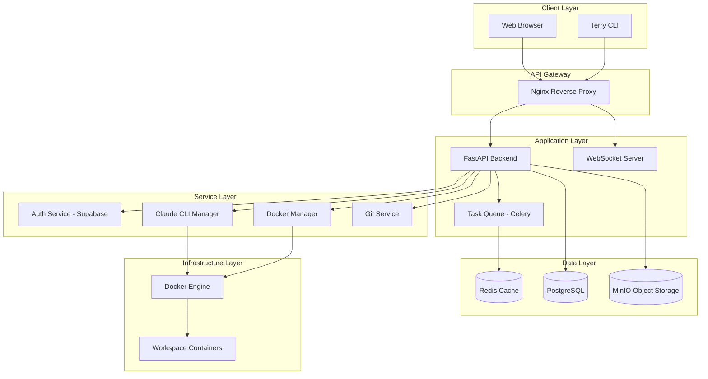
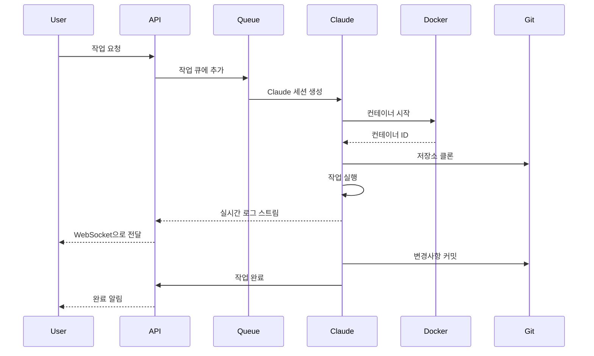
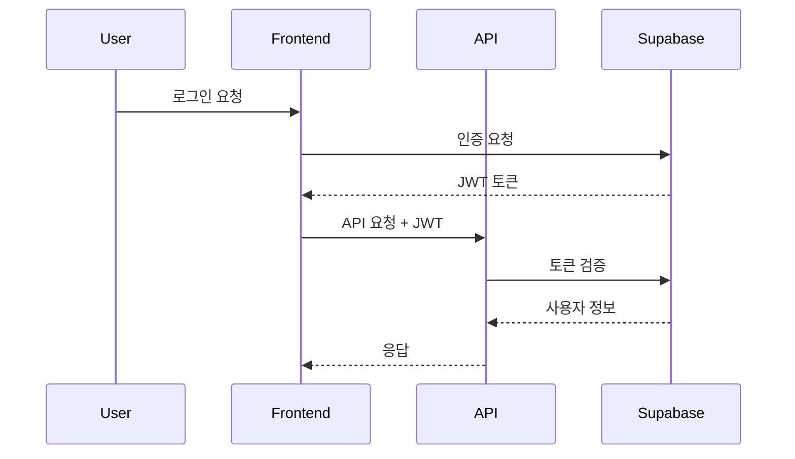

# 시스템 아키텍처

## 🏗️ 전체 아키텍처 개요

AICode Manager는 마이크로서비스 아키텍처를 기반으로 설계되었으며, 각 컴포넌트는 Docker 컨테이너로 격리되어 실행됩니다.



## 🔧 핵심 컴포넌트

### 1. API Gateway (Nginx)
- **역할**: 리버스 프록시 및 로드 밸런싱
- **기능**:
  - HTTPS 종료
  - 정적 파일 서빙
  - WebSocket 프록시
  - Rate limiting

### 2. FastAPI Backend
- **역할**: 핵심 비즈니스 로직 처리
- **주요 모듈**:
  ```python
  backend/
  ├── api/
  │   ├── auth.py          # 인증 엔드포인트
  │   ├── workspaces.py    # 워크스페이스 관리
  │   ├── tasks.py         # 작업 관리
  │   └── streams.py       # 실시간 스트리밍
  ├── services/
  │   ├── claude_manager.py # Claude CLI 관리
  │   ├── docker_service.py # Docker 컨테이너 관리
  │   └── git_service.py    # Git 작업 처리
  └── models/
      ├── user.py          # 사용자 모델
      ├── workspace.py     # 워크스페이스 모델
      └── task.py          # 작업 모델
  ```

### 3. Claude CLI Manager
- **역할**: Claude CLI 프로세스 생명주기 관리
- **핵심 기능**:
  ```python
  class ClaudeManager:
      async def create_session(self, workspace_id: str) -> ClaudeSession:
          """새로운 Claude 세션 생성"""
          
      async def execute_command(self, session_id: str, command: str) -> AsyncIterator[str]:
          """명령 실행 및 스트림 반환"""
          
      async def terminate_session(self, session_id: str) -> None:
          """세션 종료 및 정리"""
  ```

### 4. Docker Service
- **역할**: 워크스페이스 컨테이너 관리
- **기능**:
  - 컨테이너 생성/삭제
  - 볼륨 마운트 관리
  - 네트워크 격리
  - 리소스 제한

### 5. WebSocket Server
- **역할**: 실시간 양방향 통신
- **구현**:
  ```python
  @app.websocket("/ws/{workspace_id}")
  async def websocket_endpoint(websocket: WebSocket, workspace_id: str):
      await manager.connect(websocket, workspace_id)
      try:
          while True:
              data = await websocket.receive_text()
              await manager.process_command(workspace_id, data)
      except WebSocketDisconnect:
          manager.disconnect(workspace_id)
  ```

## 🔄 데이터 플로우

### 1. 작업 실행 플로우


### 2. 인증 플로우


## 🐳 Docker 아키텍처

### 1. 컨테이너 구성
```yaml
services:
  # API 서비스
  api:
    build: ./backend
    environment:
      - ANTHROPIC_OAUTH_TOKEN=${ANTHROPIC_OAUTH_TOKEN}
    volumes:
      - ./workspaces:/workspaces
    depends_on:
      - postgres
      - redis
  
  # 워크스페이스 템플릿
  workspace-template:
    build: ./docker/workspace
    volumes:
      - /var/run/docker.sock:/var/run/docker.sock
    privileged: true
```

### 2. 네트워크 격리
- **api_network**: API 서비스 간 통신
- **workspace_network**: 워크스페이스 컨테이너 격리
- **bridge**: 외부 통신용

## 📊 스케일링 전략

### 1. 수평 확장
- **API 서버**: 로드 밸런서 뒤에 여러 인스턴스 배치
- **Claude 워커**: Celery 워커 수 증가
- **Redis**: Redis Cluster 구성

### 2. 수직 확장
- **컨테이너 리소스**: CPU/메모리 제한 조정
- **동시 실행 제한**: 워크스페이스별 제한 설정

## 🔐 보안 아키텍처

### 1. 네트워크 보안
- 컨테이너 간 격리
- 최소 권한 원칙
- TLS/SSL 암호화

### 2. 데이터 보안
- 저장 데이터 암호화
- 민감 정보 환경 변수 관리
- 정기적인 보안 업데이트

## 🔍 모니터링 및 로깅

### 1. 로깅 스택
- **Fluentd**: 로그 수집
- **Elasticsearch**: 로그 저장 및 인덱싱
- **Kibana**: 로그 시각화

### 2. 메트릭 수집
- **Prometheus**: 메트릭 수집
- **Grafana**: 대시보드 및 알림

### 3. 추적
- **OpenTelemetry**: 분산 추적
- **Jaeger**: 추적 데이터 시각화

## 🚀 성능 최적화

### 1. 캐싱 전략
- **Redis**: 세션 데이터, 임시 결과
- **CDN**: 정적 자산
- **API 응답 캐싱**: 자주 요청되는 데이터

### 2. 비동기 처리
- **Celery**: 장시간 실행 작업
- **asyncio**: I/O 바운드 작업
- **WebSocket**: 실시간 통신

### 3. 리소스 최적화
- **Docker 이미지**: 멀티 스테이지 빌드
- **컨테이너 재사용**: 웜 스타트
- **메모리 관리**: 가비지 컬렉션 튜닝